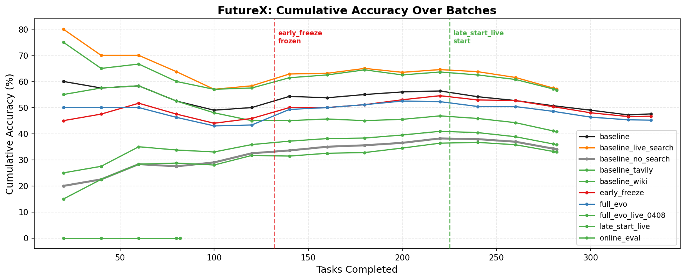
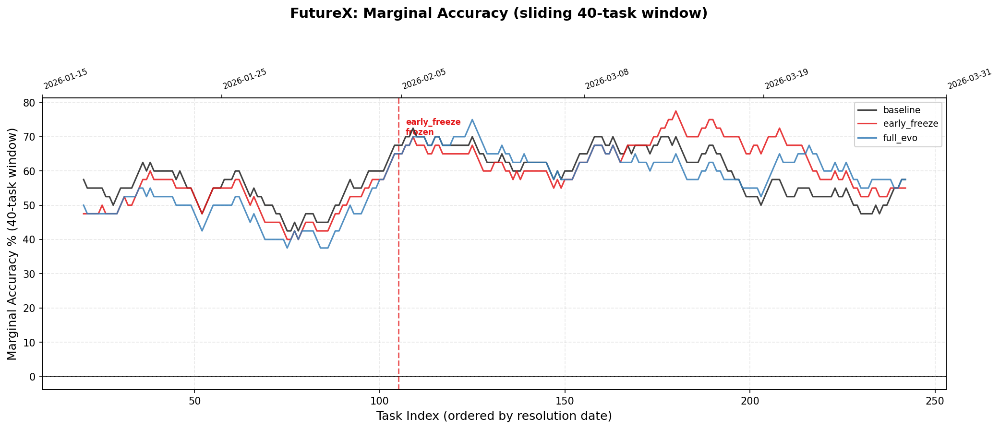

# A-Evolve-V2 FutureX Experiment Report

Auto-generated from `results` (10 experiments).

---

## Experiment Summary

| Metric | baseline | baseline_live_search | baseline_no_search | baseline_tavily | baseline_wiki | early_freeze | full_evo | full_evo_live_0408 | late_start_live | online_eval |
| --- | ---: | ---: | ---: | ---: | ---: | ---: | ---: | ---: | ---: | ---: |
| Tasks | 332 | 282 | 282 | 282 | 282 | 332 | 332 | 282 | 282 | 82 |
| Passed | 158/332 | 161/282 | 96/282 | 115/282 | 101/282 | 155/332 | 150/332 | 160/282 | 93/282 | 0/82 |
| **Accuracy** | **47.6%** | **57.1%** | **34.0%** | **40.8%** | **35.8%** | **46.7%** | **45.2%** | **56.7%** | **33.0%** | **0.0%** |
| Search mode | strict | live | none | ? | ? | strict | ? | ? | live | ? |
| Avg turns | 12.5 | 12.0 | 4.0 | 14.5 | 15.9 | 13.7 | 13.4 | 11.7 | 17.9 | 15.8 |
| Avg elapsed | 180s | 65s | 54s | 84s | 84s | 189s | 172s | 62s | 82s | 201s |
| Evo cycles | 0 | 0 | 0 | 0 | 0 | 7 | 17 | 15 | 4 | 0 |
| Mutated | 0 | 0 | 0 | 0 | 0 | 7 | 17 | 15 | 4 | 0 |
| Skills | 0 | 0 | 0 | 0 | 0 | 11 | 14 | 7 | 5 | 7 |
| Tools | 0 | 0 | 0 | 0 | 0 | 7 | 1 | 1 | 1 | 1 |
| Memories | 0 | 0 | 0 | 0 | 0 | 81 | 177 | 185 | 26 | 185 |
| Prompt (chars) | 2104 | 2104 | 2104 | 2104 | 2104 | 16344 | 44182 | 36478 | 9572 | 36478 |

## Accuracy by Domain

| Domain | Tasks | baseline | baseline_live_search | baseline_no_search | baseline_tavily | baseline_wiki | early_freeze | full_evo | full_evo_live_0408 | late_start_live | online_eval |
| --- | ---: | ---: | ---: | ---: | ---: | ---: | ---: | ---: | ---: | ---: | ---: |
| Finance | 12 | 3/12 (25%) | 0/12 (0%) | 0/12 (0%) | 0/12 (0%) | 0/12 (0%) | 2/12 (17%) | 2/12 (17%) | 0/12 (0%) | 0/12 (0%) | 0/12 (0%) |
| Politics | 9 | 5/9 (56%) | 0/9 (0%) | 0/9 (0%) | 0/9 (0%) | 0/9 (0%) | 3/9 (33%) | 4/9 (44%) | 0/9 (0%) | 0/9 (0%) | 0/9 (0%) |
| Sports | 96 | 65/96 (68%) | 4/96 (4%) | 2/96 (2%) | 4/96 (4%) | 2/96 (2%) | 66/96 (69%) | 59/96 (61%) | 4/96 (4%) | 2/96 (2%) | 0/96 (0%) |
| Technology | 215 | 85/215 (40%) | 4/215 (2%) | 2/215 (1%) | 3/215 (1%) | 2/215 (1%) | 84/215 (39%) | 85/215 (40%) | 4/215 (2%) | 2/215 (1%) | 0/215 (0%) |

## Accuracy by Difficulty Level

| Level | Tasks | baseline | baseline_live_search | baseline_no_search | baseline_tavily | baseline_wiki | early_freeze | full_evo | full_evo_live_0408 | late_start_live | online_eval |
| --- | ---: | ---: | ---: | ---: | ---: | ---: | ---: | ---: | ---: | ---: | ---: |
| 1 | 128 | 92/128 (72%) | 5/128 (4%) | 3/128 (2%) | 5/128 (4%) | 4/128 (3%) | 91/128 (71%) | 90/128 (70%) | 5/128 (4%) | 3/128 (2%) | 0/128 (0%) |
| 2 | 135 | 64/135 (47%) | 3/135 (2%) | 1/135 (1%) | 2/135 (1%) | 0/135 (0%) | 63/135 (47%) | 60/135 (44%) | 3/135 (2%) | 1/135 (1%) | 0/135 (0%) |
| 3 | 24 | 0/24 (0%) | 0/24 (0%) | 0/24 (0%) | 0/24 (0%) | 0/24 (0%) | 0/24 (0%) | 0/24 (0%) | 0/24 (0%) | 0/24 (0%) | 0/24 (0%) |
| 4 | 45 | 2/45 (4%) | 0/45 (0%) | 0/45 (0%) | 0/45 (0%) | 0/45 (0%) | 1/45 (2%) | 0/45 (0%) | 0/45 (0%) | 0/45 (0%) | 0/45 (0%) |

## Accuracy by Resolution Month

| Month | Tasks | baseline | baseline_live_search | baseline_no_search | baseline_tavily | baseline_wiki | early_freeze | full_evo | full_evo_live_0408 | late_start_live | online_eval |
| --- | ---: | ---: | ---: | ---: | ---: | ---: | ---: | ---: | ---: | ---: | ---: |
| 2026-01 | 76 | 45/76 (59%) | 8/76 (11%) | 4/76 (5%) | 7/76 (9%) | 4/76 (5%) | 41/76 (54%) | 40/76 (53%) | 8/76 (11%) | 4/76 (5%) | 0/76 (0%) |
| 2026-02 | 65 | 38/65 (58%) | 0/65 (0%) | 0/65 (0%) | 0/65 (0%) | 0/65 (0%) | 36/65 (55%) | 37/65 (57%) | 0/65 (0%) | 0/65 (0%) | 0/65 (0%) |
| 2026-03 | 122 | 73/122 (60%) | 0/122 (0%) | 0/122 (0%) | 0/122 (0%) | 0/122 (0%) | 77/122 (63%) | 73/122 (60%) | 0/122 (0%) | 0/122 (0%) | 0/122 (0%) |

## FutureX Leaderboard Comparison (March Week 2)

**36 verified shared tasks** between our Futurex-Past and the leaderboard's Futurex-Online snapshot (`a696ecd3`, 77 tasks, Mar 12-17).

Matching criteria (all three must hold):
1. Same `id` field in both datasets
2. Same `title` / `en_title`
3. Same `end_time` (resolution date)

Level distribution: L1=12, L2=24 (total 36)

| Agent | Model | Search | L1 (12) | L2 (24) | Overall (36) |
| --- | --- | --- | ---: | ---: | ---: |
| H2O Super Agent v1.82 | Sonnet 4.6 | Google Serper + Jina | 83.3% | 65.3% | ~71%* |
| MiroFlow | GPT-5 | Google Serper + Jina | 83.3% | 65.3% | ~71%* |
| TongAgents beta | GPT-5 | Google Serper | 83.3% | 69.4% | ~74%* |
| --- | --- | --- | --- | --- | --- |
| **baseline** | Sonnet 4.6 | strict | 75.0% | 62.5% | **66.7%** |
| **baseline_live_search** | Sonnet 4.6 | live | 0.0% | 0.0% | **0.0%** |
| **baseline_no_search** | Sonnet 4.6 | none | 0.0% | 0.0% | **0.0%** |
| **baseline_tavily** | Sonnet 4.6 | ? | 0.0% | 0.0% | **0.0%** |
| **baseline_wiki** | Sonnet 4.6 | ? | 0.0% | 0.0% | **0.0%** |
| **early_freeze** | Sonnet 4.6 | strict | 83.3% | 70.8% | **75.0%** |
| **full_evo** | Sonnet 4.6 | ? | 75.0% | 54.2% | **61.1%** |
| **full_evo_live_0408** | Sonnet 4.6 | ? | 0.0% | 0.0% | **0.0%** |
| **late_start_live** | Sonnet 4.6 | live | 0.0% | 0.0% | **0.0%** |
| **online_eval** | Sonnet 4.6 | ? | 0.0% | 0.0% | **0.0%** |

*\*Leaderboard L1+L2 overall estimated as weighted average. Their published overall (62-65%) includes L3+L4 tasks not in our shared set.*

## Head-to-Head vs `futurex_baseline_no_search`

| Experiment | Both pass | Improved | Regressed | Net |
| --- | ---: | ---: | ---: | ---: |
| baseline | 3 | 4 | 1 | +3 |
| baseline_live_search | 80 | 81 | 16 | +65 |
| baseline_tavily | 81 | 34 | 15 | +19 |
| baseline_wiki | 84 | 17 | 12 | +5 |
| early_freeze | 2 | 3 | 2 | +1 |
| full_evo | 3 | 3 | 1 | +2 |
| full_evo_live_0408 | 78 | 82 | 18 | +64 |
| late_start_live | 89 | 4 | 7 | -3 |
| online_eval | 0 | 0 | 0 | +0 |

## Batch-Level Score Progression

### baseline
| Batch | Tasks | Passed | Acc | Mutated |
| ---: | ---: | ---: | ---: | ---: |
| 1 | 20 | 12 | 60% | skip |
| 2 | 20 | 11 | 55% | skip |
| 3 | 20 | 12 | 60% | skip |
| 4 | 20 | 7 | 35% | skip |
| 5 | 20 | 7 | 35% | skip |
| 6 | 20 | 11 | 55% | skip |
| 7 | 20 | 16 | 80% | skip |
| 8 | 20 | 10 | 50% | skip |
| 9 | 20 | 13 | 65% | skip |
| 10 | 20 | 13 | 65% | skip |
| 11 | 20 | 12 | 60% | skip |
| 12 | 20 | 6 | 30% | skip |
| 13 | 20 | 7 | 35% | skip |
| 14 | 20 | 5 | 25% | skip |
| 15 | 20 | 5 | 25% | skip |
| 16 | 20 | 4 | 20% | skip |
| 17 | 12 | 7 | 58% | skip |

### baseline_live_search
| Batch | Tasks | Passed | Acc | Mutated |
| ---: | ---: | ---: | ---: | ---: |
| 1 | 20 | 16 | 80% | skip |
| 2 | 20 | 12 | 60% | skip |
| 3 | 20 | 14 | 70% | skip |
| 4 | 20 | 9 | 45% | skip |
| 5 | 20 | 6 | 30% | skip |
| 6 | 20 | 13 | 65% | skip |
| 7 | 20 | 18 | 90% | skip |
| 8 | 20 | 13 | 65% | skip |
| 9 | 20 | 16 | 80% | skip |
| 10 | 20 | 10 | 50% | skip |
| 11 | 20 | 15 | 75% | skip |
| 12 | 20 | 11 | 55% | skip |
| 13 | 20 | 7 | 35% | skip |
| 14 | 20 | 1 | 5% | skip |
| 15 | 2 | 0 | 0% | skip |

### baseline_no_search
| Batch | Tasks | Passed | Acc | Mutated |
| ---: | ---: | ---: | ---: | ---: |
| 1 | 20 | 4 | 20% | skip |
| 2 | 20 | 5 | 25% | skip |
| 3 | 20 | 8 | 40% | skip |
| 4 | 20 | 5 | 25% | skip |
| 5 | 20 | 7 | 35% | skip |
| 6 | 20 | 10 | 50% | skip |
| 7 | 20 | 8 | 40% | skip |
| 8 | 20 | 9 | 45% | skip |
| 9 | 20 | 8 | 40% | skip |
| 10 | 20 | 9 | 45% | skip |
| 11 | 20 | 11 | 55% | skip |
| 12 | 20 | 7 | 35% | skip |
| 13 | 20 | 5 | 25% | skip |
| 14 | 20 | 0 | 0% | skip |
| 15 | 2 | 0 | 0% | skip |

### baseline_tavily
| Batch | Tasks | Passed | Acc | Mutated |
| ---: | ---: | ---: | ---: | ---: |
| 1 | 20 | 11 | 55% | skip |
| 2 | 20 | 12 | 60% | skip |
| 3 | 20 | 12 | 60% | skip |
| 4 | 20 | 7 | 35% | skip |
| 5 | 20 | 6 | 30% | skip |
| 6 | 20 | 6 | 30% | skip |
| 7 | 20 | 9 | 45% | skip |
| 8 | 20 | 10 | 50% | skip |
| 9 | 20 | 8 | 40% | skip |
| 10 | 20 | 10 | 50% | skip |
| 11 | 20 | 12 | 60% | skip |
| 12 | 20 | 7 | 35% | skip |
| 13 | 20 | 5 | 25% | skip |
| 14 | 20 | 0 | 0% | skip |
| 15 | 2 | 0 | 0% | skip |

### baseline_wiki
| Batch | Tasks | Passed | Acc | Mutated |
| ---: | ---: | ---: | ---: | ---: |
| 1 | 20 | 5 | 25% | skip |
| 2 | 20 | 6 | 30% | skip |
| 3 | 20 | 10 | 50% | skip |
| 4 | 20 | 6 | 30% | skip |
| 5 | 20 | 6 | 30% | skip |
| 6 | 20 | 10 | 50% | skip |
| 7 | 20 | 9 | 45% | skip |
| 8 | 20 | 9 | 45% | skip |
| 9 | 20 | 8 | 40% | skip |
| 10 | 20 | 10 | 50% | skip |
| 11 | 20 | 11 | 55% | skip |
| 12 | 20 | 7 | 35% | skip |
| 13 | 20 | 4 | 20% | skip |
| 14 | 20 | 0 | 0% | skip |
| 15 | 2 | 0 | 0% | skip |

### early_freeze
| Batch | Tasks | Passed | Acc | Mutated |
| ---: | ---: | ---: | ---: | ---: |
| 1 | 20 | 9 | 45% | Y |
| 2 | 20 | 10 | 50% | Y |
| 3 | 20 | 12 | 60% | Y |
| 4 | 20 | 7 | 35% | Y |
| 5 | 20 | 6 | 30% | Y |
| 6 | 20 | 11 | 55% | Y |
| 7 | 20 | 15 | 75% | Y |
| 8 | 20 | 10 | 50% | skip |
| 9 | 20 | 12 | 60% | skip |
| 10 | 20 | 14 | 70% | skip |
| 11 | 20 | 14 | 70% | skip |
| 12 | 20 | 7 | 35% | skip |
| 13 | 20 | 10 | 50% | skip |
| 14 | 20 | 4 | 20% | skip |
| 15 | 20 | 3 | 15% | skip |
| 16 | 20 | 5 | 25% | skip |
| 17 | 12 | 6 | 50% | skip |

### full_evo
| Batch | Tasks | Passed | Acc | Mutated |
| ---: | ---: | ---: | ---: | ---: |
| 1 | 20 | 10 | 50% | Y |
| 2 | 20 | 10 | 50% | Y |
| 3 | 20 | 10 | 50% | Y |
| 4 | 20 | 7 | 35% | Y |
| 5 | 20 | 6 | 30% | Y |
| 6 | 20 | 9 | 45% | Y |
| 7 | 20 | 17 | 85% | Y |
| 8 | 20 | 11 | 55% | Y |
| 9 | 20 | 12 | 60% | Y |
| 10 | 20 | 13 | 65% | Y |
| 11 | 20 | 10 | 50% | Y |
| 12 | 20 | 6 | 30% | Y |
| 13 | 20 | 10 | 50% | Y |
| 14 | 20 | 5 | 25% | Y |
| 15 | 20 | 3 | 15% | Y |
| 16 | 20 | 6 | 30% | Y |
| 17 | 12 | 5 | 42% | Y |

### full_evo_live_0408
| Batch | Tasks | Passed | Acc | Mutated |
| ---: | ---: | ---: | ---: | ---: |
| 1 | 20 | 15 | 75% | Y |
| 2 | 20 | 11 | 55% | Y |
| 3 | 20 | 14 | 70% | Y |
| 4 | 20 | 8 | 40% | Y |
| 5 | 20 | 9 | 45% | Y |
| 6 | 20 | 12 | 60% | Y |
| 7 | 20 | 17 | 85% | Y |
| 8 | 20 | 14 | 70% | Y |
| 9 | 20 | 16 | 80% | Y |
| 10 | 20 | 9 | 45% | Y |
| 11 | 20 | 15 | 75% | Y |
| 12 | 20 | 10 | 50% | Y |
| 13 | 20 | 8 | 40% | Y |
| 14 | 20 | 2 | 10% | Y |
| 15 | 2 | 0 | 0% | Y |

### late_start_live
| Batch | Tasks | Passed | Acc | Mutated |
| ---: | ---: | ---: | ---: | ---: |
| 1 | 20 | 3 | 15% | skip |
| 2 | 20 | 6 | 30% | skip |
| 3 | 20 | 8 | 40% | skip |
| 4 | 20 | 6 | 30% | skip |
| 5 | 20 | 5 | 25% | skip |
| 6 | 20 | 10 | 50% | skip |
| 7 | 20 | 6 | 30% | skip |
| 8 | 20 | 8 | 40% | skip |
| 9 | 20 | 7 | 35% | skip |
| 10 | 20 | 10 | 50% | skip |
| 11 | 20 | 11 | 55% | skip |
| 12 | 20 | 8 | 40% | Y |
| 13 | 20 | 5 | 25% | Y |
| 14 | 20 | 0 | 0% | Y |
| 15 | 2 | 0 | 0% | Y |

### online_eval
| Batch | Tasks | Passed | Acc | Mutated |
| ---: | ---: | ---: | ---: | ---: |
| 1 | 20 | 0 | 0% | skip |
| 2 | 20 | 0 | 0% | skip |
| 3 | 20 | 0 | 0% | skip |
| 4 | 20 | 0 | 0% | skip |
| 5 | 2 | 0 | 0% | skip |

## Artifact Growth Over Evolution

### early_freeze
| Cycle | Score | Skills | Tools | Memos | Prompt | Mutated |
| ---: | ---: | ---: | ---: | ---: | ---: | ---: |
| 1 | 0.45 | 3 | 1 | - | 4669c | True |
| 2 | 0.50 | 6 | 3 | - | 6640c | True |
| 3 | 0.60 | 7 | 4 | - | 7233c | True |
| 4 | 0.35 | 9 | 4 | - | 9789c | True |
| 5 | 0.30 | 9 | 5 | - | 11529c | True |
| 6 | 0.55 | 10 | 6 | - | 14314c | True |
| 7 | 0.75 | 11 | 7 | - | 16235c | True |
| 8 | 0.50 | 11 | 7 | - | 16235c | False |
| 9 | 0.60 | 11 | 7 | - | 16235c | False |
| 10 | 0.70 | 11 | 7 | - | 16235c | False |
| 11 | 0.70 | 11 | 7 | - | 16235c | False |
| 12 | 0.35 | 11 | 7 | - | 16235c | False |
| 13 | 0.50 | 11 | 7 | - | 16235c | False |
| 14 | 0.20 | 11 | 7 | - | 16235c | False |
| 15 | 0.15 | 11 | 7 | - | 16235c | False |
| 16 | 0.25 | 11 | 7 | - | 16235c | False |
| 17 | 0.50 | 11 | 7 | - | 16235c | False |

### full_evo
| Cycle | Score | Skills | Tools | Memos | Prompt | Mutated |
| ---: | ---: | ---: | ---: | ---: | ---: | ---: |
| 1 | 0.50 | 4 | 1 | - | 3922c | True |
| 2 | 0.50 | 6 | 1 | - | 5602c | True |
| 3 | 0.50 | 7 | 1 | - | 7652c | True |
| 4 | 0.35 | 8 | 1 | - | 9241c | True |
| 5 | 0.30 | 9 | 1 | - | 11823c | True |
| 6 | 0.45 | 10 | 1 | - | 13604c | True |
| 7 | 0.85 | 11 | 1 | - | 14912c | True |
| 8 | 0.55 | 12 | 1 | - | 16474c | True |
| 9 | 0.60 | 12 | 1 | - | 18515c | True |
| 10 | 0.65 | 12 | 1 | - | 21377c | True |
| 11 | 0.50 | 12 | 1 | - | 24774c | True |
| 12 | 0.30 | 13 | 1 | - | 27716c | True |
| 13 | 0.50 | 13 | 1 | - | 29817c | True |
| 14 | 0.25 | 14 | 1 | - | 33787c | True |
| 15 | 0.15 | 14 | 1 | - | 38184c | True |
| 16 | 0.30 | 14 | 1 | - | 40490c | True |
| 17 | 0.42 | 14 | 1 | - | 43677c | True |

### full_evo_live_0408
| Cycle | Score | Skills | Tools | Memos | Prompt | Mutated |
| ---: | ---: | ---: | ---: | ---: | ---: | ---: |
| 1 | 0.75 | 4 | 1 | - | 4126c | True |
| 2 | 0.55 | 5 | 1 | - | 5347c | True |
| 3 | 0.70 | 5 | 1 | - | 7034c | True |
| 4 | 0.40 | 6 | 1 | - | 8784c | True |
| 5 | 0.45 | 6 | 1 | - | 10839c | True |
| 6 | 0.60 | 7 | 1 | - | 13158c | True |
| 7 | 0.85 | 7 | 1 | - | 15426c | True |
| 8 | 0.70 | 7 | 1 | - | 17443c | True |
| 9 | 0.80 | 7 | 1 | - | 18706c | True |
| 10 | 0.45 | 7 | 1 | - | 21091c | True |
| 11 | 0.75 | 7 | 1 | - | 23406c | True |
| 12 | 0.50 | 7 | 1 | - | 26328c | True |
| 13 | 0.40 | 7 | 1 | - | 30115c | True |
| 14 | 0.10 | 7 | 1 | - | 33546c | True |
| 15 | 0.00 | 7 | 1 | - | 35634c | True |

### late_start_live
| Cycle | Score | Skills | Tools | Memos | Prompt | Mutated |
| ---: | ---: | ---: | ---: | ---: | ---: | ---: |
| 1 | 0.15 | 0 | 0 | - | 2104c | False |
| 2 | 0.30 | 0 | 0 | - | 2104c | False |
| 3 | 0.40 | 0 | 0 | - | 2104c | False |
| 4 | 0.30 | 0 | 0 | - | 2104c | False |
| 5 | 0.25 | 0 | 0 | - | 2104c | False |
| 6 | 0.50 | 0 | 0 | - | 2104c | False |
| 7 | 0.30 | 0 | 0 | - | 2104c | False |
| 8 | 0.40 | 0 | 0 | - | 2104c | False |
| 9 | 0.35 | 0 | 0 | - | 2104c | False |
| 10 | 0.50 | 0 | 0 | - | 2104c | False |
| 11 | 0.55 | 0 | 0 | - | 2104c | False |
| 12 | 0.40 | 4 | 1 | - | 3884c | True |
| 13 | 0.25 | 5 | 1 | - | 5826c | True |
| 14 | 0.00 | 5 | 1 | - | 8530c | True |
| 15 | 0.00 | 5 | 1 | - | 9268c | True |

## Data Integrity

| Experiment | Raw | Dedup | Dupes | Errors | Timeouts | MaxTurns |
| --- | ---: | ---: | ---: | ---: | ---: | ---: |
| baseline | 332 | 332 | 0 | 0 | 0 | 57 |
| baseline_live_search | 282 | 282 | 0 | 0 | 0 | 93 |
| baseline_no_search | 282 | 282 | 0 | 0 | 0 | 0 |
| baseline_tavily | 282 | 282 | 0 | 0 | 0 | 79 |
| baseline_wiki | 282 | 282 | 0 | 0 | 0 | 91 |
| early_freeze | 332 | 332 | 0 | 0 | 0 | 82 |
| full_evo | 332 | 332 | 0 | 0 | 0 | 76 |
| full_evo_live_0408 | 282 | 282 | 0 | 0 | 0 | 93 |
| late_start_live | 282 | 282 | 0 | 0 | 0 | 137 |
| online_eval | 82 | 82 | 0 | 0 | 0 | 0 |

## Figure: Cumulative Accuracy Over Batches

## Figure: Marginal Accuracy Over Time

Sliding 40-task window accuracy (%) ordered by event resolution date. Shows local performance trends. H0c (live search) excluded.
