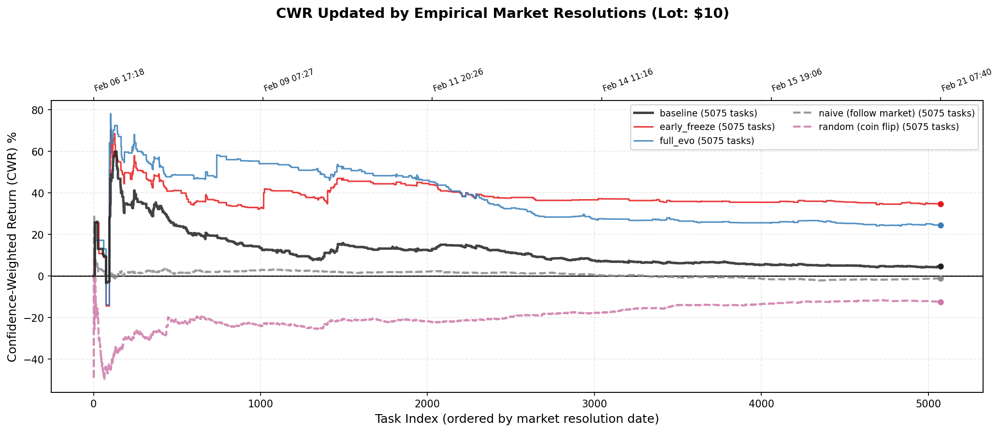
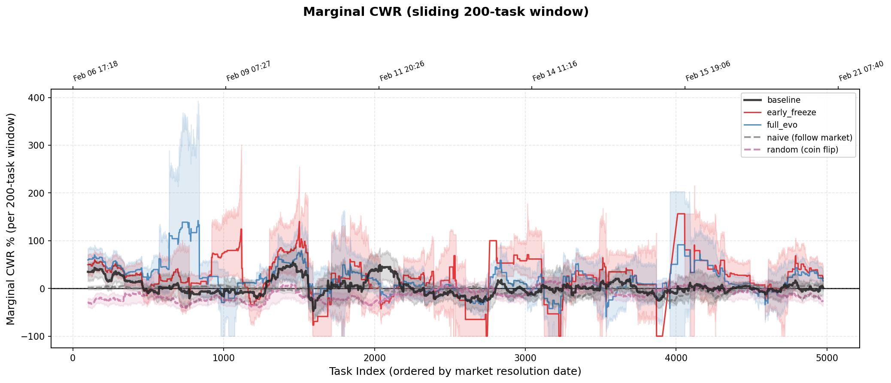

# A-Evolve-V2 PolyBench Experiment Report

Auto-generated from `results` (3 experiments).

Baseline: `polybench_baseline`

---

## Experiment Summary

| Metric | baseline | early_freeze | full_evo |
| --- | ---: | ---: | ---: |
| Total tasks | 5075 | 5075 | 5075 |
| Gated (conf < 0.6) | 3827 | 4467 | 4116 |
| Agent SKIPs | 97 | 236 | 496 |
| Traded | 1150 | 370 | 462 |
| Correct | 782 | 295 | 361 |
| Accuracy | 68.0% | 79.7% | 78.1% |
| Avg confidence | 0.759 | 0.860 | 0.849 |
| CWR Return | +4.6% | +34.7% | +24.4% |
| CWR invested | $8676.82 | $3181.70 | $3910.19 |
| CWR profit | $+395.83 | $+1103.30 | $+955.37 |
| Non-CWR Return | -0.4% | +30.4% | +20.1% |
| Avg APY | +10% | +80% | +59% |
| Avg turns | 3.4 | 1.5 | 2.3 |
| Avg elapsed (s) | 65.3 | 30.1 | 40.7 |
| Avg input tokens | 32.5K | 61.7K | 120.7K |
| Avg output tokens | 4.0K | 1.7K | 2.3K |
| Evo cycles | 0 | 21 | 20 |
| Mutated | 0 | 20 | 20 |
| Evo time (s) | - | 9039 | 8301 |
| Skills | 1 | 14 | 31 |
| Tools | 0 | 4 | 3 |
| Memories | 0 | 35 | 17 |
| Prompt (chars) | 2315 | 22394 | 20998 |

## Table 1: Experiment Overview

| Experiment | Tasks | Traded | Acc | F1 | CWR% | Sharpe | Gated | Skills | Tools | Memos | EvoCyc | Mutated |
| --- | ---: | ---: | ---: | ---: | ---: | ---: | ---: | ---: | ---: | ---: | ---: | ---: |
| baseline | 5075 | 1150 | 68.0% | 0.810 | +4.6% | 0.05 | 3827 | 1 | 0 | 0 | 0 | 0 |
| early_freeze | 5075 | 370 | 79.7% | 0.887 | +34.7% | 0.23 | 4467 | 14 | 4 | 35 | 21 | 20 |
| full_evo | 5075 | 462 | 78.1% | 0.877 | +24.4% | 0.20 | 4116 | 31 | 3 | 17 | 20 | 20 |

## Table 2: Official PolyBench Metrics

Matches `evaluate_mimo.py`: Accuracy, F1, ECE, Non-CWR Return, CWR Return, Avg APY, Sharpe Ratio.

| Experiment | N | Accuracy | F1 | ECE | AvgConf | NonCWR% | CWR% | AvgAPY | Sharpe |
| --- | ---: | ---: | ---: | ---: | ---: | ---: | ---: | ---: | ---: |
| baseline | 1150 | 68.0% | 0.810 | 0.084 | 0.759 | -0.4% | +4.6% | +1016.2% | 0.05 |
| early_freeze | 370 | 79.7% | 0.887 | 0.073 | 0.860 | +30.4% | +34.7% | +7998.9% | 0.23 |
| full_evo | 462 | 78.1% | 0.877 | 0.074 | 0.849 | +20.1% | +24.4% | +5855.6% | 0.20 |

## Table 3: Fair Comparison (common 5075 tasks)

| Experiment | Acc | F1 | CWR% | Sharpe | Δ Acc | Δ CWR% |
| --- | ---: | ---: | ---: | ---: | ---: | ---: |
| baseline | 68.0% | 0.810 | +4.6% | 0.05 | - | - |
| early_freeze | 79.7% | 0.887 | +34.7% | 0.23 | +11.7% | +30.1% |
| full_evo | 78.1% | 0.877 | +24.4% | 0.20 | +10.1% | +19.9% |

## Table 4: Task-Level Agreement vs `polybench_baseline` (5075 common)

| Experiment | Agree | Improve | Regress | Net |
| --- | ---: | ---: | ---: | ---: |
| early_freeze | 4466 | 61 | 548 | -487 |
| full_evo | 4506 | 74 | 495 | -421 |

## Table 5: Cycle-1 Consistency Check (pre-evolution, 100 common tasks)

Before any evolution, all experiments using the same solver model should produce similar results. Differences come from LLM non-determinism and seed workspace config (baseline skips skills).

| Experiment | C1 Tasks | C1 Pass | C1 Rate | Common Pass | Common Rate | BatchSize |
| --- | ---: | ---: | ---: | ---: | ---: | ---: |
| baseline | 151 | 31 | 21% | 9 | 9% | 100 |
| early_freeze | 100 | 5 | 5% | 5 | 5% | 100 |
| full_evo | 100 | 5 | 5% | 5 | 5% | 100 |

### Task-level detail (common cycle-1 tasks)

| Task | baseline | early_free | full_evo |
| --- | ---: | ---: | ---: |
| `117916_996327_1522` | 0.00 | 0.00 | 0.00 |
| `133689_1068318_1908` | 0.00 | 0.00 | 0.00 |
| `133689_1068319_1609` | 0.00 | 0.00 | 0.00 |
| `133689_1068320_2861` | 0.00 | 0.00 | 0.00 |
| `133689_1068321_3252` | 0.00 | 0.00 | 0.00 |
| `133689_1228590_2213` | 0.00 | 0.00 | 0.00 |
| `133689_1343060_3532` | 0.00 | 0.00 | 0.00 |
| `153917_1145494_2696` | 0.00 | 0.00 | 0.00 |
| `153918_1145497_3694` | 0.00 | 0.00 | 0.00 |
| `184879_1255894_2763` | 1.00 | 1.00 | 1.00 |
| `185050_1256544_3529` | 0.00 | 0.00 | 0.00 |
| `189994_1275210_418` | 0.00 | 0.00 | 0.00 |
| `189994_1275211_538` | 0.00 | 0.00 | 0.00 |
| `189994_1275213_525` | 0.00 | 0.00 | 0.00 |
| `189994_1275214_613` | 0.00 | 0.00 | 0.00 |
| `189994_1275215_734` | 0.00 | 0.00 | 0.00 |
| `189994_1275216_711` | 0.00 | 0.00 | 0.00 |
| `189994_1275217_776` | 0.00 | 0.00 | 0.00 |
| `189994_1275218_965` | 0.00 | 0.00 | 0.00 |
| `189994_1275219_962` | 0.00 | 0.00 | 0.00 |
| `189994_1275222_1358` | 0.00 | 0.00 | 0.00 |
| `189994_1275224_1250` | 0.00 | 0.00 | 0.00 |
| `189994_1275226_1457` | 0.00 | 0.00 | 0.00 |
| `189994_1275227_1721` | 0.00 | 0.00 | 0.00 |
| `189994_1275228_1749` | 0.00 | 0.00 | 0.00 |
| `189994_1275229_1834` | 0.00 | 0.00 | 0.00 |
| `189994_1275230_2041` | 0.00 | 0.00 | 0.00 |
| `189994_1275231_2207` | 0.00 | 0.00 | 0.00 |
| `189994_1275232_2154` | 0.00 | 0.00 | 0.00 |
| `189994_1275234_2120` | 0.00 | 0.00 | 0.00 |
| `189994_1275236_2192` | 0.00 | 0.00 | 0.00 |
| `189994_1275239_2223` | 0.00 | 0.00 | 0.00 |
| `189994_1275240_1878` | 0.00 | 0.00 | 0.00 |
| `190420_1277629_1292` | 0.00 | 0.00 | 0.00 |
| `190463_1277937_2607` | 0.00 | 0.00 | 0.00 |
| `191754_1285674_697` | 0.00 | 0.00 | 0.00 |
| `193643_1299318_912` | 0.00 | 0.00 | 0.00 |
| `193706_1299668_1299` | 0.00 | 0.00 | 0.00 |
| `193706_1299671_1755` | 0.00 | 0.00 | 0.00 |
| `193706_1299674_1738` | 0.00 | 0.00 | 0.00 |
| `193706_1299677_2831` | 0.00 | 0.00 | 0.00 |
| `193706_1299680_2257` | 0.00 | 0.00 | 0.00 |
| `193706_1299685_1642` | 0.00 | 0.00 | 0.00 |
| `193707_1299665_1568` | 1.00 | 0.00 | 0.00 |
| `193707_1299667_1500` | 0.00 | 0.00 | 0.00 |
| `193707_1299669_2810` | 0.00 | 0.00 | 0.00 |
| `193707_1299672_2304` | 0.00 | 0.00 | 0.00 |
| `193707_1299675_1861` | 0.00 | 1.00 | 0.00 |
| `193707_1299690_3098` | 0.00 | 0.00 | 0.00 |
| `193707_1299691_2741` | 0.00 | 0.00 | 0.00 |
| `193714_1299698_2984` | 0.00 | 0.00 | 0.00 |
| `193714_1299700_3164` | 0.00 | 0.00 | 0.00 |
| `193714_1299701_3019` | 0.00 | 0.00 | 0.00 |
| `193714_1299704_3200` | 0.00 | 0.00 | 0.00 |
| `193714_1299714_2982` | 0.00 | 0.00 | 0.00 |
| `193714_1299720_2063` | 0.00 | 0.00 | 0.00 |
| `193714_1299723_1997` | 0.00 | 0.00 | 0.00 |
| `193717_1299706_563` | 1.00 | 0.00 | 0.00 |
| `193717_1299709_527` | 0.00 | 0.00 | 0.00 |
| `193717_1299712_576` | 0.00 | 0.00 | 0.00 |
| `193717_1299715_839` | 0.00 | 0.00 | 0.00 |
| `193717_1299721_1611` | 0.00 | 0.00 | 0.00 |
| `193717_1299728_2280` | 0.00 | 0.00 | 0.00 |
| `193717_1299729_2000` | 0.00 | 0.00 | 0.00 |
| `193718_1299734_3299` | 0.00 | 0.00 | 0.00 |
| `193718_1299735_2676` | 0.00 | 0.00 | 0.00 |
| `193719_1299736_1644` | 0.00 | 0.00 | 0.00 |
| `193719_1299738_1831` | 0.00 | 0.00 | 0.00 |
| `193719_1299740_2030` | 0.00 | 0.00 | 0.00 |
| `193719_1299742_1756` | 0.00 | 0.00 | 0.00 |
| `193719_1299747_2219` | 0.00 | 0.00 | 0.00 |
| `193720_1299760_1863` | 0.00 | 0.00 | 0.00 |
| `193721_1299759_2115` | 0.00 | 0.00 | 0.00 |
| `193721_1299761_2031` | 1.00 | 0.00 | 0.00 |
| `193721_1299764_2646` | 0.00 | 0.00 | 0.00 |
| `193721_1299771_2686` | 0.00 | 0.00 | 0.00 |
| `193923_1301554_2966` | 0.00 | 0.00 | 0.00 |
| `193923_1301577_3585` | 0.00 | 0.00 | 0.00 |
| `193942_1301680_3582` | 0.00 | 0.00 | 0.00 |
| `193944_1301691_3409` | 0.00 | 0.00 | 0.00 |
| `193944_1301713_3688` | 0.00 | 0.00 | 0.00 |
| `193976_1301879_3481` | 1.00 | 0.00 | 0.00 |
| `193990_1301963_3500` | 0.00 | 0.00 | 0.00 |
| `193995_1301990_3803` | 0.00 | 0.00 | 0.00 |
| `194167_1304193_975` | 0.00 | 0.00 | 0.00 |
| `195421_1313203_920` | 0.00 | 0.00 | 0.00 |
| `196814_1320792_827` | 0.00 | 0.00 | 0.00 |
| `197782_1328040_1361` | 0.00 | 0.00 | 0.00 |
| `197825_1328693_2891` | 0.00 | 0.00 | 0.00 |
| `197825_1328699_1517` | 1.00 | 1.00 | 1.00 |
| `197919_1329813_655` | 0.00 | 0.00 | 1.00 |
| `197919_1329816_1553` | 0.00 | 0.00 | 0.00 |
| `197920_1329818_2124` | 0.00 | 0.00 | 0.00 |
| `197920_1329819_1613` | 0.00 | 0.00 | 0.00 |
| `198278_1332485_2832` | 0.00 | 0.00 | 0.00 |
| `198554_1334198_625` | 1.00 | 1.00 | 1.00 |
| `198559_1334223_1303` | 1.00 | 0.00 | 0.00 |
| `198636_1334968_1377` | 0.00 | 0.00 | 0.00 |
| `79048_676801_1331` | 0.00 | 0.00 | 0.00 |
| `79229_677405_543` | 1.00 | 1.00 | 1.00 |

**Agreement**: 93/100 tasks have identical pass/fail across all experiments. 7 task(s) diverge due to LLM non-determinism (borderline confidence near 0.6 gate).

## Table 6: Batch-Level Score Progression

### baseline
| Batch | Tasks | Acc | CWR% | NonCWR% | Mutated |
| ---: | ---: | ---: | ---: | ---: | ---: |
| 1 | 151 | 91% | +46.8% | +46.7% | skip |
| 2 | 100 | 72% | +30.4% | +19.1% | skip |
| 3 | 100 | 70% | -6.3% | -10.1% | skip |
| 4 | 100 | 84% | +23.7% | +20.3% | skip |
| 5 | 100 | 64% | -15.7% | -18.3% | skip |
| 6 | 100 | 62% | -4.3% | -10.5% | skip |
| 7 | 100 | 47% | +5.1% | -9.3% | skip |
| 8 | 100 | 73% | -19.8% | -22.1% | skip |
| 9 | 100 | 83% | +2.5% | -0.5% | skip |
| 10 | 100 | 67% | -23.2% | -25.6% | skip |
| 11 | 100 | 67% | +7.5% | +4.8% | skip |
| 12 | 100 | 62% | -24.7% | -29.4% | skip |
| 13 | 100 | 67% | -3.6% | -4.5% | skip |
| 14 | 100 | 72% | +39.7% | +30.8% | skip |
| 15 | 100 | 63% | +61.1% | +50.0% | skip |
| 16 | 100 | 55% | -37.8% | -42.0% | skip |
| 17 | 100 | 75% | +18.1% | +22.0% | skip |
| 18 | 100 | 44% | +1.3% | -5.5% | skip |
| 19 | 100 | 58% | +6.0% | -3.4% | skip |
| 20 | 100 | 83% | +31.8% | +29.8% | skip |
| 21 | 100 | 94% | +55.2% | +49.4% | skip |
| 22 | 100 | 67% | +10.7% | +1.6% | skip |
| 23 | 100 | 48% | -10.4% | -21.0% | skip |
| 24 | 100 | 66% | -15.8% | -19.0% | skip |
| 25 | 100 | 67% | -13.7% | -19.2% | skip |
| 26 | 100 | 53% | -17.9% | -21.8% | skip |
| 27 | 100 | 45% | -19.7% | -20.3% | skip |
| 28 | 100 | 53% | -26.6% | -30.1% | skip |
| 29 | 100 | 81% | +31.5% | +30.8% | skip |
| 30 | 100 | 60% | -19.1% | -20.6% | skip |
| 31 | 100 | 68% | -2.5% | -5.5% | skip |
| 32 | 100 | 53% | +4.3% | +9.8% | skip |
| 33 | 100 | 70% | +6.2% | +3.5% | skip |
| 34 | 100 | 55% | +7.0% | -2.9% | skip |
| 35 | 100 | 67% | -13.9% | -15.8% | skip |
| 36 | 100 | 70% | +18.9% | +18.9% | skip |
| 37 | 100 | 74% | -3.3% | -5.0% | skip |
| 38 | 100 | 63% | -10.7% | -13.3% | skip |
| 39 | 100 | 71% | -7.3% | -8.9% | skip |
| 40 | 100 | 63% | -3.4% | -4.5% | skip |
| 41 | 100 | 47% | -12.1% | -17.7% | skip |
| 42 | 100 | 63% | +21.5% | +10.0% | skip |
| 43 | 100 | 46% | -37.0% | -39.8% | skip |
| 44 | 100 | 85% | +4.7% | +1.6% | skip |
| 45 | 100 | 92% | +4.3% | +4.1% | skip |
| 46 | 100 | 62% | -17.8% | -21.0% | skip |
| 47 | 100 | 75% | +6.7% | +3.2% | skip |
| 48 | 100 | 76% | +9.7% | +7.3% | skip |
| 49 | 100 | 68% | -14.7% | -18.7% | skip |
| 50 | 100 | 74% | +0.9% | -4.4% | skip |
| 51 | 24 | 78% | +50.4% | +48.2% | skip |

### early_freeze
| Batch | Tasks | Acc | CWR% | NonCWR% | Mutated |
| ---: | ---: | ---: | ---: | ---: | ---: |
| 1 | 100 | 83% | +48.2% | +47.4% | Y |
| 2 | 100 | 85% | +50.0% | +42.1% | N |
| 3 | 100 | 86% | +49.7% | +43.3% | Y |
| 4 | 100 | 80% | +36.7% | +32.5% | Y |
| 5 | 100 | 86% | +14.3% | +10.1% | Y |
| 6 | 100 | 38% | -53.8% | -53.7% | Y |
| 7 | 100 | 82% | +59.5% | +53.8% | Y |
| 8 | 100 | 60% | -24.4% | -29.6% | Y |
| 9 | 100 | 100% | +26.8% | +26.0% | Y |
| 10 | 100 | 88% | +22.0% | +17.6% | Y |
| 11 | 100 | 100% | +94.6% | +91.9% | Y |
| 12 | 100 | 50% | -39.8% | -40.8% | Y |
| 13 | 100 | 50% | -32.5% | -41.5% | Y |
| 14 | 100 | 83% | +15.8% | +17.6% | Y |
| 15 | 100 | 86% | +137.7% | +137.6% | Y |
| 16 | 100 | 0% | -100.0% | -100.0% | Y |
| 17 | 100 | 33% | -58.8% | -59.5% | Y |
| 18 | 100 | 100% | +68.5% | +68.3% | Y |
| 19 | 100 | 40% | +11.8% | +4.0% | Y |
| 20 | 100 | 86% | +69.4% | +56.4% | Y |
| 21 | 100 | 38% | -58.1% | -55.6% | Y |
| 22 | 100 | 88% | +5.9% | +4.1% | skip |
| 23 | 100 | 73% | +34.5% | +30.8% | skip |
| 24 | 100 | 57% | -30.4% | -29.4% | skip |
| 25 | 100 | 67% | +13.4% | +12.9% | skip |
| 26 | 100 | 100% | +112.8% | +112.8% | skip |
| 27 | 100 | 25% | -64.9% | -69.5% | skip |
| 28 | 100 | 0% | +0.0% | +0.0% | skip |
| 29 | 100 | 100% | +100.0% | +100.0% | skip |
| 30 | 100 | 100% | +42.0% | +41.9% | skip |
| 31 | 100 | 100% | +70.7% | +70.8% | skip |
| 32 | 100 | 100% | +23.5% | +23.5% | skip |
| 33 | 100 | 0% | -100.0% | -100.0% | skip |
| 34 | 100 | 80% | +22.7% | +18.2% | skip |
| 35 | 100 | 60% | +39.3% | +28.9% | skip |
| 36 | 100 | 0% | +0.0% | +0.0% | skip |
| 37 | 100 | 100% | +34.7% | +34.3% | skip |
| 38 | 100 | 100% | +44.7% | +41.3% | skip |
| 39 | 100 | 0% | -100.0% | -100.0% | skip |
| 40 | 100 | 0% | +0.0% | +0.0% | skip |
| 41 | 100 | 0% | +0.0% | +0.0% | skip |
| 42 | 100 | 67% | +33.3% | +20.2% | skip |
| 43 | 100 | 75% | +76.8% | +64.2% | skip |
| 44 | 100 | 100% | +48.3% | +47.8% | skip |
| 45 | 100 | 100% | +13.2% | +12.7% | skip |
| 46 | 100 | 100% | +7.4% | +7.5% | skip |
| 47 | 100 | 33% | -53.1% | -53.1% | skip |
| 48 | 100 | 67% | +57.2% | +39.6% | skip |
| 49 | 100 | 89% | +51.1% | +51.7% | skip |
| 50 | 100 | 93% | +30.2% | +27.7% | skip |
| 51 | 75 | 100% | +11.9% | +12.1% | skip |

### full_evo
| Batch | Tasks | Acc | CWR% | NonCWR% | Mutated |
| ---: | ---: | ---: | ---: | ---: | ---: |
| 1 | 100 | 83% | +58.4% | +48.9% | Y |
| 2 | 100 | 92% | +59.8% | +55.1% | Y |
| 3 | 100 | 89% | +56.1% | +50.6% | Y |
| 4 | 100 | 86% | +41.1% | +37.4% | Y |
| 5 | 100 | 93% | +26.7% | +27.4% | Y |
| 6 | 100 | 100% | +20.5% | +20.5% | Y |
| 7 | 100 | 80% | +47.6% | +43.6% | Y |
| 8 | 100 | 83% | +176.3% | +175.1% | Y |
| 9 | 100 | 100% | +43.9% | +44.4% | Y |
| 10 | 100 | 50% | -29.6% | -29.6% | Y |
| 11 | 100 | 0% | +0.0% | +0.0% | Y |
| 12 | 100 | 100% | +11.3% | +12.0% | Y |
| 13 | 100 | 100% | +12.7% | +13.4% | Y |
| 14 | 100 | 79% | +17.5% | +19.2% | Y |
| 15 | 100 | 74% | +80.8% | +78.5% | Y |
| 16 | 100 | 50% | +10.8% | +13.6% | Y |
| 17 | 100 | 62% | -17.4% | -17.3% | Y |
| 18 | 100 | 100% | +68.5% | +68.3% | Y |
| 19 | 100 | 40% | +44.5% | +24.5% | Y |
| 20 | 100 | 88% | +29.7% | +25.6% | Y |
| 21 | 100 | 57% | -25.2% | -27.8% | skip |
| 22 | 100 | 73% | -15.9% | -15.4% | skip |
| 23 | 100 | 73% | +29.2% | +24.9% | skip |
| 24 | 100 | 44% | -41.5% | -42.7% | skip |
| 25 | 100 | 85% | +7.5% | +7.4% | skip |
| 26 | 100 | 83% | +0.3% | -3.6% | skip |
| 27 | 100 | 46% | -35.0% | -40.1% | skip |
| 28 | 100 | 75% | +2.9% | +2.0% | skip |
| 29 | 100 | 100% | +50.9% | +51.1% | skip |
| 30 | 100 | 54% | -3.0% | -5.6% | skip |
| 31 | 100 | 90% | +24.7% | +22.0% | skip |
| 32 | 100 | 100% | +23.5% | +23.5% | skip |
| 33 | 100 | 33% | -51.7% | -51.7% | skip |
| 34 | 100 | 82% | +29.6% | +27.0% | skip |
| 35 | 100 | 67% | +31.6% | +27.6% | skip |
| 36 | 100 | 0% | -100.0% | -100.0% | skip |
| 37 | 100 | 83% | +16.9% | +11.9% | skip |
| 38 | 100 | 100% | +45.4% | +41.3% | skip |
| 39 | 100 | 75% | -18.6% | -16.8% | skip |
| 40 | 100 | 0% | +0.0% | +0.0% | skip |
| 41 | 100 | 50% | +50.5% | +51.5% | skip |
| 42 | 100 | 67% | +28.4% | +19.3% | skip |
| 43 | 100 | 100% | +95.1% | +90.5% | skip |
| 44 | 100 | 91% | +20.9% | +18.9% | skip |
| 45 | 100 | 87% | -3.0% | -5.8% | skip |
| 46 | 100 | 83% | +1.3% | -9.2% | skip |
| 47 | 100 | 25% | -64.2% | -64.8% | skip |
| 48 | 100 | 86% | +38.1% | +31.7% | skip |
| 49 | 100 | 91% | +46.0% | +42.6% | skip |
| 50 | 100 | 93% | +29.2% | +27.9% | skip |
| 51 | 75 | 67% | -28.7% | -27.5% | skip |

## Table 7: Artifact Growth Over Evolution (C1: Context Saturation)

### early_freeze
| Cycle | Score | Skills | Tools | Memos | Prompt | Mutated |
| ---: | ---: | ---: | ---: | ---: | ---: | ---: |
| 1 | 0.05 | 4 | 2 | 10 | 5094c | True |
| 2 | 0.23 | 4 | 2 | 10 | 5094c | False |
| 3 | 0.19 | 5 | 3 | 14 | 5969c | True |
| 4 | 0.16 | 5 | 3 | 14 | 7192c | True |
| 5 | 0.12 | 5 | 3 | 16 | 8512c | True |
| 6 | 0.03 | 5 | 3 | 17 | 9647c | True |
| 7 | 0.09 | 6 | 3 | 19 | 10808c | True |
| 8 | 0.03 | 7 | 3 | 22 | 12276c | True |
| 9 | 0.12 | 7 | 3 | 25 | 13232c | True |
| 10 | 0.07 | 7 | 3 | 26 | 15013c | True |
| 11 | 0.21 | 7 | 3 | 31 | 17767c | True |
| 12 | 0.01 | 7 | 3 | 32 | 19502c | True |
| 13 | 0.03 | 8 | 4 | 36 | 20982c | True |
| 14 | 0.20 | 9 | 4 | 41 | 23362c | True |
| 15 | 0.19 | 11 | 4 | 20 | 12019c | True |
| 16 | 0.00 | 13 | 4 | 25 | 13725c | True |
| 17 | 0.01 | 13 | 4 | 30 | 15556c | True |
| 18 | 0.01 | 13 | 4 | 30 | 16647c | True |
| 19 | 0.02 | 13 | 4 | 33 | 18521c | True |
| 20 | 0.06 | 14 | 4 | 36 | 20689c | True |
| 21 | 0.03 | 14 | 4 | 35 | 22267c | True |
| 22 | 0.07 | 14 | 4 | 35 | 22267c | False |
| 23 | 0.16 | 14 | 4 | 35 | 22267c | False |
| 24 | 0.04 | 14 | 4 | 35 | 22267c | False |
| 25 | 0.02 | 14 | 4 | 35 | 22267c | False |
| 26 | 0.01 | 14 | 4 | 35 | 22267c | False |
| 27 | 0.01 | 14 | 4 | 35 | 22267c | False |
| 28 | 0.00 | 14 | 4 | 35 | 22267c | False |
| 29 | 0.01 | 14 | 4 | 35 | 22267c | False |
| 30 | 0.03 | 14 | 4 | 35 | 22267c | False |
| 31 | 0.04 | 14 | 4 | 35 | 22267c | False |
| 32 | 0.01 | 14 | 4 | 35 | 22267c | False |
| 33 | 0.00 | 14 | 4 | 35 | 22267c | False |
| 34 | 0.08 | 14 | 4 | 35 | 22267c | False |
| 35 | 0.03 | 14 | 4 | 35 | 22267c | False |
| 36 | 0.00 | 14 | 4 | 35 | 22267c | False |
| 37 | 0.05 | 14 | 4 | 35 | 22267c | False |
| 38 | 0.03 | 14 | 4 | 35 | 22267c | False |
| 39 | 0.00 | 14 | 4 | 35 | 22267c | False |
| 40 | 0.00 | 14 | 4 | 35 | 22267c | False |
| 41 | 0.00 | 14 | 4 | 35 | 22267c | False |
| 42 | 0.02 | 14 | 4 | 35 | 22267c | False |
| 43 | 0.03 | 14 | 4 | 35 | 22267c | False |
| 44 | 0.06 | 14 | 4 | 35 | 22267c | False |
| 45 | 0.08 | 14 | 4 | 35 | 22267c | False |
| 46 | 0.05 | 14 | 4 | 35 | 22267c | False |
| 47 | 0.01 | 14 | 4 | 35 | 22267c | False |
| 48 | 0.02 | 14 | 4 | 35 | 22267c | False |
| 49 | 0.08 | 14 | 4 | 35 | 22267c | False |
| 50 | 0.13 | 14 | 4 | 35 | 22267c | False |
| 51 | 0.03 | 14 | 4 | 35 | 22267c | False |

### full_evo
| Cycle | Score | Skills | Tools | Memos | Prompt | Mutated |
| ---: | ---: | ---: | ---: | ---: | ---: | ---: |
| 1 | 0.05 | 4 | 1 | 10 | 5417c | True |
| 2 | 0.23 | 5 | 1 | 16 | 7264c | True |
| 3 | 0.17 | 6 | 1 | 20 | 8299c | True |
| 4 | 0.18 | 7 | 1 | 18 | 10129c | True |
| 5 | 0.14 | 8 | 1 | 15 | 11809c | True |
| 6 | 0.01 | 9 | 1 | 18 | 13459c | True |
| 7 | 0.08 | 11 | 1 | 22 | 14720c | True |
| 8 | 0.05 | 12 | 1 | 13 | 16589c | True |
| 9 | 0.05 | 14 | 1 | 16 | 19210c | True |
| 10 | 0.01 | 15 | 1 | 21 | 19964c | True |
| 11 | 0.00 | 16 | 1 | 21 | 23387c | True |
| 12 | 0.05 | 19 | 1 | 29 | 25073c | True |
| 13 | 0.04 | 21 | 1 | 34 | 27668c | True |
| 14 | 0.11 | 24 | 1 | 33 | 29883c | True |
| 15 | 0.14 | 25 | 2 | 15 | 31441c | True |
| 16 | 0.01 | 27 | 2 | 19 | 34678c | True |
| 17 | 0.05 | 28 | 3 | 21 | 37915c | True |
| 18 | 0.01 | 29 | 3 | 24 | 35111c | True |
| 19 | 0.02 | 29 | 3 | 14 | 19076c | True |
| 20 | 0.22 | 31 | 3 | 17 | 20808c | True |
| 21 | 0.04 | 31 | 3 | 17 | 20808c | False |
| 22 | 0.11 | 31 | 3 | 17 | 20808c | False |
| 23 | 0.19 | 31 | 3 | 17 | 20808c | False |
| 24 | 0.07 | 31 | 3 | 17 | 20808c | False |
| 25 | 0.17 | 31 | 3 | 17 | 20808c | False |
| 26 | 0.10 | 31 | 3 | 17 | 20808c | False |
| 27 | 0.06 | 31 | 3 | 17 | 20808c | False |
| 28 | 0.03 | 31 | 3 | 17 | 20808c | False |
| 29 | 0.05 | 31 | 3 | 17 | 20808c | False |
| 30 | 0.07 | 31 | 3 | 17 | 20808c | False |
| 31 | 0.09 | 31 | 3 | 17 | 20808c | False |
| 32 | 0.01 | 31 | 3 | 17 | 20808c | False |
| 33 | 0.01 | 31 | 3 | 17 | 20808c | False |
| 34 | 0.09 | 31 | 3 | 17 | 20808c | False |
| 35 | 0.06 | 31 | 3 | 17 | 20808c | False |
| 36 | 0.00 | 31 | 3 | 17 | 20808c | False |
| 37 | 0.05 | 31 | 3 | 17 | 20808c | False |
| 38 | 0.03 | 31 | 3 | 17 | 20808c | False |
| 39 | 0.03 | 31 | 3 | 17 | 20808c | False |
| 40 | 0.00 | 31 | 3 | 17 | 20808c | False |
| 41 | 0.01 | 31 | 3 | 17 | 20808c | False |
| 42 | 0.04 | 31 | 3 | 17 | 20808c | False |
| 43 | 0.05 | 31 | 3 | 17 | 20808c | False |
| 44 | 0.10 | 31 | 3 | 17 | 20808c | False |
| 45 | 0.13 | 31 | 3 | 17 | 20808c | False |
| 46 | 0.05 | 31 | 3 | 17 | 20808c | False |
| 47 | 0.01 | 31 | 3 | 17 | 20808c | False |
| 48 | 0.06 | 31 | 3 | 17 | 20808c | False |
| 49 | 0.10 | 31 | 3 | 17 | 20808c | False |
| 50 | 0.14 | 31 | 3 | 17 | 20808c | False |
| 51 | 0.05 | 31 | 3 | 17 | 20808c | False |

## Table 8: Confidence Calibration

| Experiment | Avg Conf (correct) | Avg Conf (wrong) | High Conf (≥0.8) Acc | Low Conf (<0.7) Acc | Overconfident% |
| --- | ---: | ---: | ---: | ---: | ---: |
| baseline | 0.801 | 0.694 | 84.6% | 45.6% | 6.3% |
| early_freeze | 0.883 | 0.843 | 55.4% | 24.4% | 54.3% |
| full_evo | 0.870 | 0.840 | 39.5% | 3.9% | 84.2% |

## Table 9: Task-Level Changes vs `polybench_baseline`

### early_freeze: 548 regressions, 61 improvements

| Instance | Dir | BL Side | BL Conf | Evo Side | Evo Conf | Winning | BL Score | Evo Score |
| --- | --- | ---: | ---: | ---: | ---: | ---: | ---: | ---: |
| `100300_897780_3244` | REGRESS | NO | 0.99 |  | 0.50 | No | 1.00 | 0.00 |
| `100300_897785_3223` | REGRESS | NO | 0.97 |  | 0.55 | No | 1.00 | 0.00 |
| `100352_898180_14778` | REGRESS | NO | 0.97 |  | 0.50 | No | 1.00 | 0.00 |
| `100353_898196_14466` | REGRESS | NO | 0.95 |  | 0.55 | No | 1.00 | 0.00 |
| `100353_898198_17105` | REGRESS | NO | 0.97 |  | 0.50 | No | 1.00 | 0.00 |
| `100353_898199_17079` | REGRESS | NO | 0.97 |  | 0.50 | No | 1.00 | 0.00 |
| `100353_898200_16213` | REGRESS | NO | 0.97 |  | 0.55 | No | 1.00 | 0.00 |
| `103635_1272010_5372` | REGRESS | YES | 0.67 |  | 0.55 | Yes | 1.00 | 0.00 |
| `103635_1272011_7787` | REGRESS | YES | 0.72 |  | 0.55 | Yes | 1.00 | 0.00 |
| `108178_957296_17209` | REGRESS | NO | 0.90 |  | 0.50 | No | 1.00 | 0.00 |
| `108178_957297_17208` | REGRESS | NO | 0.82 |  | 0.50 | No | 1.00 | 0.00 |
| `108178_957301_16734` | REGRESS | NO | 0.75 |  | 0.50 | No | 1.00 | 0.00 |
| `108293_957643_9136` | REGRESS | NO | 0.92 |  | 0.50 | No | 1.00 | 0.00 |
| `110067_964808_5416` | REGRESS | NO | 0.78 |  | 0.50 | No | 1.00 | 0.00 |
| `111039_969645_2859` | REGRESS | NO | 0.68 |  | 0.50 | No | 1.00 | 0.00 |
| `114242_1273609_309` | REGRESS | NO | 0.88 |  | 0.50 | No | 1.00 | 0.00 |
| `114242_1273610_190` | REGRESS | NO | 0.70 |  | 0.55 | No | 1.00 | 0.00 |
| `114242_1335518_778` | REGRESS | NO | 0.70 |  | 0.50 | No | 1.00 | 0.00 |
| `117984_996753_9248` | REGRESS | NO | 0.97 |  | 0.55 | No | 1.00 | 0.00 |
| `117984_996756_9256` | REGRESS | NO | 0.92 |  | 0.55 | No | 1.00 | 0.00 |
| `121900_1013525_681` | REGRESS | YES | 0.70 |  | 0.50 | Yes | 1.00 | 0.00 |
| `121900_1013526_714` | REGRESS | YES | 0.65 |  | 0.55 | Yes | 1.00 | 0.00 |
| `123209_1019689_8371` | REGRESS | EAST TENNESSEE STATE BUCCANEERS | 0.65 |  | 0.50 | East Tennessee State Buccaneers | 1.00 | 0.00 |
| `131077_1099985_14011` | REGRESS | OVER | 0.97 |  | 0.50 | Over | 1.00 | 0.00 |
| `131103_1057782_13379` | REGRESS | ARKANSAS-PINE BLUFF GOLDEN LIONS | 0.95 |  | 0.50 | Arkansas-Pine Bluff Golden Lions | 1.00 | 0.00 |
| `131132_1105810_15275` | REGRESS | UNDER | 0.97 |  | 0.97 | Under | 1.00 | 0.00 |
| `131141_1057820_13715` | REGRESS | CAMPBELL FIGHTING CAMELS | 0.97 |  | 0.50 | Campbell Fighting Camels | 1.00 | 0.00 |
| `131171_1057880_1679` | REGRESS | NO | 0.65 |  | 0.50 | No | 1.00 | 0.00 |
| `139497_1090144_11127` | REGRESS | NO | 0.82 |  | 0.50 | No | 1.00 | 0.00 |
| `147598_1123392_8707` | REGRESS | NO | 0.97 |  | 0.50 | No | 1.00 | 0.00 |
| `151953_1200889_526` | REGRESS | NO | 0.72 |  | 0.50 | No | 1.00 | 0.00 |
| `153683_1144341_3665` | REGRESS | NO | 0.95 |  | 0.50 | No | 1.00 | 0.00 |
| `153683_1144346_5374` | REGRESS | NO | 0.92 |  | 0.50 | No | 1.00 | 0.00 |
| `154064_1230789_4644` | REGRESS | YES | 0.62 |  | 0.50 | Yes | 1.00 | 0.00 |
| `157698_1160156_10046` | REGRESS | NO | 0.80 | YES | 0.75 | No | 1.00 | 0.00 |
| `157700_1160162_9750` | REGRESS | NO | 0.68 |  | 0.50 | No | 1.00 | 0.00 |
| `160070_1168506_16177` | REGRESS | YES | 0.75 |  | 0.50 | Yes | 1.00 | 0.00 |
| `160070_1168509_12688` | REGRESS | YES | 0.82 |  | 0.50 | Yes | 1.00 | 0.00 |
| `160070_1168510_16844` | REGRESS | YES | 0.85 |  | 0.50 | Yes | 1.00 | 0.00 |
| `160070_1168511_28162` | REGRESS | YES | 0.75 |  | 0.50 | Yes | 1.00 | 0.00 |
| `160070_1168513_5430` | REGRESS | YES | 0.92 |  | 0.50 | Yes | 1.00 | 0.00 |
| `160070_1168514_28163` | REGRESS | YES | 0.92 |  | 0.50 | Yes | 1.00 | 0.00 |
| `160070_1168516_18090` | REGRESS | YES | 0.88 |  | 0.50 | Yes | 1.00 | 0.00 |
| `160070_1168517_4281` | REGRESS | YES | 0.85 |  | 0.50 | Yes | 1.00 | 0.00 |
| `160077_1168551_13419` | REGRESS | YES | 0.85 |  | 0.50 | Yes | 1.00 | 0.00 |
| `160077_1168553_28166` | REGRESS | YES | 0.82 |  | 0.50 | Yes | 1.00 | 0.00 |
| `160077_1168555_28167` | REGRESS | YES | 0.72 |  | 0.50 | Yes | 1.00 | 0.00 |
| `160077_1168556_28165` | REGRESS | YES | 0.65 |  | 0.50 | Yes | 1.00 | 0.00 |
| `160077_1168557_28168` | REGRESS | NO | 0.68 |  | 0.50 | No | 1.00 | 0.00 |
| `160077_1168558_28169` | REGRESS | YES | 0.67 |  | 0.50 | Yes | 1.00 | 0.00 |
| `160077_1168560_5389` | REGRESS | NO | 0.67 |  | 0.50 | No | 1.00 | 0.00 |
| `160376_1170154_6673` | REGRESS | NO | 0.95 |  | 0.50 | No | 1.00 | 0.00 |
| `160376_1170157_9137` | REGRESS | NO | 0.92 |  | 0.50 | No | 1.00 | 0.00 |
| `160376_1170158_10406` | REGRESS | NO | 0.92 |  | 0.50 | No | 1.00 | 0.00 |
| `160376_1170161_5721` | REGRESS | NO | 0.92 |  | 0.55 | No | 1.00 | 0.00 |
| `160376_1170162_10272` | REGRESS | NO | 0.92 |  | 0.97 | No | 1.00 | 0.00 |
| `160376_1170165_5790` | REGRESS | NO | 0.95 |  | 0.50 | No | 1.00 | 0.00 |
| `160376_1170166_10580` | REGRESS | NO | 0.97 |  | 0.50 | No | 1.00 | 0.00 |
| `164433_1185094_13072` | REGRESS | NO | 0.63 |  | 0.50 | No | 1.00 | 0.00 |
| `164580_1185720_3206` | REGRESS | NO | 0.68 |  | 0.55 | No | 1.00 | 0.00 |
| `164580_1185721_3760` | REGRESS | NO | 0.63 |  | 0.50 | No | 1.00 | 0.00 |
| `165155_1187879_16129` | REGRESS | YES | 0.65 |  | 0.99 | Yes | 1.00 | 0.00 |
| `166099_1190781_13647` | REGRESS | NO | 0.92 |  | 0.50 | No | 1.00 | 0.00 |
| `166099_1190783_14042` | REGRESS | YES | 0.87 | NO | 0.91 | Yes | 1.00 | 0.00 |
| `166681_1194276_28432` | REGRESS | YES | 0.82 |  | 0.50 | Yes | 1.00 | 0.00 |
| `166829_1194764_7210` | REGRESS | NO | 0.63 |  | 0.50 | No | 1.00 | 0.00 |
| `166972_1195520_4761` | REGRESS | YES | 0.63 |  | 0.50 | Yes | 1.00 | 0.00 |
| `167528_1197055_17654` | REGRESS | NO | 0.85 |  | 0.95 | No | 1.00 | 0.00 |
| `168593_1199741_28521` | REGRESS | YES | 0.63 |  | 0.50 | Yes | 1.00 | 0.00 |
| `168594_1199745_28524` | REGRESS | NO | 0.62 |  | 0.50 | No | 1.00 | 0.00 |
| `168742_1200249_18189` | REGRESS | NO | 0.63 |  | 0.50 | No | 1.00 | 0.00 |
| `168779_1200499_16988` | REGRESS | YES | 0.63 |  | 0.50 | Yes | 1.00 | 0.00 |
| `168781_1200503_28531` | REGRESS | YES | 0.82 |  | 0.50 | Yes | 1.00 | 0.00 |
| `168866_1200868_28541` | REGRESS | YES | 0.62 |  | 0.50 | Yes | 1.00 | 0.00 |
| `169665_1204794_28550` | REGRESS | YES | 0.62 |  | 0.50 | Yes | 1.00 | 0.00 |
| `169665_1204795_6441` | REGRESS | NO | 0.72 |  | 0.50 | No | 1.00 | 0.00 |
| `169666_1204799_28553` | REGRESS | YES | 0.62 |  | 0.50 | Yes | 1.00 | 0.00 |
| `169667_1204801_17657` | REGRESS | NO | 0.88 |  | 0.95 | No | 1.00 | 0.00 |
| `170695_1208819_16497` | REGRESS | YES | 0.63 |  | 0.50 | Yes | 1.00 | 0.00 |
| `170695_1208821_17858` | REGRESS | NO | 0.63 |  | 0.50 | No | 1.00 | 0.00 |
| `170697_1208825_7727` | REGRESS | YES | 0.63 |  | 0.55 | Yes | 1.00 | 0.00 |
| `170697_1208827_9244` | REGRESS | NO | 0.63 |  | 0.50 | No | 1.00 | 0.00 |
| `170698_1208828_16742` | REGRESS | NO | 0.62 |  | 0.50 | No | 1.00 | 0.00 |
| `170805_1209322_28576` | REGRESS | NO | 0.63 |  | 0.70 | No | 1.00 | 0.00 |
| `170888_1209617_28585` | REGRESS | NO | 0.63 |  | 0.50 | No | 1.00 | 0.00 |
| `171478_1211381_28604` | REGRESS | NO | 0.62 |  | 0.50 | No | 1.00 | 0.00 |
| `171722_1212071_28620` | REGRESS | YES | 0.63 |  | 0.50 | Yes | 1.00 | 0.00 |
| `171722_1212073_28621` | REGRESS | NO | 0.63 |  | 0.50 | No | 1.00 | 0.00 |
| `171723_1212076_17403` | REGRESS | NO | 0.65 |  | 0.50 | No | 1.00 | 0.00 |
| `171727_1212091_17664` | REGRESS | YES | 0.63 |  | 0.50 | Yes | 1.00 | 0.00 |
| `171727_1212092_17412` | REGRESS | NO | 0.75 |  | 0.50 | No | 1.00 | 0.00 |
| `171727_1212093_17665` | REGRESS | NO | 0.65 |  | 0.50 | No | 1.00 | 0.00 |
| `171729_1212097_28630` | REGRESS | NO | 0.63 |  | 0.50 | No | 1.00 | 0.00 |
| `171729_1212098_17668` | REGRESS | NO | 0.88 |  | 0.50 | No | 1.00 | 0.00 |
| `172433_1213527_10195` | REGRESS | EAST TENNESSEE STATE BUCCANEERS | 0.95 |  | 0.50 | East Tennessee State Buccaneers | 1.00 | 0.00 |
| `172593_1213687_8106` | REGRESS | UTAH STATE AGGIES | 0.95 |  | 0.55 | Utah State Aggies | 1.00 | 0.00 |
| `172849_1214276_28651` | REGRESS | YES | 0.63 |  | 0.50 | Yes | 1.00 | 0.00 |
| `172850_1214279_18023` | REGRESS | YES | 0.70 |  | 0.50 | Yes | 1.00 | 0.00 |
| `172907_1214488_17313` | REGRESS | YES | 0.62 |  | 0.50 | Yes | 1.00 | 0.00 |
| `172908_1214490_28656` | REGRESS | NO | 0.63 |  | 0.50 | No | 1.00 | 0.00 |
| `172953_1214572_28664` | REGRESS | YES | 0.63 |  | 0.50 | Yes | 1.00 | 0.00 |
| `173103_1215040_6082` | REGRESS | NO | 0.68 |  | 0.50 | No | 1.00 | 0.00 |
| `173995_1218533_11189` | REGRESS | NO | 0.62 |  | 0.50 | No | 1.00 | 0.00 |
| `173995_1218534_28674` | REGRESS | NO | 0.75 |  | 0.50 | No | 1.00 | 0.00 |
| `173995_1218535_28675` | REGRESS | YES | 0.65 |  | 0.50 | Yes | 1.00 | 0.00 |
| `174593_1220224_9125` | REGRESS | BELMONT BRUINS | 0.97 |  | 0.50 | Belmont Bruins | 1.00 | 0.00 |
| `175107_1221921_17171` | REGRESS | NO | 0.67 |  | 0.50 | No | 1.00 | 0.00 |
| `177110_1228546_6379` | REGRESS | YES | 0.99 |  | 0.50 | Yes | 1.00 | 0.00 |
| `177110_1228547_8329` | REGRESS | NO | 0.97 |  | 0.50 | No | 1.00 | 0.00 |
| `177110_1228549_9000` | REGRESS | NO | 0.97 |  | 0.50 | No | 1.00 | 0.00 |
| `177149_1228646_28948` | REGRESS | YES | 0.62 |  | 0.50 | Yes | 1.00 | 0.00 |
| `177149_1228648_28950` | REGRESS | NO | 0.63 |  | 0.50 | No | 1.00 | 0.00 |
| `177154_1228663_17902` | REGRESS | NO | 0.62 |  | 0.50 | No | 1.00 | 0.00 |
| `177267_1229316_29021` | REGRESS | NO | 0.92 |  | 0.50 | No | 1.00 | 0.00 |
| `177267_1229317_29022` | REGRESS | YES | 0.88 |  | 0.50 | Yes | 1.00 | 0.00 |
| `177267_1229318_17290` | REGRESS | NO | 0.82 |  | 0.50 | No | 1.00 | 0.00 |
| `177268_1229319_10141` | REGRESS | NO | 0.97 |  | 0.50 | No | 1.00 | 0.00 |
| `177268_1229320_9530` | REGRESS | NO | 0.97 |  | 0.50 | No | 1.00 | 0.00 |
| `177268_1229321_4372` | REGRESS | YES | 0.97 |  | 0.50 | Yes | 1.00 | 0.00 |
| `177268_1229322_9480` | REGRESS | NO | 0.97 |  | 0.50 | No | 1.00 | 0.00 |
| `177268_1229323_10007` | REGRESS | NO | 0.97 |  | 0.50 | No | 1.00 | 0.00 |
| `177274_1229372_10251` | REGRESS | NO | 0.97 |  | 0.50 | No | 1.00 | 0.00 |
| `177275_1229391_5393` | REGRESS | NO | 0.75 |  | 0.50 | No | 1.00 | 0.00 |
| `177275_1229393_9834` | REGRESS | NO | 0.95 |  | 0.50 | No | 1.00 | 0.00 |
| `177275_1229394_7507` | REGRESS | NO | 0.70 |  | 0.50 | No | 1.00 | 0.00 |
| `177284_1229416_4219` | REGRESS | NO | 0.97 |  | 0.50 | No | 1.00 | 0.00 |
| `177307_1229550_5766` | REGRESS | NO | 0.72 |  | 0.50 | No | 1.00 | 0.00 |
| `177629_1230747_3083` | REGRESS | NO | 0.75 |  | 0.50 | No | 1.00 | 0.00 |
| `177721_1231078_1750` | REGRESS | YES | 0.65 |  | 0.50 | Yes | 1.00 | 0.00 |
| `179185_1235151_10442` | REGRESS | NO | 0.92 |  | 0.55 | No | 1.00 | 0.00 |
| `179185_1235156_12233` | REGRESS | NO | 0.85 |  | 0.55 | No | 1.00 | 0.00 |
| `179734_1237122_3065` | REGRESS | YES | 0.78 |  | 0.50 | Yes | 1.00 | 0.00 |
| `179734_1237125_5186` | REGRESS | YES | 0.70 |  | 0.50 | Yes | 1.00 | 0.00 |
| `179864_1237795_7931` | REGRESS | NO | 0.62 |  | 0.55 | No | 1.00 | 0.00 |
| `179914_1237898_15228` | REGRESS | NO | 0.80 |  | 0.50 | No | 1.00 | 0.00 |
| `179914_1237908_14192` | REGRESS | NO | 0.92 |  | 0.55 | No | 1.00 | 0.00 |
| `182665_1247739_29475` | REGRESS | YES | 0.65 |  | 0.50 | Yes | 1.00 | 0.00 |
| `182665_1247740_17682` | REGRESS | NO | 0.92 |  | 0.50 | No | 1.00 | 0.00 |
| `182665_1247741_29476` | REGRESS | NO | 0.72 |  | 0.50 | No | 1.00 | 0.00 |
| `183786_1250962_29516` | REGRESS | NO | 0.62 |  | 0.50 | No | 1.00 | 0.00 |
| `183793_1250982_29531` | REGRESS | YES | 0.88 |  | 0.50 | Yes | 1.00 | 0.00 |
| `183793_1250983_17810` | REGRESS | NO | 0.88 |  | 0.55 | No | 1.00 | 0.00 |
| `183793_1250984_17684` | REGRESS | NO | 0.85 |  | 0.50 | No | 1.00 | 0.00 |
| `183794_1250987_29534` | REGRESS | NO | 0.62 |  | 0.50 | No | 1.00 | 0.00 |
| `183799_1251001_29549` | REGRESS | NO | 0.65 |  | 0.50 | No | 1.00 | 0.00 |
| `183799_1251002_29548` | REGRESS | NO | 0.72 |  | 0.50 | No | 1.00 | 0.00 |
| `183801_1251007_29553` | REGRESS | NO | 0.63 |  | 0.50 | No | 1.00 | 0.00 |
| `183803_1251009_29556` | REGRESS | NO | 0.65 |  | 0.50 | No | 1.00 | 0.00 |
| `183816_1251049_29565` | REGRESS | YES | 0.92 |  | 0.50 | Yes | 1.00 | 0.00 |
| `183817_1251053_29568` | REGRESS | YES | 0.92 |  | 0.50 | Yes | 1.00 | 0.00 |
| `183817_1251054_29566` | REGRESS | NO | 0.87 |  | 0.50 | No | 1.00 | 0.00 |
| `183819_1251058_29569` | REGRESS | YES | 0.97 |  | 0.50 | Yes | 1.00 | 0.00 |
| `183826_1251080_29591` | REGRESS | NO | 0.62 |  | 0.50 | No | 1.00 | 0.00 |
| `183848_1251145_2615` | REGRESS | NO | 0.68 |  | 0.50 | No | 1.00 | 0.00 |
| `183851_1251152_29604` | REGRESS | NO | 0.68 |  | 0.50 | No | 1.00 | 0.00 |
| `183851_1251153_29605` | REGRESS | YES | 0.92 |  | 0.75 | Yes | 1.00 | 0.00 |
| `183851_1251154_29606` | REGRESS | NO | 0.82 |  | 0.50 | No | 1.00 | 0.00 |
| `183882_1251239_29626` | REGRESS | NO | 0.63 |  | 0.50 | No | 1.00 | 0.00 |
| `183885_1251249_29635` | REGRESS | NO | 0.62 |  | 0.50 | No | 1.00 | 0.00 |
| `183886_1251250_18163` | REGRESS | YES | 0.63 |  | 0.50 | Yes | 1.00 | 0.00 |
| `183886_1251251_29636` | REGRESS | NO | 0.65 |  | 0.50 | No | 1.00 | 0.00 |
| `183886_1251252_29637` | REGRESS | NO | 0.72 |  | 0.50 | No | 1.00 | 0.00 |
| `183937_1251404_8317` | REGRESS | NO | 0.72 |  | 0.50 | No | 1.00 | 0.00 |
| `184091_1252006_6017` | REGRESS | NO | 0.63 |  | 0.50 | No | 1.00 | 0.00 |
| `185052_1256549_2351` | REGRESS | NO | 0.93 |  | 0.50 | No | 1.00 | 0.00 |
| `185113_1256774_29718` | REGRESS | NO | 0.72 |  | 0.50 | No | 1.00 | 0.00 |
| `185698_1258590_10182` | REGRESS | TOWSON TIGERS | 0.95 |  | 0.50 | Towson Tigers | 1.00 | 0.00 |
| `186059_1259978_5911` | REGRESS | NO | 0.65 |  | 0.50 | No | 1.00 | 0.00 |
| `186931_1262735_6396` | REGRESS | NO | 0.85 |  | 0.50 | No | 1.00 | 0.00 |
| `186934_1262751_5300` | REGRESS | YES | 0.87 | NO | 0.83 | Yes | 1.00 | 0.00 |
| `187275_1264076_4709` | REGRESS | SYDNEY KINGS | 0.95 |  | 0.50 | Sydney Kings | 1.00 | 0.00 |
| `187995_1265800_7717` | REGRESS | AKRON ZIPS | 0.97 |  | 0.50 | Akron Zips | 1.00 | 0.00 |
| `188578_1267321_17978` | REGRESS | YES | 0.85 |  | 0.50 | Yes | 1.00 | 0.00 |
| `188591_1267365_30330` | REGRESS | YES | 0.85 |  | 0.55 | Yes | 1.00 | 0.00 |
| `188924_1269103_18353` | REGRESS | NO | 0.87 |  | 0.50 | No | 1.00 | 0.00 |
| `188924_1269104_30424` | REGRESS | NO | 0.78 |  | 0.50 | No | 1.00 | 0.00 |
| `188924_1269107_30426` | REGRESS | NO | 0.65 |  | 0.95 | No | 1.00 | 0.00 |
| `188978_1269479_5231` | REGRESS | UNDER | 0.65 |  | 0.50 | Under | 1.00 | 0.00 |
| `188978_1269482_2627` | REGRESS | NO | 0.63 | YES | 0.92 | No | 1.00 | 0.00 |
| `188978_1269485_14863` | REGRESS | YES | 0.92 |  | 0.50 | Yes | 1.00 | 0.00 |
| `188978_1269491_15263` | REGRESS | YES | 0.95 |  | 0.50 | Yes | 1.00 | 0.00 |
| `188978_1269504_12585` | REGRESS | UNDER | 0.70 |  | 0.50 | Under | 1.00 | 0.00 |
| `188978_1269512_18125` | REGRESS | OVER | 0.95 |  | 0.50 | Over | 1.00 | 0.00 |
| `188978_1272561_12740` | REGRESS | UNDER | 0.62 |  | 0.50 | Under | 1.00 | 0.00 |
| `188978_1274450_14640` | REGRESS | UNDER | 0.75 |  | 0.50 | Under | 1.00 | 0.00 |
| `189053_1269762_6926` | REGRESS | NO | 0.63 |  | 0.50 | No | 1.00 | 0.00 |
| `189088_1269935_11572` | REGRESS | OVER | 0.62 |  | 0.50 | Over | 1.00 | 0.00 |
| `189090_1269952_10269` | REGRESS | OVER | 0.63 |  | 0.50 | Over | 1.00 | 0.00 |
| `189090_1269957_8922` | REGRESS | YES | 0.63 |  | 0.50 | Yes | 1.00 | 0.00 |
| `189122_1270151_9286` | REGRESS | NO | 0.63 |  | 0.50 | No | 1.00 | 0.00 |
| `189337_1271002_30538` | REGRESS | OVER | 0.92 |  | 0.50 | Over | 1.00 | 0.00 |
| `189337_1271007_30541` | REGRESS | OVER | 0.92 |  | 0.50 | Over | 1.00 | 0.00 |
| `189337_1271009_30542` | REGRESS | YES | 0.95 |  | 0.55 | Yes | 1.00 | 0.00 |
| `189341_1271020_30546` | REGRESS | UNDER | 0.75 |  | 0.50 | Under | 1.00 | 0.00 |
| `189345_1271028_30550` | REGRESS | UNDER | 0.92 |  | 0.50 | Under | 1.00 | 0.00 |
| `189503_1271403_30606` | REGRESS | YES | 0.82 |  | 0.55 | Yes | 1.00 | 0.00 |
| `189506_1271409_30607` | REGRESS | YES | 0.85 |  | 0.50 | Yes | 1.00 | 0.00 |
| `189560_1271643_4297` | REGRESS | YES | 0.97 |  | 0.95 | Yes | 1.00 | 0.00 |
| `189560_1271644_10696` | REGRESS | NO | 0.85 |  | 0.50 | No | 1.00 | 0.00 |
| `189569_1271752_5182` | REGRESS | YES | 0.63 |  | 0.50 | Yes | 1.00 | 0.00 |
| `189648_1272218_5967` | REGRESS | YES | 0.72 |  | 0.50 | Yes | 1.00 | 0.00 |
| `189648_1272226_9190` | REGRESS | YES | 0.82 |  | 0.50 | Yes | 1.00 | 0.00 |
| `189648_1273027_15279` | REGRESS | YES | 0.70 |  | 0.50 | Yes | 1.00 | 0.00 |
| `189648_1273028_6399` | REGRESS | YES | 0.82 |  | 0.50 | Yes | 1.00 | 0.00 |
| `189648_1273033_6063` | REGRESS | NO | 0.65 |  | 0.50 | No | 1.00 | 0.00 |
| `189648_1273045_9988` | REGRESS | NO | 0.67 |  | 0.50 | No | 1.00 | 0.00 |
| `189648_1273047_7153` | REGRESS | NO | 0.65 |  | 0.50 | No | 1.00 | 0.00 |
| `189743_1272956_16457` | REGRESS | NO | 0.97 |  | 0.50 | No | 1.00 | 0.00 |
| `189780_1273235_18332` | REGRESS | YES | 0.62 |  | 0.50 | Yes | 1.00 | 0.00 |
| `189781_1273252_12462` | REGRESS | NO | 0.97 |  | 0.50 | No | 1.00 | 0.00 |
| `189781_1273255_13008` | REGRESS | NO | 0.97 |  | 0.50 | No | 1.00 | 0.00 |
| `189781_1273256_12540` | REGRESS | NO | 0.97 |  | 0.50 | No | 1.00 | 0.00 |
| `189781_1273257_12632` | REGRESS | NO | 0.97 |  | 0.50 | No | 1.00 | 0.00 |
| `189781_1273258_12668` | REGRESS | NO | 0.97 |  | 0.50 | No | 1.00 | 0.00 |
| `189781_1273259_12633` | REGRESS | NO | 0.97 |  | 0.97 | No | 1.00 | 0.00 |
| `189781_1273260_13177` | REGRESS | NO | 0.97 |  | 0.97 | No | 1.00 | 0.00 |
| `189781_1273261_12492` | REGRESS | NO | 0.97 |  | 0.50 | No | 1.00 | 0.00 |
| `189786_1273279_17257` | REGRESS | NO | 0.95 |  | 0.50 | No | 1.00 | 0.00 |
| `189786_1273280_17261` | REGRESS | NO | 0.97 |  | 0.50 | No | 1.00 | 0.00 |
| `189786_1273283_17263` | REGRESS | NO | 0.95 |  | 0.50 | No | 1.00 | 0.00 |
| `189786_1273284_17259` | REGRESS | NO | 0.97 |  | 0.55 | No | 1.00 | 0.00 |
| `189786_1273285_17262` | REGRESS | NO | 0.97 |  | 0.50 | No | 1.00 | 0.00 |
| `189786_1273286_17260` | REGRESS | NO | 0.95 |  | 0.50 | No | 1.00 | 0.00 |
| `189786_1273287_17256` | REGRESS | NO | 0.97 |  | 0.50 | No | 1.00 | 0.00 |
| `189825_1273637_16555` | REGRESS | NO | 0.87 |  | 0.50 | No | 1.00 | 0.00 |
| `189825_1273639_17133` | REGRESS | NO | 0.93 |  | 0.55 | No | 1.00 | 0.00 |
| `189840_1273726_9801` | REGRESS | NO | 0.62 |  | 0.50 | No | 1.00 | 0.00 |
| `189850_1273944_6508` | REGRESS | NO | 0.62 |  | 0.50 | No | 1.00 | 0.00 |
| `189998_1275237_9504` | REGRESS | NO | 0.65 |  | 0.50 | No | 1.00 | 0.00 |
| `190005_1275255_6932` | REGRESS | NO | 0.63 |  | 0.50 | No | 1.00 | 0.00 |
| `190035_1275436_11791` | REGRESS | OVER | 0.65 |  | 0.50 | Over | 1.00 | 0.00 |
| `190035_1275438_17991` | REGRESS | UNDER | 0.63 |  | 0.50 | Under | 1.00 | 0.00 |
| `190035_1275439_16282` | REGRESS | UNDER | 0.67 |  | 0.50 | Under | 1.00 | 0.00 |
| `190059_1275731_9252` | REGRESS | YES | 0.61 |  | 0.50 | Yes | 1.00 | 0.00 |
| `190388_1277548_8400` | REGRESS | IDAHO STATE BENGALS | 0.97 |  | 0.50 | Idaho State Bengals | 1.00 | 0.00 |
| `190463_1277940_4819` | REGRESS | NO | 0.65 |  | 0.50 | No | 1.00 | 0.00 |
| `190482_1278193_31275` | REGRESS | NO | 0.78 |  | 0.85 | No | 1.00 | 0.00 |
| `190482_1278197_31264` | REGRESS | NO | 0.67 |  | 0.50 | No | 1.00 | 0.00 |
| `190482_1278201_31260` | REGRESS | NO | 0.65 |  | 0.50 | No | 1.00 | 0.00 |
| `190482_1278206_31261` | REGRESS | NO | 0.68 |  | 0.50 | No | 1.00 | 0.00 |
| `190482_1278209_31266` | REGRESS | NO | 0.72 |  | 0.50 | No | 1.00 | 0.00 |
| `190482_1278210_31267` | REGRESS | NO | 0.65 |  | 0.50 | No | 1.00 | 0.00 |
| `190502_1278331_31304` | REGRESS | YES | 0.63 |  | 0.50 | Yes | 1.00 | 0.00 |
| `190941_1281235_5558` | REGRESS | NO | 0.65 |  | 0.50 | No | 1.00 | 0.00 |
| `190941_1281237_12959` | REGRESS | NO | 0.65 |  | 0.50 | No | 1.00 | 0.00 |
| `190944_1281246_5401` | REGRESS | NO | 0.67 |  | 0.50 | No | 1.00 | 0.00 |
| `191980_1287384_12090` | REGRESS | NO | 0.65 |  | 0.50 | No | 1.00 | 0.00 |
| `192210_1341522_34249` | REGRESS | LIVERPOOL FC | 0.92 |  | 0.50 | Liverpool FC | 1.00 | 0.00 |
| `192214_1290399_34265` | REGRESS | UNDER | 0.70 |  | 0.50 | Under | 1.00 | 0.00 |
| `192214_1290401_34266` | REGRESS | UNDER | 0.87 |  | 0.50 | Under | 1.00 | 0.00 |
| `192214_1341537_34271` | REGRESS | ASTON VILLA FC | 0.85 |  | 0.50 | Aston Villa FC | 1.00 | 0.00 |
| `192215_1290404_34272` | REGRESS | OVER | 0.95 |  | 0.50 | Over | 1.00 | 0.00 |
| `192216_1290409_17411` | REGRESS | UNDER | 0.67 |  | 0.50 | Under | 1.00 | 0.00 |
| `192216_1290410_17161` | REGRESS | UNDER | 0.63 |  | 0.50 | Under | 1.00 | 0.00 |
| `192242_1290719_34308` | REGRESS | OVER | 0.95 |  | 0.50 | Over | 1.00 | 0.00 |
| `192518_1293042_11414` | REGRESS | YES | 0.67 |  | 0.50 | Yes | 1.00 | 0.00 |
| `192642_1293176_10005` | REGRESS | BOISE STATE BRONCOS | 0.97 |  | 0.50 | Boise State Broncos | 1.00 | 0.00 |
| `192666_1293440_15259` | REGRESS | YES | 0.65 |  | 0.55 | Yes | 1.00 | 0.00 |
| `192668_1293442_17022` | REGRESS | YES | 0.73 |  | 0.65 | Yes | 1.00 | 0.00 |
| `192722_1293905_13359` | REGRESS | YES | 0.68 |  | 0.50 | Yes | 1.00 | 0.00 |
| `192727_1293919_11687` | REGRESS | NO | 0.68 |  | 0.50 | No | 1.00 | 0.00 |
| `192727_1293926_11053` | REGRESS | NO | 0.95 |  | 0.50 | No | 1.00 | 0.00 |
| `192811_1294652_34417` | REGRESS | OVER | 0.97 |  | 0.50 | Over | 1.00 | 0.00 |
| `192911_1296312_34503` | REGRESS | OVER | 0.97 |  | 0.50 | Over | 1.00 | 0.00 |
| `192912_1296319_34512` | REGRESS | UNDER | 0.92 |  | 0.50 | Under | 1.00 | 0.00 |
| `192961_1296848_34531` | REGRESS | OVER | 0.63 |  | 0.50 | Over | 1.00 | 0.00 |
| `192972_1297001_34545` | REGRESS | OVER | 0.97 |  | 0.50 | Over | 1.00 | 0.00 |
| `193110_1341565_12601` | REGRESS | ARSENAL FC | 0.82 |  | 0.50 | Arsenal FC | 1.00 | 0.00 |
| `193281_1298398_34597` | REGRESS | UNDER | 0.90 |  | 0.50 | Under | 1.00 | 0.00 |
| `193393_1298783_10355` | REGRESS | NO | 0.70 |  | 0.50 | No | 1.00 | 0.00 |
| `193393_1298784_8935` | REGRESS | NO | 0.65 |  | 0.50 | No | 1.00 | 0.00 |
| `193394_1298789_7502` | REGRESS | UP | 0.95 |  | 0.50 | Up | 1.00 | 0.00 |
| `193485_1299018_15892` | REGRESS | CENTRAL ARKANSAS BEARS | 0.95 |  | 0.50 | Central Arkansas Bears | 1.00 | 0.00 |
| `193652_1299473_5805` | REGRESS | NO | 0.97 |  | 0.50 | No | 1.00 | 0.00 |
| `193707_1299665_1568` | REGRESS | NO | 0.97 |  | 0.50 | No | 1.00 | 0.00 |
| `193717_1299706_563` | REGRESS | NO | 0.97 |  | 0.55 | No | 1.00 | 0.00 |
| `193721_1299761_2031` | REGRESS | YES | 0.92 |  | 0.50 | Yes | 1.00 | 0.00 |
| `193752_1341794_34752` | REGRESS | NEWCASTLE UNITED JETS FC | 0.82 |  | 0.50 | Newcastle United Jets FC | 1.00 | 0.00 |
| `193752_1341795_34750` | REGRESS | NEWCASTLE UNITED JETS FC | 0.63 |  | 0.50 | Newcastle United Jets FC | 1.00 | 0.00 |
| `193799_1300557_8004` | REGRESS | NO | 0.65 |  | 0.50 | No | 1.00 | 0.00 |
| `193799_1300561_6104` | REGRESS | NO | 0.72 |  | 0.50 | No | 1.00 | 0.00 |
| `193804_1300576_8241` | REGRESS | NO | 0.63 |  | 0.50 | No | 1.00 | 0.00 |
| `193804_1300579_7763` | REGRESS | NO | 0.75 |  | 0.50 | No | 1.00 | 0.00 |
| `193804_1326327_13103` | REGRESS | NO | 0.65 |  | 0.50 | No | 1.00 | 0.00 |
| `193804_1326425_11822` | REGRESS | NO | 0.70 |  | 0.50 | No | 1.00 | 0.00 |
| `193812_1300599_34787` | REGRESS | UNDER | 0.63 |  | 0.50 | Under | 1.00 | 0.00 |
| `193812_1300602_34790` | REGRESS | NO | 0.63 |  | 0.50 | No | 1.00 | 0.00 |
| `193976_1301879_3481` | REGRESS | NO | 0.97 |  | 0.50 | No | 1.00 | 0.00 |
| `194041_1302459_34936` | REGRESS | OVER | 0.78 |  | 0.50 | Over | 1.00 | 0.00 |
| `194044_1302473_34944` | REGRESS | UNDER | 0.63 |  | 0.50 | Under | 1.00 | 0.00 |
| `194170_1304204_16412` | REGRESS | NO | 0.82 |  | 0.50 | No | 1.00 | 0.00 |
| `194271_1304911_34965` | REGRESS | OVER | 0.85 |  | 0.50 | Over | 1.00 | 0.00 |
| `194271_1304920_34969` | REGRESS | YES | 0.62 |  | 0.50 | Yes | 1.00 | 0.00 |
| `194328_1305371_34975` | REGRESS | OVER | 0.65 |  | 0.50 | Over | 1.00 | 0.00 |
| `194328_1305373_34976` | REGRESS | OVER | 0.72 |  | 0.50 | Over | 1.00 | 0.00 |
| `194350_1305601_34985` | REGRESS | NO | 0.63 |  | 0.50 | No | 1.00 | 0.00 |
| `194352_1305604_34987` | REGRESS | UNDER | 0.63 |  | 0.50 | Under | 1.00 | 0.00 |
| `194352_1305605_34988` | REGRESS | UNDER | 0.65 |  | 0.50 | Under | 1.00 | 0.00 |
| `194352_1305609_34990` | REGRESS | NO | 0.65 |  | 0.50 | No | 1.00 | 0.00 |
| `194352_1341733_34992` | REGRESS | ELCHE CF | 0.83 |  | 0.50 | Elche CF | 1.00 | 0.00 |
| `194400_1305925_35009` | REGRESS | UNDER | 0.63 |  | 0.50 | Under | 1.00 | 0.00 |
| `194404_1305942_35017` | REGRESS | OVER | 0.70 |  | 0.50 | Over | 1.00 | 0.00 |
| `194454_1306507_35026` | REGRESS | OVER | 0.65 |  | 0.50 | Over | 1.00 | 0.00 |
| `194454_1306511_35025` | REGRESS | UNDER | 0.65 |  | 0.50 | Under | 1.00 | 0.00 |
| `194461_1306536_35036` | REGRESS | UNDER | 0.70 |  | 0.50 | Under | 1.00 | 0.00 |
| `194570_1343544_1640` | REGRESS | UNDER | 0.67 |  | 0.50 | Under | 1.00 | 0.00 |
| `194570_1343853_1373` | REGRESS | UNDER | 0.63 |  | 0.50 | Under | 1.00 | 0.00 |
| `194650_1308359_4891` | REGRESS | NO | 0.92 |  | 0.50 | No | 1.00 | 0.00 |
| `194658_1308396_845` | REGRESS | NO | 0.70 | YES | 0.62 | No | 1.00 | 0.00 |
| `194658_1308399_1304` | REGRESS | NO | 0.65 |  | 0.50 | No | 1.00 | 0.00 |
| `194659_1308407_5521` | REGRESS | NO | 0.95 |  | 0.50 | No | 1.00 | 0.00 |
| `194670_1308432_4478` | REGRESS | YES | 0.70 |  | 0.50 | Yes | 1.00 | 0.00 |
| `194677_1308459_9484` | REGRESS | NO | 0.85 |  | 0.50 | No | 1.00 | 0.00 |
| `194727_1308795_35289` | REGRESS | OVER | 0.75 |  | 0.50 | Over | 1.00 | 0.00 |
| `194729_1341808_35305` | REGRESS | BRISBANE ROAR FC | 0.72 |  | 0.50 | Brisbane Roar FC | 1.00 | 0.00 |
| `194781_1309612_18056` | REGRESS | YES | 0.78 |  | 0.50 | Yes | 1.00 | 0.00 |
| `194781_1309614_18181` | REGRESS | NO | 0.65 |  | 0.50 | No | 1.00 | 0.00 |
| `194783_1309618_9473` | REGRESS | YES | 0.65 |  | 0.50 | Yes | 1.00 | 0.00 |
| `194814_1309707_35332` | REGRESS | UNDER | 0.63 |  | 0.50 | Under | 1.00 | 0.00 |
| `194818_1309733_35353` | REGRESS | OVER | 0.65 |  | 0.50 | Over | 1.00 | 0.00 |
| `194818_1309734_35354` | REGRESS | OVER | 0.63 |  | 0.50 | Over | 1.00 | 0.00 |
| `194818_1309735_35355` | REGRESS | OVER | 0.63 |  | 0.50 | Over | 1.00 | 0.00 |
| `194819_1309743_35361` | REGRESS | NO | 0.63 |  | 0.50 | No | 1.00 | 0.00 |
| `194843_1309998_35363` | REGRESS | OVER | 0.72 |  | 0.50 | Over | 1.00 | 0.00 |
| `194843_1310002_35366` | REGRESS | UNDER | 0.85 |  | 0.50 | Under | 1.00 | 0.00 |
| `194846_1310006_35374` | REGRESS | OVER | 0.65 |  | 0.50 | Over | 1.00 | 0.00 |
| `194848_1310014_35382` | REGRESS | UNDER | 0.75 |  | 0.50 | Under | 1.00 | 0.00 |
| `194848_1310015_35383` | REGRESS | UNDER | 0.80 |  | 0.50 | Under | 1.00 | 0.00 |
| `194850_1310018_35390` | REGRESS | OVER | 0.68 |  | 0.50 | Over | 1.00 | 0.00 |
| `194850_1342077_35397` | REGRESS | USL DUNKERQUE | 0.63 |  | 0.50 | USL Dunkerque | 1.00 | 0.00 |
| `194852_1310036_35401` | REGRESS | UNDER | 0.75 |  | 0.50 | Under | 1.00 | 0.00 |
| `194918_1310485_5846` | REGRESS | JACOBY | 0.65 |  | 0.50 | Jacoby | 1.00 | 0.00 |
| `194955_1310820_35523` | REGRESS | UNDER | 0.68 |  | 0.50 | Under | 1.00 | 0.00 |
| `195115_1311788_35582` | REGRESS | OVER | 0.65 |  | 0.50 | Over | 1.00 | 0.00 |
| `195115_1311791_17281` | REGRESS | OVER | 0.63 |  | 0.50 | Over | 1.00 | 0.00 |
| `195115_1311799_35585` | REGRESS | YES | 0.65 |  | 0.50 | Yes | 1.00 | 0.00 |
| `195119_1311815_35599` | REGRESS | OVER | 0.85 |  | 0.50 | Over | 1.00 | 0.00 |
| `195121_1311820_35606` | REGRESS | OVER | 0.78 |  | 0.50 | Over | 1.00 | 0.00 |
| `195122_1311831_35609` | REGRESS | OVER | 0.67 |  | 0.50 | Over | 1.00 | 0.00 |
| `195123_1311833_35613` | REGRESS | OVER | 0.68 |  | 0.50 | Over | 1.00 | 0.00 |
| `195123_1311839_35615` | REGRESS | OVER | 0.65 |  | 0.50 | Over | 1.00 | 0.00 |
| `195124_1311841_35618` | REGRESS | OVER | 0.75 |  | 0.50 | Over | 1.00 | 0.00 |
| `195146_1311947_35631` | REGRESS | OVER | 0.70 |  | 0.50 | Over | 1.00 | 0.00 |
| `195151_1311962_35640` | REGRESS | OVER | 0.75 |  | 0.50 | Over | 1.00 | 0.00 |
| `195151_1311964_35641` | REGRESS | OVER | 0.63 |  | 0.50 | Over | 1.00 | 0.00 |
| `195154_1311974_35646` | REGRESS | OVER | 0.65 |  | 0.50 | Over | 1.00 | 0.00 |
| `195177_1312085_35661` | REGRESS | NO | 0.63 |  | 0.55 | No | 1.00 | 0.00 |
| `195182_1312098_35671` | REGRESS | OVER | 0.62 |  | 0.50 | Over | 1.00 | 0.00 |
| `195185_1312111_35692` | REGRESS | OVER | 0.63 |  | 0.50 | Over | 1.00 | 0.00 |
| `195250_1312333_35714` | REGRESS | UNDER | 0.65 |  | 0.50 | Under | 1.00 | 0.00 |
| `195260_1312377_35731` | REGRESS | UNDER | 0.63 |  | 0.50 | Under | 1.00 | 0.00 |
| `195316_1312606_35758` | REGRESS | UNDER | 0.75 |  | 0.50 | Under | 1.00 | 0.00 |
| `195319_1312621_35762` | REGRESS | UNDER | 0.72 |  | 0.50 | Under | 1.00 | 0.00 |
| `195321_1312628_35765` | REGRESS | UNDER | 0.72 |  | 0.50 | Under | 1.00 | 0.00 |
| `195321_1312630_35769` | REGRESS | UNDER | 0.85 |  | 0.50 | Under | 1.00 | 0.00 |
| `195321_1312632_35766` | REGRESS | UNDER | 0.78 |  | 0.50 | Under | 1.00 | 0.00 |
| `195323_1312640_35774` | REGRESS | YES | 0.62 |  | 0.50 | Yes | 1.00 | 0.00 |
| `195325_1312652_35776` | REGRESS | OVER | 0.68 |  | 0.50 | Over | 1.00 | 0.00 |
| `195325_1312653_35777` | REGRESS | UNDER | 0.65 |  | 0.50 | Under | 1.00 | 0.00 |
| `195433_1313291_35788` | REGRESS | OVER | 0.82 |  | 0.50 | Over | 1.00 | 0.00 |
| `195433_1313296_35790` | REGRESS | UNDER | 0.70 |  | 0.50 | Under | 1.00 | 0.00 |
| `195442_1313346_35826` | REGRESS | UNDER | 0.72 |  | 0.50 | Under | 1.00 | 0.00 |
| `195456_1313405_35831` | REGRESS | UNDER | 0.67 |  | 0.50 | Under | 1.00 | 0.00 |
| `195456_1313406_35832` | REGRESS | UNDER | 0.67 |  | 0.50 | Under | 1.00 | 0.00 |
| `195456_1313407_35833` | REGRESS | UNDER | 0.65 |  | 0.50 | Under | 1.00 | 0.00 |
| `195456_1313408_35834` | REGRESS | UNDER | 0.85 |  | 0.50 | Under | 1.00 | 0.00 |
| `195458_1313411_4457` | REGRESS | NETS | 0.62 |  | 0.50 | Nets | 1.00 | 0.00 |
| `195459_1313412_35836` | REGRESS | OVER | 0.65 |  | 0.50 | Over | 1.00 | 0.00 |
| `195471_1313442_5806` | REGRESS | HORNETS | 0.68 |  | 0.50 | Hornets | 1.00 | 0.00 |
| `195562_1313534_17291` | REGRESS | UNCG SPARTANS | 0.95 |  | 0.50 | UNCG Spartans | 1.00 | 0.00 |
| `195622_1313594_10002` | REGRESS | NORTH DAKOTA STATE BISON | 0.97 |  | 0.50 | North Dakota State Bison | 1.00 | 0.00 |
| `195850_1314076_8596` | REGRESS | NO | 0.75 |  | 0.50 | No | 1.00 | 0.00 |
| `195876_1314174_5105` | REGRESS | YES | 0.65 |  | 0.50 | Yes | 1.00 | 0.00 |
| `195881_1314198_10414` | REGRESS | NO | 0.92 |  | 0.50 | No | 1.00 | 0.00 |
| `195882_1314220_7342` | REGRESS | NO | 0.80 |  | 0.50 | No | 1.00 | 0.00 |
| `195903_1314403_36199` | REGRESS | OVER | 0.78 |  | 0.50 | Over | 1.00 | 0.00 |
| `195903_1314407_36201` | REGRESS | UNDER | 0.65 |  | 0.50 | Under | 1.00 | 0.00 |
| `195989_1315030_36359` | REGRESS | UNDER | 0.82 |  | 0.50 | Under | 1.00 | 0.00 |
| `195989_1341953_36367` | REGRESS | CÓRDOBA CF | 0.82 |  | 0.50 | Córdoba CF | 1.00 | 0.00 |
| `195990_1315035_36372` | REGRESS | NO | 0.65 |  | 0.50 | No | 1.00 | 0.00 |
| `195993_1315054_36388` | REGRESS | NO | 0.62 |  | 0.50 | No | 1.00 | 0.00 |
| `196019_1315227_36399` | REGRESS | UNDER | 0.75 |  | 0.50 | Under | 1.00 | 0.00 |
| `196021_1342093_36417` | REGRESS | MONTPELLIER HSC | 0.75 |  | 0.50 | Montpellier HSC | 1.00 | 0.00 |
| `196040_1315400_36430` | REGRESS | SPIKE SYNDICATE | 0.65 |  | 0.50 | SPIKE Syndicate | 1.00 | 0.00 |
| `196130_1316259_36456` | REGRESS | OVER | 0.67 |  | 0.50 | Over | 1.00 | 0.00 |
| `196130_1342004_36464` | REGRESS | DUNDEE UNITED FC | 0.62 |  | 0.50 | Dundee United FC | 1.00 | 0.00 |
| `196130_1342005_36462` | REGRESS | FALKIRK FC | 0.65 |  | 0.50 | Falkirk FC | 1.00 | 0.00 |
| `196131_1316265_36465` | REGRESS | OVER | 0.70 |  | 0.50 | Over | 1.00 | 0.00 |
| `196131_1342007_36470` | REGRESS | DUNDEE FC | 0.68 |  | 0.50 | Dundee FC | 1.00 | 0.00 |
| `196131_1342008_36473` | REGRESS | LIVINGSTON FC | 0.68 |  | 0.50 | Livingston FC | 1.00 | 0.00 |
| `196131_1342009_36471` | REGRESS | DUNDEE FC | 0.72 |  | 0.50 | Dundee FC | 1.00 | 0.00 |
| `196132_1342013_36480` | REGRESS | HIBERNIAN FC | 0.70 |  | 0.50 | Hibernian FC | 1.00 | 0.00 |
| `196248_1317127_17530` | REGRESS | NO | 0.63 |  | 0.50 | No | 1.00 | 0.00 |
| `196251_1317155_1932` | REGRESS | NO | 0.75 |  | 0.50 | No | 1.00 | 0.00 |
| `196255_1317141_36500` | REGRESS | YES | 0.63 |  | 0.50 | Yes | 1.00 | 0.00 |
| `196255_1317146_17212` | REGRESS | NO | 0.65 |  | 0.50 | No | 1.00 | 0.00 |
| `196268_1317206_6248` | REGRESS | NO | 0.90 |  | 0.50 | No | 1.00 | 0.00 |
| `196268_1317211_2737` | REGRESS | NO | 0.93 |  | 0.50 | No | 1.00 | 0.00 |
| `196268_1317214_5112` | REGRESS | NO | 0.95 |  | 0.50 | No | 1.00 | 0.00 |
| `196268_1317216_8054` | REGRESS | NO | 0.97 |  | 0.50 | No | 1.00 | 0.00 |
| `196268_1317217_6902` | REGRESS | NO | 0.97 | NO | 0.95 | No | 1.00 | 0.00 |
| `196272_1317240_4832` | REGRESS | NO | 0.72 |  | 0.50 | No | 1.00 | 0.00 |
| `196311_1317449_36535` | REGRESS | UNDER | 0.63 |  | 0.50 | Under | 1.00 | 0.00 |
| `196313_1317464_36541` | REGRESS | UNDER | 0.63 |  | 0.50 | Under | 1.00 | 0.00 |
| `196315_1317465_17503` | REGRESS | OVER | 0.63 |  | 0.50 | Over | 1.00 | 0.00 |
| `196324_1317525_17495` | REGRESS | OVER | 0.62 |  | 0.50 | Over | 1.00 | 0.00 |
| `196324_1317529_36565` | REGRESS | UNDER | 0.72 |  | 0.50 | Under | 1.00 | 0.00 |
| `196350_1317737_17777` | REGRESS | NO | 0.62 |  | 0.50 | No | 1.00 | 0.00 |
| `196357_1317759_11956` | REGRESS | NO | 0.83 |  | 0.50 | No | 1.00 | 0.00 |
| `196359_1317760_36615` | REGRESS | YES | 0.92 |  | 0.50 | Yes | 1.00 | 0.00 |
| `196359_1317763_36616` | REGRESS | NO | 0.92 |  | 0.50 | No | 1.00 | 0.00 |
| `196359_1317765_36617` | REGRESS | NO | 0.85 |  | 0.50 | No | 1.00 | 0.00 |
| `196420_1318156_36676` | REGRESS | UNDER | 0.72 |  | 0.50 | Under | 1.00 | 0.00 |
| `196424_1318164_36686` | REGRESS | OVER | 0.67 |  | 0.50 | Over | 1.00 | 0.00 |
| `196426_1318168_36689` | REGRESS | NO | 0.92 |  | 0.50 | No | 1.00 | 0.00 |
| `196426_1318170_36690` | REGRESS | NO | 0.88 |  | 0.50 | No | 1.00 | 0.00 |
| `196490_1318580_36736` | REGRESS | OVER | 0.62 |  | 0.50 | Over | 1.00 | 0.00 |
| `196494_1318598_36743` | REGRESS | UNDER | 0.70 |  | 0.50 | Under | 1.00 | 0.00 |
| `196495_1318604_36749` | REGRESS | UNDER | 0.72 |  | 0.50 | Under | 1.00 | 0.00 |
| `196497_1318615_36754` | REGRESS | UNDER | 0.65 |  | 0.50 | Under | 1.00 | 0.00 |
| `196632_1319541_36778` | REGRESS | UNDER | 0.82 |  | 0.50 | Under | 1.00 | 0.00 |
| `196634_1319545_36784` | REGRESS | OVER | 0.65 |  | 0.50 | Over | 1.00 | 0.00 |
| `196634_1319550_36787` | REGRESS | UNDER | 0.75 |  | 0.50 | Under | 1.00 | 0.00 |
| `196635_1319556_36796` | REGRESS | UNDER | 0.85 |  | 0.50 | Under | 1.00 | 0.00 |
| `196649_1319574_36802` | REGRESS | OVER | 0.68 |  | 0.50 | Over | 1.00 | 0.00 |
| `196654_1319598_4805` | REGRESS | HEAT | 0.67 |  | 0.50 | Heat | 1.00 | 0.00 |
| `196692_1319636_12844` | REGRESS | NORTH CAROLINA TAR HEELS | 0.85 |  | 0.50 | North Carolina Tar Heels | 1.00 | 0.00 |
| `196702_1319667_15593` | REGRESS | YES | 0.75 |  | 0.50 | Yes | 1.00 | 0.00 |
| `196702_1319674_13135` | REGRESS | YES | 0.72 |  | 0.50 | Yes | 1.00 | 0.00 |
| `196772_1320350_2102` | REGRESS | NO | 0.63 |  | 0.50 | No | 1.00 | 0.00 |
| `196782_1320388_2048` | REGRESS | YES | 0.65 | NO | 0.65 | Yes | 1.00 | 0.00 |
| `196783_1320393_6263` | REGRESS | NO | 0.92 |  | 0.50 | No | 1.00 | 0.00 |
| `196783_1320401_14280` | REGRESS | YES | 0.72 |  | 0.50 | Yes | 1.00 | 0.00 |
| `196789_1320454_11874` | REGRESS | NO | 0.97 |  | 0.50 | No | 1.00 | 0.00 |
| `196794_1320441_7852` | REGRESS | NO | 0.97 |  | 0.50 | No | 1.00 | 0.00 |
| `196794_1320444_6865` | REGRESS | NO | 0.85 |  | 0.50 | No | 1.00 | 0.00 |
| `196794_1320447_10620` | REGRESS | NO | 0.75 |  | 0.50 | No | 1.00 | 0.00 |
| `196794_1320450_11316` | REGRESS | YES | 0.62 |  | 0.50 | Yes | 1.00 | 0.00 |
| `196795_1320486_18124` | REGRESS | NO | 0.65 |  | 0.50 | No | 1.00 | 0.00 |
| `196795_1320495_14411` | REGRESS | NO | 0.85 |  | 0.55 | No | 1.00 | 0.00 |
| `196796_1320491_6159` | REGRESS | YES | 0.65 |  | 0.50 | Yes | 1.00 | 0.00 |
| `196796_1320494_11279` | REGRESS | YES | 0.63 |  | 0.50 | Yes | 1.00 | 0.00 |
| `196848_1321124_7006` | REGRESS | NO | 0.70 |  | 0.50 | No | 1.00 | 0.00 |
| `196876_1321395_13637` | REGRESS | YES | 0.72 |  | 0.50 | Yes | 1.00 | 0.00 |
| `196908_1321530_37112` | REGRESS | OVER | 0.75 |  | 0.50 | Over | 1.00 | 0.00 |
| `196911_1321545_37139` | REGRESS | OVER | 0.63 |  | 0.50 | Over | 1.00 | 0.00 |
| `196963_1322016_11877` | REGRESS | NO | 0.92 |  | 0.50 | No | 1.00 | 0.00 |
| `196986_1322314_37247` | REGRESS | UNDER | 0.65 |  | 0.50 | Under | 1.00 | 0.00 |
| `196990_1322327_37271` | REGRESS | OVER | 0.65 |  | 0.50 | Over | 1.00 | 0.00 |
| `196991_1322332_37281` | REGRESS | OVER | 0.62 |  | 0.95 | Over | 1.00 | 0.00 |
| `196991_1322335_37283` | REGRESS | UNDER | 0.65 |  | 0.50 | Under | 1.00 | 0.00 |
| `197010_1322604_9386` | REGRESS | NO | 0.78 |  | 0.50 | No | 1.00 | 0.00 |
| `197011_1322610_9160` | REGRESS | NO | 0.95 |  | 0.55 | No | 1.00 | 0.00 |
| `197012_1322615_4481` | REGRESS | NO | 0.75 |  | 0.50 | No | 1.00 | 0.00 |
| `197014_1322621_9868` | REGRESS | NO | 0.65 |  | 0.50 | No | 1.00 | 0.00 |
| `197080_1323343_37317` | REGRESS | OVER | 0.78 |  | 0.50 | Over | 1.00 | 0.00 |
| `197080_1323344_37318` | REGRESS | OVER | 0.68 |  | 0.50 | Over | 1.00 | 0.00 |
| `197080_1342022_37324` | REGRESS | CELTIC FC | 0.82 |  | 0.50 | Celtic FC | 1.00 | 0.00 |
| `197096_1323378_5581` | REGRESS | NO | 0.65 |  | 0.55 | No | 1.00 | 0.00 |
| `197250_1324414_37450` | REGRESS | OVER | 0.62 |  | 0.50 | Over | 1.00 | 0.00 |
| `197302_1324845_37459` | REGRESS | OVER | 0.80 |  | 0.50 | Over | 1.00 | 0.00 |
| `197387_1325388_37520` | REGRESS | OVER | 0.63 |  | 0.50 | Over | 1.00 | 0.00 |
| `197534_1326152_10439` | REGRESS | NO | 0.62 |  | 0.50 | No | 1.00 | 0.00 |
| `197544_1326260_37596` | REGRESS | OVER | 0.63 |  | 0.50 | Over | 1.00 | 0.00 |
| `197547_1326267_1495` | REGRESS | PISTONS | 0.63 |  | 0.50 | Pistons | 1.00 | 0.00 |
| `197564_1326285_12204` | REGRESS | THUNDER | 0.67 |  | 0.50 | Thunder | 1.00 | 0.00 |
| `197613_1341055_4511` | REGRESS | YES | 0.63 |  | 0.50 | Yes | 1.00 | 0.00 |
| `197647_1326795_2329` | REGRESS | YES | 0.65 |  | 0.50 | Yes | 1.00 | 0.00 |
| `197648_1326799_10260` | REGRESS | NO | 0.70 |  | 0.50 | No | 1.00 | 0.00 |
| `197648_1326810_7900` | REGRESS | NO | 0.85 |  | 0.50 | No | 1.00 | 0.00 |
| `197648_1326816_7287` | REGRESS | NO | 0.95 |  | 0.50 | No | 1.00 | 0.00 |
| `197665_1326864_3474` | REGRESS | YES | 0.63 |  | 0.50 | Yes | 1.00 | 0.00 |
| `197666_1326875_8527` | REGRESS | NO | 0.70 |  | 0.50 | No | 1.00 | 0.00 |
| `197667_1326884_6357` | REGRESS | YES | 0.68 |  | 0.50 | Yes | 1.00 | 0.00 |
| `197667_1326894_11908` | REGRESS | NO | 0.75 |  | 0.50 | No | 1.00 | 0.00 |
| `197703_1327346_6380` | REGRESS | YES | 0.82 |  | 0.50 | Yes | 1.00 | 0.00 |
| `197720_1327749_18295` | REGRESS | YES | 0.85 |  | 0.55 | Yes | 1.00 | 0.00 |
| `197723_1327757_37746` | REGRESS | YES | 0.63 |  | 0.50 | Yes | 1.00 | 0.00 |
| `197727_1327774_17389` | REGRESS | NO | 0.65 |  | 0.50 | No | 1.00 | 0.00 |
| `197747_1327896_14964` | REGRESS | YES | 0.63 |  | 0.50 | Yes | 1.00 | 0.00 |
| `197747_1327898_16430` | REGRESS | NO | 0.68 |  | 0.50 | No | 1.00 | 0.00 |
| `197799_1328382_14448` | REGRESS | NO | 0.65 |  | 0.50 | No | 1.00 | 0.00 |
| `198238_1332181_38273` | REGRESS | NO | 0.62 |  | 0.50 | No | 1.00 | 0.00 |
| `198240_1332187_38289` | REGRESS | UNDER | 0.72 |  | 0.50 | Under | 1.00 | 0.00 |
| `198240_1342307_38294` | REGRESS | GIL VICENTE FC | 0.65 |  | 0.50 | Gil Vicente FC | 1.00 | 0.00 |
| `198241_1332198_38297` | REGRESS | OVER | 0.65 |  | 0.72 | Over | 1.00 | 0.00 |
| `198241_1332201_38295` | REGRESS | UNDER | 0.80 |  | 0.50 | Under | 1.00 | 0.00 |
| `198245_1332216_38329` | REGRESS | OVER | 0.70 |  | 0.50 | Over | 1.00 | 0.00 |
| `198246_1332229_38336` | REGRESS | OVER | 0.63 |  | 0.50 | Over | 1.00 | 0.00 |
| `198246_1332233_38340` | REGRESS | YES | 0.63 |  | 0.55 | Yes | 1.00 | 0.00 |
| `198306_1332758_38380` | REGRESS | OVER | 0.65 |  | 0.50 | Over | 1.00 | 0.00 |
| `198312_1332791_38393` | REGRESS | OVER | 0.62 |  | 0.50 | Over | 1.00 | 0.00 |
| `198315_1332805_38407` | REGRESS | OVER | 0.65 |  | 0.50 | Over | 1.00 | 0.00 |
| `198315_1332809_38411` | REGRESS | YES | 0.62 |  | 0.50 | Yes | 1.00 | 0.00 |
| `198317_1332816_38417` | REGRESS | UNDER | 0.85 |  | 0.55 | Under | 1.00 | 0.00 |
| `198317_1332818_38419` | REGRESS | UNDER | 0.97 |  | 0.50 | Under | 1.00 | 0.00 |
| `198317_1332819_38420` | REGRESS | UNDER | 0.93 |  | 0.50 | Under | 1.00 | 0.00 |
| `198317_1332820_38421` | REGRESS | NO | 0.92 |  | 0.50 | No | 1.00 | 0.00 |
| `198401_1333283_38434` | REGRESS | OVER | 0.68 |  | 0.50 | Over | 1.00 | 0.00 |
| `198403_1333291_38441` | REGRESS | UNDER | 0.80 |  | 0.50 | Under | 1.00 | 0.00 |
| `198441_1333631_38464` | REGRESS | FLORIDA GATORS | 0.97 |  | 0.50 | Florida Gators | 1.00 | 0.00 |
| `198442_1333630_14451` | REGRESS | SPURS | 0.65 |  | 0.50 | Spurs | 1.00 | 0.00 |
| `198446_1333639_38468` | REGRESS | MISSOURI TIGERS | 0.95 |  | 0.50 | Missouri Tigers | 1.00 | 0.00 |
| `198450_1333643_38472` | REGRESS | SYRACUSE ORANGE | 0.95 |  | 0.50 | Syracuse Orange | 1.00 | 0.00 |
| `198457_1333650_38479` | REGRESS | WAKE FOREST DEMON DEACONS | 0.95 |  | 0.50 | Wake Forest Demon Deacons | 1.00 | 0.00 |
| `198462_1333655_38484` | REGRESS | STANFORD CARDINAL | 0.97 |  | 0.50 | Stanford Cardinal | 1.00 | 0.00 |
| `198482_1333676_38504` | REGRESS | SANTA CLARA BRONCOS | 0.75 |  | 0.50 | Santa Clara Broncos | 1.00 | 0.00 |
| `198483_1333677_38505` | REGRESS | SAN DIEGO TOREROS | 0.95 |  | 0.50 | San Diego Toreros | 1.00 | 0.00 |
| `198484_1333678_38506` | REGRESS | SAINT MARY'S GAELS | 0.97 |  | 0.95 | Saint Mary's Gaels | 1.00 | 0.00 |
| `198486_1333680_38509` | REGRESS | PACIFIC TIGERS | 0.97 |  | 0.95 | Pacific Tigers | 1.00 | 0.00 |
| `198505_1333863_3858` | REGRESS | NO | 0.63 |  | 0.50 | No | 1.00 | 0.00 |
| `198505_1333864_11308` | REGRESS | YES | 0.85 |  | 0.50 | Yes | 1.00 | 0.00 |
| `198505_1333870_16667` | REGRESS | YES | 0.85 |  | 0.50 | Yes | 1.00 | 0.00 |
| `198553_1334207_6807` | REGRESS | YES | 0.65 |  | 0.50 | Yes | 1.00 | 0.00 |
| `198553_1334211_5673` | REGRESS | NO | 0.62 |  | 0.50 | No | 1.00 | 0.00 |
| `198555_1334206_9624` | REGRESS | YES | 0.62 |  | 0.50 | Yes | 1.00 | 0.00 |
| `198555_1334221_4588` | REGRESS | NO | 0.87 |  | 0.50 | No | 1.00 | 0.00 |
| `198559_1334223_1303` | REGRESS | UP | 0.88 |  | 0.50 | Up | 1.00 | 0.00 |
| `198564_1334232_1939` | REGRESS | YES | 0.82 |  | 0.50 | Yes | 1.00 | 0.00 |
| `198565_1334233_16657` | REGRESS | NO | 0.68 |  | 0.55 | No | 1.00 | 0.00 |
| `198565_1334237_17101` | REGRESS | NO | 0.62 |  | 0.50 | No | 1.00 | 0.00 |
| `198572_1334283_17213` | REGRESS | NO | 0.68 |  | 0.50 | No | 1.00 | 0.00 |
| `198572_1334287_16661` | REGRESS | NO | 0.63 |  | 0.50 | No | 1.00 | 0.00 |
| `198572_1334289_13042` | REGRESS | NO | 0.65 |  | 0.50 | No | 1.00 | 0.00 |
| `198572_1334291_15125` | REGRESS | NO | 0.88 |  | 0.50 | No | 1.00 | 0.00 |
| `198573_1334288_8579` | REGRESS | YES | 0.65 |  | 0.50 | Yes | 1.00 | 0.00 |
| `198576_1334344_8300` | REGRESS | NO | 0.67 |  | 0.50 | No | 1.00 | 0.00 |
| `198590_1334559_7261` | REGRESS | NO | 0.62 |  | 0.50 | No | 1.00 | 0.00 |
| `198675_1335156_38661` | REGRESS | OVER | 0.82 |  | 0.50 | Over | 1.00 | 0.00 |
| `198676_1335166_38669` | REGRESS | UNDER | 0.65 |  | 0.50 | Under | 1.00 | 0.00 |
| `198677_1335174_38673` | REGRESS | OVER | 0.70 |  | 0.50 | Over | 1.00 | 0.00 |
| `198719_1335752_7298` | REGRESS | NO | 0.65 |  | 0.50 | No | 1.00 | 0.00 |
| `198755_1336098_6958` | REGRESS | NO | 0.95 |  | 0.85 | No | 1.00 | 0.00 |
| `28829_1286764_11388` | REGRESS | NO | 0.97 |  | 0.50 | No | 1.00 | 0.00 |
| `28829_555786_3698` | REGRESS | NO | 0.97 |  | 0.55 | No | 1.00 | 0.00 |
| `28829_555788_7830` | REGRESS | NO | 0.82 |  | 0.50 | No | 1.00 | 0.00 |
| `28829_555790_3482` | REGRESS | NO | 0.68 |  | 0.50 | No | 1.00 | 0.00 |
| `28829_555792_2085` | REGRESS | NO | 0.93 |  | 0.55 | No | 1.00 | 0.00 |
| `28829_555807_3287` | REGRESS | NO | 0.87 |  | 0.72 | No | 1.00 | 0.00 |
| `28829_555811_6066` | REGRESS | NO | 0.78 |  | 0.50 | No | 1.00 | 0.00 |
| `34582_569337_10370` | REGRESS | NO | 0.92 |  | 0.50 | No | 1.00 | 0.00 |
| `38001_576881_1842` | REGRESS | NO | 0.78 |  | 0.50 | No | 1.00 | 0.00 |
| `63430_644379_13126` | REGRESS | NO | 0.97 |  | 0.55 | No | 1.00 | 0.00 |
| `67292_654427_3538` | REGRESS | NO | 0.63 |  | 0.50 | No | 1.00 | 0.00 |
| `67292_654428_3685` | REGRESS | NO | 0.67 |  | 0.50 | No | 1.00 | 0.00 |
| `67292_654429_1599` | REGRESS | NO | 0.65 |  | 0.50 | No | 1.00 | 0.00 |
| `85672_692183_12894` | REGRESS | NO | 0.95 |  | 0.50 | No | 1.00 | 0.00 |
| `94624_784479_1005` | REGRESS | NO | 0.92 |  | 0.50 | No | 1.00 | 0.00 |
| `146143_1118203_2879` | IMPROVE | YES | 0.73 | NO | 0.87 | No | 0.00 | 1.00 |
| `146143_1118258_2813` | IMPROVE |  | 0.55 | YES | 0.90 |  | 0.00 | 1.00 |
| `146183_1118513_7912` | IMPROVE |  | 0.50 | YES | 0.88 |  | 0.00 | 1.00 |
| `146183_1118514_14591` | IMPROVE |  | 0.50 | NO | 0.90 |  | 0.00 | 1.00 |
| `152046_1140335_3667` | IMPROVE |  | 0.50 | NO | 0.87 |  | 0.00 | 1.00 |
| `152079_1140421_3358` | IMPROVE | YES | 0.75 | NO | 0.88 | No | 0.00 | 1.00 |
| `152079_1140422_4076` | IMPROVE | NO | 0.72 | YES | 0.90 | Yes | 0.00 | 1.00 |
| `164256_1184366_12402` | IMPROVE |  | 0.50 | NO | 0.93 |  | 0.00 | 1.00 |
| `183787_1250965_29518` | IMPROVE | YES | 0.70 | NO | 0.75 | No | 0.00 | 1.00 |
| `186071_1260000_5117` | IMPROVE | YES | 0.95 | NO | 0.90 | No | 0.00 | 1.00 |
| `188978_1269486_11043` | IMPROVE |  | 0.50 | NO | 0.88 |  | 0.00 | 1.00 |
| `188978_1269489_11844` | IMPROVE |  | 0.50 | NO | 0.75 |  | 0.00 | 1.00 |
| `188978_1269492_11058` | IMPROVE |  | 0.50 | NO TOUCHDOWN | 0.87 |  | 0.00 | 1.00 |
| `188978_1269494_8181` | IMPROVE |  | 0.45 | NO TOUCHDOWN | 0.87 |  | 0.00 | 1.00 |
| `188978_1269495_11170` | IMPROVE |  | 0.55 | AJ BARNER | 0.92 |  | 0.00 | 1.00 |
| `188978_1269496_10103` | IMPROVE |  | 0.50 | NO TOUCHDOWN | 0.85 |  | 0.00 | 1.00 |
| `188978_1269497_9864` | IMPROVE |  | 0.50 | NO TOUCHDOWN | 0.85 |  | 0.00 | 1.00 |
| `188978_1269500_8940` | IMPROVE |  | 0.50 | NO TOUCHDOWN | 0.82 |  | 0.00 | 1.00 |
| `188978_1269501_11252` | IMPROVE |  | 0.50 | NO TOUCHDOWN | 0.85 |  | 0.00 | 1.00 |
| `188978_1271400_218` | IMPROVE |  | 0.50 | SEAHAWKS | 0.85 |  | 0.00 | 1.00 |
| `189092_1269977_11567` | IMPROVE | OVER | 0.78 | UNDER | 0.75 | Under | 0.00 | 1.00 |
| `189093_1269983_12230` | IMPROVE |  | 0.50 | OVER | 0.82 |  | 0.00 | 1.00 |
| `189545_1271565_1311` | IMPROVE |  | 0.50 | NO | 0.85 |  | 0.00 | 1.00 |
| `189545_1271566_1545` | IMPROVE |  | 0.52 | NO | 0.82 |  | 0.00 | 1.00 |
| `189545_1271567_1531` | IMPROVE |  | 0.50 | YES | 0.87 |  | 0.00 | 1.00 |
| `190100_1275988_17356` | IMPROVE | NO | 0.75 | YES | 0.95 | Yes | 0.00 | 1.00 |
| `190616_1279218_3696` | IMPROVE |  | 0.50 | NO | 0.80 |  | 0.00 | 1.00 |
| `190616_1279219_5934` | IMPROVE |  | 0.45 | NO | 0.85 |  | 0.00 | 1.00 |
| `190616_1279220_5442` | IMPROVE |  | 0.50 | YES | 0.88 |  | 0.00 | 1.00 |
| `190616_1279221_4111` | IMPROVE |  | 0.50 | NO | 0.82 |  | 0.00 | 1.00 |
| `190616_1279222_5717` | IMPROVE |  | 0.50 | NO | 0.78 |  | 0.00 | 1.00 |
| `190616_1279223_6456` | IMPROVE |  | 0.50 | NO | 0.82 |  | 0.00 | 1.00 |
| `191980_1287385_12234` | IMPROVE |  | 0.50 | NO | 0.82 |  | 0.00 | 1.00 |
| `192212_1341528_34254` | IMPROVE |  | 0.50 | MANCHESTER CITY FC | 0.82 |  | 0.00 | 1.00 |
| `192213_1290391_34257` | IMPROVE |  | 0.50 | UNDER | 0.82 |  | 0.00 | 1.00 |
| `192213_1290397_34260` | IMPROVE |  | 0.50 | NO | 0.72 |  | 0.00 | 1.00 |
| `192450_1292423_34332` | IMPROVE |  | 0.50 | UNDER | 0.70 |  | 0.00 | 1.00 |
| `192524_1293048_15300` | IMPROVE |  | 0.50 | NO | 0.65 |  | 0.00 | 1.00 |
| `193395_1298811_6075` | IMPROVE |  | 0.50 | YES | 0.75 |  | 0.00 | 1.00 |
| `193707_1299675_1861` | IMPROVE |  | 0.50 | NO | 0.97 |  | 0.00 | 1.00 |
| `194646_1308352_1759` | IMPROVE |  | 0.50 | YES | 0.65 |  | 0.00 | 1.00 |
| `194659_1308395_3488` | IMPROVE |  | 0.50 | NO | 0.63 |  | 0.00 | 1.00 |
| `194659_1308398_7603` | IMPROVE | NO | 0.62 | YES | 0.68 | Yes | 0.00 | 1.00 |
| `195119_1311825_35601` | IMPROVE |  | 0.55 | YES | 0.93 |  | 0.00 | 1.00 |
| `195873_1314162_6574` | IMPROVE |  | 0.50 | NO | 0.82 |  | 0.00 | 1.00 |
| `196298_1317416_5314` | IMPROVE |  | 0.50 | YES | 0.67 |  | 0.00 | 1.00 |
| `196783_1320397_16423` | IMPROVE |  | 0.50 | NO | 0.78 |  | 0.00 | 1.00 |
| `196789_1320526_10339` | IMPROVE |  | 0.50 | NO | 0.93 |  | 0.00 | 1.00 |
| `196933_1321905_12641` | IMPROVE |  | 0.50 | NO | 0.85 |  | 0.00 | 1.00 |
| `198555_1334210_9726` | IMPROVE |  | 0.50 | NO | 0.67 |  | 0.00 | 1.00 |
| `23656_540227_120` | IMPROVE |  | 0.50 | NO | 0.87 |  | 0.00 | 1.00 |
| `23656_540234_264` | IMPROVE |  | 0.50 | YES | 0.90 |  | 0.00 | 1.00 |
| `28829_1335816_9847` | IMPROVE |  | 0.50 | NO | 0.87 |  | 0.00 | 1.00 |
| `28829_555795_8182` | IMPROVE |  | 0.50 | NO | 0.87 |  | 0.00 | 1.00 |
| `28829_555797_6628` | IMPROVE |  | 0.50 | NO | 0.72 |  | 0.00 | 1.00 |
| `28829_555803_5762` | IMPROVE |  | 0.50 | NO | 0.85 |  | 0.00 | 1.00 |
| `28829_556120_4706` | IMPROVE |  | 0.50 | NO | 0.82 |  | 0.00 | 1.00 |
| `39272_580001_3712` | IMPROVE | YES | 0.62 | NO | 0.90 | No | 0.00 | 1.00 |
| `39272_580008_6838` | IMPROVE |  | 0.50 | YES | 0.95 |  | 0.00 | 1.00 |
| `76568_672160_3555` | IMPROVE |  | 0.50 | NO | 0.88 |  | 0.00 | 1.00 |
| `76568_672162_2717` | IMPROVE |  | 0.50 | YES | 0.88 |  | 0.00 | 1.00 |

### full_evo: 495 regressions, 74 improvements

| Instance | Dir | BL Side | BL Conf | Evo Side | Evo Conf | Winning | BL Score | Evo Score |
| --- | --- | ---: | ---: | ---: | ---: | ---: | ---: | ---: |
| `100300_897780_3244` | REGRESS | NO | 0.99 |  | 0.99 | No | 1.00 | 0.00 |
| `100300_897785_3223` | REGRESS | NO | 0.97 |  | 0.99 | No | 1.00 | 0.00 |
| `100352_898180_14778` | REGRESS | NO | 0.97 |  | 0.99 | No | 1.00 | 0.00 |
| `100353_898196_14466` | REGRESS | NO | 0.95 |  | 0.97 | No | 1.00 | 0.00 |
| `100353_898200_16213` | REGRESS | NO | 0.97 |  | 0.97 | No | 1.00 | 0.00 |
| `108178_957296_17209` | REGRESS | NO | 0.90 |  | 0.50 | No | 1.00 | 0.00 |
| `108178_957297_17208` | REGRESS | NO | 0.82 |  | 0.50 | No | 1.00 | 0.00 |
| `108178_957301_16734` | REGRESS | NO | 0.75 |  | 0.72 | No | 1.00 | 0.00 |
| `108293_957643_9136` | REGRESS | NO | 0.92 |  | 0.85 | No | 1.00 | 0.00 |
| `110067_964808_5416` | REGRESS | NO | 0.78 |  | 0.50 | No | 1.00 | 0.00 |
| `114242_1273609_309` | REGRESS | NO | 0.88 |  | 0.50 | No | 1.00 | 0.00 |
| `114242_1335518_778` | REGRESS | NO | 0.70 |  | 0.50 | No | 1.00 | 0.00 |
| `117984_996753_9248` | REGRESS | NO | 0.97 |  | 0.97 | No | 1.00 | 0.00 |
| `117984_996756_9256` | REGRESS | NO | 0.92 |  | 0.50 | No | 1.00 | 0.00 |
| `121900_1013526_714` | REGRESS | YES | 0.65 |  | 0.50 | Yes | 1.00 | 0.00 |
| `131077_1099985_14011` | REGRESS | OVER | 0.97 |  | 0.50 | Over | 1.00 | 0.00 |
| `131103_1057782_13379` | REGRESS | ARKANSAS-PINE BLUFF GOLDEN LIONS | 0.95 |  | 0.50 | Arkansas-Pine Bluff Golden Lions | 1.00 | 0.00 |
| `131132_1105810_15275` | REGRESS | UNDER | 0.97 |  | 0.50 | Under | 1.00 | 0.00 |
| `131141_1057820_13715` | REGRESS | CAMPBELL FIGHTING CAMELS | 0.97 |  | 0.50 | Campbell Fighting Camels | 1.00 | 0.00 |
| `131171_1057880_1679` | REGRESS | NO | 0.65 |  | 0.50 | No | 1.00 | 0.00 |
| `139497_1090144_11127` | REGRESS | NO | 0.82 |  | 0.50 | No | 1.00 | 0.00 |
| `147598_1123392_8707` | REGRESS | NO | 0.97 |  | 0.50 | No | 1.00 | 0.00 |
| `151953_1200889_526` | REGRESS | NO | 0.72 |  | 0.50 | No | 1.00 | 0.00 |
| `154064_1230789_4644` | REGRESS | YES | 0.62 |  | 0.50 | Yes | 1.00 | 0.00 |
| `157698_1160156_10046` | REGRESS | NO | 0.80 | YES | 0.92 | No | 1.00 | 0.00 |
| `157700_1160162_9750` | REGRESS | NO | 0.68 |  | 0.50 | No | 1.00 | 0.00 |
| `159871_1167819_7023` | REGRESS | YES | 0.72 |  | 0.50 | Yes | 1.00 | 0.00 |
| `160070_1168510_16844` | REGRESS | YES | 0.85 |  | 0.50 | Yes | 1.00 | 0.00 |
| `160077_1168553_28166` | REGRESS | YES | 0.82 |  | 0.50 | Yes | 1.00 | 0.00 |
| `160077_1168556_28165` | REGRESS | YES | 0.65 |  | 0.50 | Yes | 1.00 | 0.00 |
| `160077_1168557_28168` | REGRESS | NO | 0.68 |  | 0.50 | No | 1.00 | 0.00 |
| `160077_1168558_28169` | REGRESS | YES | 0.67 |  | 0.50 | Yes | 1.00 | 0.00 |
| `160077_1168560_5389` | REGRESS | NO | 0.67 |  | 0.50 | No | 1.00 | 0.00 |
| `160376_1170154_6673` | REGRESS | NO | 0.95 |  | 0.97 | No | 1.00 | 0.00 |
| `160376_1170158_10406` | REGRESS | NO | 0.92 |  | 0.97 | No | 1.00 | 0.00 |
| `160376_1170162_10272` | REGRESS | NO | 0.92 |  | 0.97 | No | 1.00 | 0.00 |
| `160376_1170166_10580` | REGRESS | NO | 0.97 |  | 0.97 | No | 1.00 | 0.00 |
| `164433_1185094_13072` | REGRESS | NO | 0.63 |  | 0.50 | No | 1.00 | 0.00 |
| `164580_1185721_3760` | REGRESS | NO | 0.63 |  | 0.50 | No | 1.00 | 0.00 |
| `165155_1187879_16129` | REGRESS | YES | 0.65 |  | 0.50 | Yes | 1.00 | 0.00 |
| `166099_1190783_14042` | REGRESS | YES | 0.87 |  | 0.50 | Yes | 1.00 | 0.00 |
| `166829_1194764_7210` | REGRESS | NO | 0.63 |  | 0.50 | No | 1.00 | 0.00 |
| `166972_1195520_4761` | REGRESS | YES | 0.63 |  | 0.50 | Yes | 1.00 | 0.00 |
| `167528_1197055_17654` | REGRESS | NO | 0.85 |  | 0.50 | No | 1.00 | 0.00 |
| `168593_1199741_28521` | REGRESS | YES | 0.63 |  | 0.50 | Yes | 1.00 | 0.00 |
| `168594_1199745_28524` | REGRESS | NO | 0.62 |  | 0.50 | No | 1.00 | 0.00 |
| `168742_1200249_18189` | REGRESS | NO | 0.63 |  | 0.50 | No | 1.00 | 0.00 |
| `168779_1200499_16988` | REGRESS | YES | 0.63 |  | 0.50 | Yes | 1.00 | 0.00 |
| `168781_1200503_28531` | REGRESS | YES | 0.82 |  | 0.50 | Yes | 1.00 | 0.00 |
| `168866_1200868_28541` | REGRESS | YES | 0.62 |  | 0.50 | Yes | 1.00 | 0.00 |
| `169665_1204794_28550` | REGRESS | YES | 0.62 |  | 0.50 | Yes | 1.00 | 0.00 |
| `169665_1204795_6441` | REGRESS | NO | 0.72 |  | 0.50 | No | 1.00 | 0.00 |
| `169666_1204799_28553` | REGRESS | YES | 0.62 |  | 0.50 | Yes | 1.00 | 0.00 |
| `169667_1204801_17657` | REGRESS | NO | 0.88 |  | 0.50 | No | 1.00 | 0.00 |
| `170695_1208819_16497` | REGRESS | YES | 0.63 |  | 0.50 | Yes | 1.00 | 0.00 |
| `170695_1208821_17858` | REGRESS | NO | 0.63 |  | 0.50 | No | 1.00 | 0.00 |
| `170697_1208825_7727` | REGRESS | YES | 0.63 |  | 0.50 | Yes | 1.00 | 0.00 |
| `170697_1208827_9244` | REGRESS | NO | 0.63 |  | 0.50 | No | 1.00 | 0.00 |
| `170698_1208828_16742` | REGRESS | NO | 0.62 |  | 0.50 | No | 1.00 | 0.00 |
| `170805_1209322_28576` | REGRESS | NO | 0.63 |  | 0.50 | No | 1.00 | 0.00 |
| `170888_1209617_28585` | REGRESS | NO | 0.63 |  | 0.50 | No | 1.00 | 0.00 |
| `171478_1211381_28604` | REGRESS | NO | 0.62 |  | 0.50 | No | 1.00 | 0.00 |
| `171722_1212071_28620` | REGRESS | YES | 0.63 |  | 0.50 | Yes | 1.00 | 0.00 |
| `171722_1212073_28621` | REGRESS | NO | 0.63 | YES | 0.72 | No | 1.00 | 0.00 |
| `171723_1212076_17403` | REGRESS | NO | 0.65 |  | 0.50 | No | 1.00 | 0.00 |
| `171727_1212091_17664` | REGRESS | YES | 0.63 |  | 0.50 | Yes | 1.00 | 0.00 |
| `171727_1212092_17412` | REGRESS | NO | 0.75 |  | 0.50 | No | 1.00 | 0.00 |
| `171727_1212093_17665` | REGRESS | NO | 0.65 |  | 0.50 | No | 1.00 | 0.00 |
| `171729_1212097_28630` | REGRESS | NO | 0.63 |  | 0.50 | No | 1.00 | 0.00 |
| `172433_1213527_10195` | REGRESS | EAST TENNESSEE STATE BUCCANEERS | 0.95 |  | 0.95 | East Tennessee State Buccaneers | 1.00 | 0.00 |
| `172593_1213687_8106` | REGRESS | UTAH STATE AGGIES | 0.95 |  | 0.50 | Utah State Aggies | 1.00 | 0.00 |
| `172849_1214276_28651` | REGRESS | YES | 0.63 |  | 0.50 | Yes | 1.00 | 0.00 |
| `172850_1214279_18023` | REGRESS | YES | 0.70 |  | 0.60 | Yes | 1.00 | 0.00 |
| `172907_1214488_17313` | REGRESS | YES | 0.62 |  | 0.50 | Yes | 1.00 | 0.00 |
| `172908_1214490_28656` | REGRESS | NO | 0.63 |  | 0.55 | No | 1.00 | 0.00 |
| `172953_1214572_28664` | REGRESS | YES | 0.63 |  | 0.50 | Yes | 1.00 | 0.00 |
| `173103_1215040_6082` | REGRESS | NO | 0.68 |  | 0.50 | No | 1.00 | 0.00 |
| `173995_1218533_11189` | REGRESS | NO | 0.62 |  | 0.50 | No | 1.00 | 0.00 |
| `173995_1218534_28674` | REGRESS | NO | 0.75 |  | 0.60 | No | 1.00 | 0.00 |
| `173995_1218535_28675` | REGRESS | YES | 0.65 |  | 0.50 | Yes | 1.00 | 0.00 |
| `175107_1221921_17171` | REGRESS | NO | 0.67 |  | 0.50 | No | 1.00 | 0.00 |
| `177110_1228546_6379` | REGRESS | YES | 0.99 |  | 0.97 | Yes | 1.00 | 0.00 |
| `177110_1228547_8329` | REGRESS | NO | 0.97 |  | 0.97 | No | 1.00 | 0.00 |
| `177110_1228549_9000` | REGRESS | NO | 0.97 |  | 0.99 | No | 1.00 | 0.00 |
| `177149_1228646_28948` | REGRESS | YES | 0.62 |  | 0.50 | Yes | 1.00 | 0.00 |
| `177149_1228648_28950` | REGRESS | NO | 0.63 |  | 0.50 | No | 1.00 | 0.00 |
| `177154_1228663_17902` | REGRESS | NO | 0.62 |  | 0.50 | No | 1.00 | 0.00 |
| `177267_1229316_29021` | REGRESS | NO | 0.92 |  | 0.50 | No | 1.00 | 0.00 |
| `177267_1229317_29022` | REGRESS | YES | 0.88 |  | 0.50 | Yes | 1.00 | 0.00 |
| `177267_1229318_17290` | REGRESS | NO | 0.82 |  | 0.50 | No | 1.00 | 0.00 |
| `177268_1229319_10141` | REGRESS | NO | 0.97 |  | 0.50 | No | 1.00 | 0.00 |
| `177268_1229320_9530` | REGRESS | NO | 0.97 |  | 0.97 | No | 1.00 | 0.00 |
| `177268_1229321_4372` | REGRESS | YES | 0.97 |  | 0.97 | Yes | 1.00 | 0.00 |
| `177268_1229322_9480` | REGRESS | NO | 0.97 |  | 0.50 | No | 1.00 | 0.00 |
| `177268_1229323_10007` | REGRESS | NO | 0.97 |  | 0.50 | No | 1.00 | 0.00 |
| `177274_1229372_10251` | REGRESS | NO | 0.97 |  | 0.50 | No | 1.00 | 0.00 |
| `177275_1229391_5393` | REGRESS | NO | 0.75 |  | 0.50 | No | 1.00 | 0.00 |
| `177275_1229393_9834` | REGRESS | NO | 0.95 |  | 0.50 | No | 1.00 | 0.00 |
| `177275_1229394_7507` | REGRESS | NO | 0.70 |  | 0.50 | No | 1.00 | 0.00 |
| `177284_1229416_4219` | REGRESS | NO | 0.97 |  | 0.50 | No | 1.00 | 0.00 |
| `177629_1230747_3083` | REGRESS | NO | 0.75 |  | 0.50 | No | 1.00 | 0.00 |
| `177649_1279026_1970` | REGRESS | YES | 0.63 |  | 0.50 | Yes | 1.00 | 0.00 |
| `177721_1231078_1750` | REGRESS | YES | 0.65 |  | 0.50 | Yes | 1.00 | 0.00 |
| `179185_1235151_10442` | REGRESS | NO | 0.92 |  | 0.50 | No | 1.00 | 0.00 |
| `179185_1235156_12233` | REGRESS | NO | 0.85 |  | 0.50 | No | 1.00 | 0.00 |
| `179734_1237122_3065` | REGRESS | YES | 0.78 |  | 0.50 | Yes | 1.00 | 0.00 |
| `179734_1237125_5186` | REGRESS | YES | 0.70 |  | 0.50 | Yes | 1.00 | 0.00 |
| `179864_1237795_7931` | REGRESS | NO | 0.62 |  | 0.50 | No | 1.00 | 0.00 |
| `179914_1237898_15228` | REGRESS | NO | 0.80 |  | 0.75 | No | 1.00 | 0.00 |
| `179914_1237908_14192` | REGRESS | NO | 0.92 |  | 0.85 | No | 1.00 | 0.00 |
| `182665_1247739_29475` | REGRESS | YES | 0.65 |  | 0.50 | Yes | 1.00 | 0.00 |
| `182665_1247741_29476` | REGRESS | NO | 0.72 |  | 0.50 | No | 1.00 | 0.00 |
| `183786_1250962_29516` | REGRESS | NO | 0.62 |  | 0.50 | No | 1.00 | 0.00 |
| `183793_1250983_17810` | REGRESS | NO | 0.88 |  | 0.50 | No | 1.00 | 0.00 |
| `183793_1250984_17684` | REGRESS | NO | 0.85 |  | 0.50 | No | 1.00 | 0.00 |
| `183794_1250987_29534` | REGRESS | NO | 0.62 |  | 0.50 | No | 1.00 | 0.00 |
| `183799_1251001_29549` | REGRESS | NO | 0.65 |  | 0.50 | No | 1.00 | 0.00 |
| `183799_1251002_29548` | REGRESS | NO | 0.72 |  | 0.50 | No | 1.00 | 0.00 |
| `183801_1251007_29553` | REGRESS | NO | 0.63 |  | 0.50 | No | 1.00 | 0.00 |
| `183803_1251009_29556` | REGRESS | NO | 0.65 |  | 0.50 | No | 1.00 | 0.00 |
| `183816_1251049_29565` | REGRESS | YES | 0.92 |  | 0.50 | Yes | 1.00 | 0.00 |
| `183817_1251053_29568` | REGRESS | YES | 0.92 |  | 0.95 | Yes | 1.00 | 0.00 |
| `183817_1251054_29566` | REGRESS | NO | 0.87 |  | 0.50 | No | 1.00 | 0.00 |
| `183819_1251058_29569` | REGRESS | YES | 0.97 |  | 0.97 | Yes | 1.00 | 0.00 |
| `183826_1251080_29591` | REGRESS | NO | 0.62 |  | 0.50 | No | 1.00 | 0.00 |
| `183848_1251145_2615` | REGRESS | NO | 0.68 |  | 0.50 | No | 1.00 | 0.00 |
| `183851_1251152_29604` | REGRESS | NO | 0.68 |  | 0.50 | No | 1.00 | 0.00 |
| `183851_1251153_29605` | REGRESS | YES | 0.92 |  | 0.50 | Yes | 1.00 | 0.00 |
| `183851_1251154_29606` | REGRESS | NO | 0.82 |  | 0.50 | No | 1.00 | 0.00 |
| `183882_1251239_29626` | REGRESS | NO | 0.63 |  | 0.50 | No | 1.00 | 0.00 |
| `183885_1251249_29635` | REGRESS | NO | 0.62 |  | 0.50 | No | 1.00 | 0.00 |
| `183886_1251250_18163` | REGRESS | YES | 0.63 |  | 0.50 | Yes | 1.00 | 0.00 |
| `183886_1251251_29636` | REGRESS | NO | 0.65 |  | 0.50 | No | 1.00 | 0.00 |
| `183886_1251252_29637` | REGRESS | NO | 0.72 |  | 0.50 | No | 1.00 | 0.00 |
| `183937_1251404_8317` | REGRESS | NO | 0.72 |  | 0.50 | No | 1.00 | 0.00 |
| `185113_1256774_29718` | REGRESS | NO | 0.72 |  | 0.65 | No | 1.00 | 0.00 |
| `185698_1258590_10182` | REGRESS | TOWSON TIGERS | 0.95 |  | 0.50 | Towson Tigers | 1.00 | 0.00 |
| `186059_1259978_5911` | REGRESS | NO | 0.65 |  | 0.50 | No | 1.00 | 0.00 |
| `186059_1259981_1328` | REGRESS | YES | 0.63 |  | 0.50 | Yes | 1.00 | 0.00 |
| `186931_1262732_7706` | REGRESS | NO | 0.75 |  | 0.50 | No | 1.00 | 0.00 |
| `186934_1262751_5300` | REGRESS | YES | 0.87 | NO | 0.70 | Yes | 1.00 | 0.00 |
| `187275_1264076_4709` | REGRESS | SYDNEY KINGS | 0.95 |  | 0.50 | Sydney Kings | 1.00 | 0.00 |
| `188578_1267321_17978` | REGRESS | YES | 0.85 |  | 0.50 | Yes | 1.00 | 0.00 |
| `188591_1267365_30330` | REGRESS | YES | 0.85 |  | 0.85 | Yes | 1.00 | 0.00 |
| `188924_1269103_18353` | REGRESS | NO | 0.87 |  | 0.50 | No | 1.00 | 0.00 |
| `188924_1269104_30424` | REGRESS | NO | 0.78 |  | 0.50 | No | 1.00 | 0.00 |
| `188924_1269107_30426` | REGRESS | NO | 0.65 |  | 0.50 | No | 1.00 | 0.00 |
| `188978_1269479_5231` | REGRESS | UNDER | 0.65 |  | 0.50 | Under | 1.00 | 0.00 |
| `188978_1269482_2627` | REGRESS | NO | 0.63 | YES | 0.90 | No | 1.00 | 0.00 |
| `188978_1269485_14863` | REGRESS | YES | 0.92 |  | 0.50 | Yes | 1.00 | 0.00 |
| `188978_1269491_15263` | REGRESS | YES | 0.95 |  | 0.50 | Yes | 1.00 | 0.00 |
| `188978_1269498_12149` | REGRESS | NO TOUCHDOWN | 0.88 |  | 0.50 | No Touchdown | 1.00 | 0.00 |
| `188978_1269499_11413` | REGRESS | NO TOUCHDOWN | 0.80 |  | 0.50 | No Touchdown | 1.00 | 0.00 |
| `188978_1269504_12585` | REGRESS | UNDER | 0.70 |  | 0.50 | Under | 1.00 | 0.00 |
| `188978_1269512_18125` | REGRESS | OVER | 0.95 |  | 0.50 | Over | 1.00 | 0.00 |
| `188978_1269570_6573` | REGRESS | OVER | 0.70 |  | 0.50 | Over | 1.00 | 0.00 |
| `188978_1272561_12740` | REGRESS | UNDER | 0.62 |  | 0.50 | Under | 1.00 | 0.00 |
| `188978_1274450_14640` | REGRESS | UNDER | 0.75 |  | 0.70 | Under | 1.00 | 0.00 |
| `189053_1269762_6926` | REGRESS | NO | 0.63 |  | 0.50 | No | 1.00 | 0.00 |
| `189088_1269935_11572` | REGRESS | OVER | 0.62 |  | 0.50 | Over | 1.00 | 0.00 |
| `189090_1269952_10269` | REGRESS | OVER | 0.63 |  | 0.50 | Over | 1.00 | 0.00 |
| `189090_1269957_8922` | REGRESS | YES | 0.63 |  | 0.50 | Yes | 1.00 | 0.00 |
| `189122_1270151_9286` | REGRESS | NO | 0.63 |  | 0.50 | No | 1.00 | 0.00 |
| `189123_1270155_10518` | REGRESS | YES | 0.92 | NO | 0.88 | Yes | 1.00 | 0.00 |
| `189337_1271002_30538` | REGRESS | OVER | 0.92 |  | 0.50 | Over | 1.00 | 0.00 |
| `189337_1271007_30541` | REGRESS | OVER | 0.92 |  | 0.85 | Over | 1.00 | 0.00 |
| `189337_1271009_30542` | REGRESS | YES | 0.95 |  | 0.85 | Yes | 1.00 | 0.00 |
| `189341_1271020_30546` | REGRESS | UNDER | 0.75 |  | 0.50 | Under | 1.00 | 0.00 |
| `189345_1271028_30550` | REGRESS | UNDER | 0.92 |  | 0.85 | Under | 1.00 | 0.00 |
| `189503_1271403_30606` | REGRESS | YES | 0.82 |  | 0.50 | Yes | 1.00 | 0.00 |
| `189506_1271409_30607` | REGRESS | YES | 0.85 |  | 0.50 | Yes | 1.00 | 0.00 |
| `189545_1271564_1762` | REGRESS | NO | 0.67 |  | 0.50 | No | 1.00 | 0.00 |
| `189560_1271643_4297` | REGRESS | YES | 0.97 |  | 0.50 | Yes | 1.00 | 0.00 |
| `189560_1271644_10696` | REGRESS | NO | 0.85 |  | 0.50 | No | 1.00 | 0.00 |
| `189569_1271752_5182` | REGRESS | YES | 0.63 |  | 0.50 | Yes | 1.00 | 0.00 |
| `189648_1272218_5967` | REGRESS | YES | 0.72 |  | 0.50 | Yes | 1.00 | 0.00 |
| `189648_1272226_9190` | REGRESS | YES | 0.82 |  | 0.50 | Yes | 1.00 | 0.00 |
| `189648_1273027_15279` | REGRESS | YES | 0.70 |  | 0.50 | Yes | 1.00 | 0.00 |
| `189648_1273028_6399` | REGRESS | YES | 0.82 |  | 0.50 | Yes | 1.00 | 0.00 |
| `189648_1273033_6063` | REGRESS | NO | 0.65 |  | 0.50 | No | 1.00 | 0.00 |
| `189648_1273045_9988` | REGRESS | NO | 0.67 |  | 0.50 | No | 1.00 | 0.00 |
| `189648_1273047_7153` | REGRESS | NO | 0.65 |  | 0.50 | No | 1.00 | 0.00 |
| `189780_1273235_18332` | REGRESS | YES | 0.62 |  | 0.50 | Yes | 1.00 | 0.00 |
| `189781_1273252_12462` | REGRESS | NO | 0.97 |  | 0.99 | No | 1.00 | 0.00 |
| `189781_1273255_13008` | REGRESS | NO | 0.97 |  | 0.99 | No | 1.00 | 0.00 |
| `189781_1273256_12540` | REGRESS | NO | 0.97 |  | 0.99 | No | 1.00 | 0.00 |
| `189781_1273257_12632` | REGRESS | NO | 0.97 |  | 0.99 | No | 1.00 | 0.00 |
| `189781_1273258_12668` | REGRESS | NO | 0.97 |  | 0.97 | No | 1.00 | 0.00 |
| `189781_1273259_12633` | REGRESS | NO | 0.97 | NO | 0.99 | No | 1.00 | 0.00 |
| `189781_1273260_13177` | REGRESS | NO | 0.97 |  | 0.99 | No | 1.00 | 0.00 |
| `189781_1273261_12492` | REGRESS | NO | 0.97 |  | 0.50 | No | 1.00 | 0.00 |
| `189786_1273283_17263` | REGRESS | NO | 0.95 |  | 0.50 | No | 1.00 | 0.00 |
| `189786_1273286_17260` | REGRESS | NO | 0.95 |  | 0.97 | No | 1.00 | 0.00 |
| `189786_1273287_17256` | REGRESS | NO | 0.97 |  | 0.97 | No | 1.00 | 0.00 |
| `189819_1273615_6636` | REGRESS | NO | 0.82 |  | 0.50 | No | 1.00 | 0.00 |
| `189825_1273637_16555` | REGRESS | NO | 0.87 |  | 0.50 | No | 1.00 | 0.00 |
| `189840_1273726_9801` | REGRESS | NO | 0.62 |  | 0.50 | No | 1.00 | 0.00 |
| `189850_1273944_6508` | REGRESS | NO | 0.62 |  | 0.50 | No | 1.00 | 0.00 |
| `189998_1275237_9504` | REGRESS | NO | 0.65 |  | 0.50 | No | 1.00 | 0.00 |
| `190005_1275255_6932` | REGRESS | NO | 0.63 |  | 0.50 | No | 1.00 | 0.00 |
| `190035_1275436_11791` | REGRESS | OVER | 0.65 |  | 0.50 | Over | 1.00 | 0.00 |
| `190035_1275438_17991` | REGRESS | UNDER | 0.63 |  | 0.50 | Under | 1.00 | 0.00 |
| `190035_1275439_16282` | REGRESS | UNDER | 0.67 |  | 0.50 | Under | 1.00 | 0.00 |
| `190059_1275731_9252` | REGRESS | YES | 0.61 |  | 0.50 | Yes | 1.00 | 0.00 |
| `190060_1275735_18233` | REGRESS | NO | 0.88 | YES | 0.78 | No | 1.00 | 0.00 |
| `190388_1277548_8400` | REGRESS | IDAHO STATE BENGALS | 0.97 |  | 0.99 | Idaho State Bengals | 1.00 | 0.00 |
| `190463_1277940_4819` | REGRESS | NO | 0.65 |  | 0.50 | No | 1.00 | 0.00 |
| `190482_1278193_31275` | REGRESS | NO | 0.78 |  | 0.50 | No | 1.00 | 0.00 |
| `190482_1278197_31264` | REGRESS | NO | 0.67 |  | 0.50 | No | 1.00 | 0.00 |
| `190482_1278201_31260` | REGRESS | NO | 0.65 |  | 0.50 | No | 1.00 | 0.00 |
| `190482_1278206_31261` | REGRESS | NO | 0.68 |  | 0.50 | No | 1.00 | 0.00 |
| `190482_1278209_31266` | REGRESS | NO | 0.72 |  | 0.50 | No | 1.00 | 0.00 |
| `190482_1278210_31267` | REGRESS | NO | 0.65 |  | 0.50 | No | 1.00 | 0.00 |
| `190502_1278331_31304` | REGRESS | YES | 0.63 |  | 0.50 | Yes | 1.00 | 0.00 |
| `190941_1281235_5558` | REGRESS | NO | 0.65 |  | 0.50 | No | 1.00 | 0.00 |
| `190941_1281237_12959` | REGRESS | NO | 0.65 |  | 0.50 | No | 1.00 | 0.00 |
| `190944_1281246_5401` | REGRESS | NO | 0.67 |  | 0.50 | No | 1.00 | 0.00 |
| `191980_1287384_12090` | REGRESS | NO | 0.65 |  | 0.50 | No | 1.00 | 0.00 |
| `192214_1290401_34266` | REGRESS | UNDER | 0.87 |  | 0.50 | Under | 1.00 | 0.00 |
| `192214_1341537_34271` | REGRESS | ASTON VILLA FC | 0.85 |  | 0.50 | Aston Villa FC | 1.00 | 0.00 |
| `192215_1290404_34272` | REGRESS | OVER | 0.95 |  | 0.50 | Over | 1.00 | 0.00 |
| `192215_1341539_34277` | REGRESS | CRYSTAL PALACE FC | 0.72 |  | 0.50 | Crystal Palace FC | 1.00 | 0.00 |
| `192216_1290409_17411` | REGRESS | UNDER | 0.67 |  | 0.50 | Under | 1.00 | 0.00 |
| `192216_1290410_17161` | REGRESS | UNDER | 0.63 |  | 0.50 | Under | 1.00 | 0.00 |
| `192242_1290719_34308` | REGRESS | OVER | 0.95 |  | 0.99 | Over | 1.00 | 0.00 |
| `192642_1293176_10005` | REGRESS | BOISE STATE BRONCOS | 0.97 |  | 0.50 | Boise State Broncos | 1.00 | 0.00 |
| `192668_1293442_17022` | REGRESS | YES | 0.73 |  | 0.50 | Yes | 1.00 | 0.00 |
| `192727_1293919_11687` | REGRESS | NO | 0.68 |  | 0.50 | No | 1.00 | 0.00 |
| `192727_1293926_11053` | REGRESS | NO | 0.95 |  | 0.50 | No | 1.00 | 0.00 |
| `192811_1294652_34417` | REGRESS | OVER | 0.97 |  | 0.50 | Over | 1.00 | 0.00 |
| `192911_1296312_34503` | REGRESS | OVER | 0.97 |  | 0.99 | Over | 1.00 | 0.00 |
| `192912_1296319_34512` | REGRESS | UNDER | 0.92 |  | 0.99 | Under | 1.00 | 0.00 |
| `192961_1296848_34531` | REGRESS | OVER | 0.63 |  | 0.50 | Over | 1.00 | 0.00 |
| `192972_1297001_34545` | REGRESS | OVER | 0.97 |  | 0.95 | Over | 1.00 | 0.00 |
| `193110_1341565_12601` | REGRESS | ARSENAL FC | 0.82 |  | 0.50 | Arsenal FC | 1.00 | 0.00 |
| `193281_1298398_34597` | REGRESS | UNDER | 0.90 |  | 0.50 | Under | 1.00 | 0.00 |
| `193393_1298783_10355` | REGRESS | NO | 0.70 |  | 0.50 | No | 1.00 | 0.00 |
| `193394_1298789_7502` | REGRESS | UP | 0.95 |  | 0.50 | Up | 1.00 | 0.00 |
| `193652_1299473_5805` | REGRESS | NO | 0.97 |  | 0.50 | No | 1.00 | 0.00 |
| `193707_1299665_1568` | REGRESS | NO | 0.97 |  | 0.55 | No | 1.00 | 0.00 |
| `193717_1299706_563` | REGRESS | NO | 0.97 |  | 0.50 | No | 1.00 | 0.00 |
| `193721_1299761_2031` | REGRESS | YES | 0.92 |  | 0.55 | Yes | 1.00 | 0.00 |
| `193752_1341794_34752` | REGRESS | NEWCASTLE UNITED JETS FC | 0.82 |  | 0.50 | Newcastle United Jets FC | 1.00 | 0.00 |
| `193752_1341795_34750` | REGRESS | NEWCASTLE UNITED JETS FC | 0.63 | PERTH GLORY FC | 0.73 | Newcastle United Jets FC | 1.00 | 0.00 |
| `193799_1300557_8004` | REGRESS | NO | 0.65 |  | 0.50 | No | 1.00 | 0.00 |
| `193799_1300561_6104` | REGRESS | NO | 0.72 |  | 0.50 | No | 1.00 | 0.00 |
| `193804_1300575_8856` | REGRESS | NO | 0.72 |  | 0.50 | No | 1.00 | 0.00 |
| `193804_1300576_8241` | REGRESS | NO | 0.63 |  | 0.50 | No | 1.00 | 0.00 |
| `193804_1300579_7763` | REGRESS | NO | 0.75 |  | 0.50 | No | 1.00 | 0.00 |
| `193804_1326327_13103` | REGRESS | NO | 0.65 |  | 0.50 | No | 1.00 | 0.00 |
| `193804_1326425_11822` | REGRESS | NO | 0.70 |  | 0.50 | No | 1.00 | 0.00 |
| `193812_1300599_34787` | REGRESS | UNDER | 0.63 |  | 0.50 | Under | 1.00 | 0.00 |
| `193812_1300602_34790` | REGRESS | NO | 0.63 |  | 0.50 | No | 1.00 | 0.00 |
| `193976_1301879_3481` | REGRESS | NO | 0.97 |  | 0.50 | No | 1.00 | 0.00 |
| `194041_1302459_34936` | REGRESS | OVER | 0.78 |  | 0.50 | Over | 1.00 | 0.00 |
| `194044_1302473_34944` | REGRESS | UNDER | 0.63 |  | 0.50 | Under | 1.00 | 0.00 |
| `194271_1304911_34965` | REGRESS | OVER | 0.85 |  | 0.50 | Over | 1.00 | 0.00 |
| `194271_1304920_34969` | REGRESS | YES | 0.62 |  | 0.50 | Yes | 1.00 | 0.00 |
| `194328_1305373_34976` | REGRESS | OVER | 0.72 |  | 0.50 | Over | 1.00 | 0.00 |
| `194350_1305601_34985` | REGRESS | NO | 0.63 |  | 0.50 | No | 1.00 | 0.00 |
| `194352_1305605_34988` | REGRESS | UNDER | 0.65 |  | 0.50 | Under | 1.00 | 0.00 |
| `194352_1305609_34990` | REGRESS | NO | 0.65 |  | 0.50 | No | 1.00 | 0.00 |
| `194352_1341733_34992` | REGRESS | ELCHE CF | 0.83 |  | 0.50 | Elche CF | 1.00 | 0.00 |
| `194400_1305925_35009` | REGRESS | UNDER | 0.63 |  | 0.90 | Under | 1.00 | 0.00 |
| `194404_1305942_35017` | REGRESS | OVER | 0.70 |  | 0.50 | Over | 1.00 | 0.00 |
| `194454_1306507_35026` | REGRESS | OVER | 0.65 |  | 0.50 | Over | 1.00 | 0.00 |
| `194454_1306511_35025` | REGRESS | UNDER | 0.65 |  | 0.50 | Under | 1.00 | 0.00 |
| `194461_1306536_35036` | REGRESS | UNDER | 0.70 |  | 0.75 | Under | 1.00 | 0.00 |
| `194570_1343544_1640` | REGRESS | UNDER | 0.67 |  | 0.50 | Under | 1.00 | 0.00 |
| `194570_1343853_1373` | REGRESS | UNDER | 0.63 |  | 0.50 | Under | 1.00 | 0.00 |
| `194586_1344328_4444` | REGRESS | TRAIL BLAZERS | 0.67 |  | 0.50 | Trail Blazers | 1.00 | 0.00 |
| `194650_1308359_4891` | REGRESS | NO | 0.92 |  | 0.50 | No | 1.00 | 0.00 |
| `194658_1308396_845` | REGRESS | NO | 0.70 |  | 0.50 | No | 1.00 | 0.00 |
| `194658_1308399_1304` | REGRESS | NO | 0.65 |  | 0.50 | No | 1.00 | 0.00 |
| `194659_1308407_5521` | REGRESS | NO | 0.95 |  | 0.50 | No | 1.00 | 0.00 |
| `194670_1308432_4478` | REGRESS | YES | 0.70 |  | 0.50 | Yes | 1.00 | 0.00 |
| `194677_1308459_9484` | REGRESS | NO | 0.85 |  | 0.50 | No | 1.00 | 0.00 |
| `194727_1308795_35289` | REGRESS | OVER | 0.75 |  | 0.50 | Over | 1.00 | 0.00 |
| `194729_1341808_35305` | REGRESS | BRISBANE ROAR FC | 0.72 |  | 0.50 | Brisbane Roar FC | 1.00 | 0.00 |
| `194781_1309614_18181` | REGRESS | NO | 0.65 |  | 0.50 | No | 1.00 | 0.00 |
| `194783_1309618_9473` | REGRESS | YES | 0.65 |  | 0.50 | Yes | 1.00 | 0.00 |
| `194814_1309707_35332` | REGRESS | UNDER | 0.63 |  | 0.50 | Under | 1.00 | 0.00 |
| `194818_1309733_35353` | REGRESS | OVER | 0.65 |  | 0.50 | Over | 1.00 | 0.00 |
| `194818_1309734_35354` | REGRESS | OVER | 0.63 |  | 0.50 | Over | 1.00 | 0.00 |
| `194818_1309735_35355` | REGRESS | OVER | 0.63 |  | 0.50 | Over | 1.00 | 0.00 |
| `194819_1309743_35361` | REGRESS | NO | 0.63 |  | 0.50 | No | 1.00 | 0.00 |
| `194843_1309998_35363` | REGRESS | OVER | 0.72 |  | 0.50 | Over | 1.00 | 0.00 |
| `194843_1310002_35366` | REGRESS | UNDER | 0.85 |  | 0.65 | Under | 1.00 | 0.00 |
| `194846_1310006_35374` | REGRESS | OVER | 0.65 |  | 0.50 | Over | 1.00 | 0.00 |
| `194848_1310014_35382` | REGRESS | UNDER | 0.75 |  | 0.50 | Under | 1.00 | 0.00 |
| `194848_1310015_35383` | REGRESS | UNDER | 0.80 |  | 0.50 | Under | 1.00 | 0.00 |
| `194850_1310018_35390` | REGRESS | OVER | 0.68 |  | 0.50 | Over | 1.00 | 0.00 |
| `194850_1342077_35397` | REGRESS | USL DUNKERQUE | 0.63 |  | 0.50 | USL Dunkerque | 1.00 | 0.00 |
| `194852_1310036_35401` | REGRESS | UNDER | 0.75 |  | 0.50 | Under | 1.00 | 0.00 |
| `194918_1310485_5846` | REGRESS | JACOBY | 0.65 |  | 0.50 | Jacoby | 1.00 | 0.00 |
| `194955_1310820_35523` | REGRESS | UNDER | 0.68 |  | 0.50 | Under | 1.00 | 0.00 |
| `195115_1311788_35582` | REGRESS | OVER | 0.65 |  | 0.50 | Over | 1.00 | 0.00 |
| `195115_1311791_17281` | REGRESS | OVER | 0.63 |  | 0.50 | Over | 1.00 | 0.00 |
| `195115_1311799_35585` | REGRESS | YES | 0.65 |  | 0.50 | Yes | 1.00 | 0.00 |
| `195121_1311820_35606` | REGRESS | OVER | 0.78 |  | 0.50 | Over | 1.00 | 0.00 |
| `195123_1311833_35613` | REGRESS | OVER | 0.68 |  | 0.50 | Over | 1.00 | 0.00 |
| `195123_1311839_35615` | REGRESS | OVER | 0.65 |  | 0.50 | Over | 1.00 | 0.00 |
| `195124_1311841_35618` | REGRESS | OVER | 0.75 |  | 0.50 | Over | 1.00 | 0.00 |
| `195146_1311947_35631` | REGRESS | OVER | 0.70 |  | 0.50 | Over | 1.00 | 0.00 |
| `195151_1311962_35640` | REGRESS | OVER | 0.75 |  | 0.50 | Over | 1.00 | 0.00 |
| `195151_1311964_35641` | REGRESS | OVER | 0.63 |  | 0.50 | Over | 1.00 | 0.00 |
| `195154_1311974_35646` | REGRESS | OVER | 0.65 |  | 0.50 | Over | 1.00 | 0.00 |
| `195177_1312085_35661` | REGRESS | NO | 0.63 |  | 0.50 | No | 1.00 | 0.00 |
| `195182_1312098_35671` | REGRESS | OVER | 0.62 |  | 0.60 | Over | 1.00 | 0.00 |
| `195185_1312111_35692` | REGRESS | OVER | 0.63 |  | 0.50 | Over | 1.00 | 0.00 |
| `195250_1312333_35714` | REGRESS | UNDER | 0.65 |  | 0.50 | Under | 1.00 | 0.00 |
| `195260_1312377_35731` | REGRESS | UNDER | 0.63 |  | 0.50 | Under | 1.00 | 0.00 |
| `195316_1312606_35758` | REGRESS | UNDER | 0.75 |  | 0.50 | Under | 1.00 | 0.00 |
| `195319_1312621_35762` | REGRESS | UNDER | 0.72 |  | 0.50 | Under | 1.00 | 0.00 |
| `195321_1312628_35765` | REGRESS | UNDER | 0.72 |  | 0.50 | Under | 1.00 | 0.00 |
| `195321_1312630_35769` | REGRESS | UNDER | 0.85 |  | 0.50 | Under | 1.00 | 0.00 |
| `195321_1312632_35766` | REGRESS | UNDER | 0.78 |  | 0.50 | Under | 1.00 | 0.00 |
| `195323_1312640_35774` | REGRESS | YES | 0.62 |  | 0.50 | Yes | 1.00 | 0.00 |
| `195325_1312652_35776` | REGRESS | OVER | 0.68 |  | 0.50 | Over | 1.00 | 0.00 |
| `195325_1312653_35777` | REGRESS | UNDER | 0.65 |  | 0.50 | Under | 1.00 | 0.00 |
| `195433_1313291_35788` | REGRESS | OVER | 0.82 |  | 0.50 | Over | 1.00 | 0.00 |
| `195433_1313296_35790` | REGRESS | UNDER | 0.70 |  | 0.50 | Under | 1.00 | 0.00 |
| `195442_1313346_35826` | REGRESS | UNDER | 0.72 |  | 0.50 | Under | 1.00 | 0.00 |
| `195456_1313405_35831` | REGRESS | UNDER | 0.67 |  | 0.50 | Under | 1.00 | 0.00 |
| `195456_1313406_35832` | REGRESS | UNDER | 0.67 |  | 0.50 | Under | 1.00 | 0.00 |
| `195456_1313407_35833` | REGRESS | UNDER | 0.65 |  | 0.50 | Under | 1.00 | 0.00 |
| `195456_1313408_35834` | REGRESS | UNDER | 0.85 |  | 0.50 | Under | 1.00 | 0.00 |
| `195458_1313411_4457` | REGRESS | NETS | 0.62 |  | 0.50 | Nets | 1.00 | 0.00 |
| `195459_1313412_35836` | REGRESS | OVER | 0.65 |  | 0.50 | Over | 1.00 | 0.00 |
| `195471_1313442_5806` | REGRESS | HORNETS | 0.68 |  | 0.50 | Hornets | 1.00 | 0.00 |
| `195622_1313594_10002` | REGRESS | NORTH DAKOTA STATE BISON | 0.97 |  | 0.50 | North Dakota State Bison | 1.00 | 0.00 |
| `195850_1314073_5737` | REGRESS | NO | 0.65 |  | 0.50 | No | 1.00 | 0.00 |
| `195850_1314076_8596` | REGRESS | NO | 0.75 |  | 0.50 | No | 1.00 | 0.00 |
| `195876_1314174_5105` | REGRESS | YES | 0.65 |  | 0.50 | Yes | 1.00 | 0.00 |
| `195881_1314198_10414` | REGRESS | NO | 0.92 |  | 0.50 | No | 1.00 | 0.00 |
| `195882_1314220_7342` | REGRESS | NO | 0.80 |  | 0.99 | No | 1.00 | 0.00 |
| `195903_1314403_36199` | REGRESS | OVER | 0.78 |  | 0.50 | Over | 1.00 | 0.00 |
| `195903_1314407_36201` | REGRESS | UNDER | 0.65 |  | 0.60 | Under | 1.00 | 0.00 |
| `195989_1315030_36359` | REGRESS | UNDER | 0.82 |  | 0.50 | Under | 1.00 | 0.00 |
| `195989_1341953_36367` | REGRESS | CÓRDOBA CF | 0.82 |  | 0.50 | Córdoba CF | 1.00 | 0.00 |
| `195990_1315035_36372` | REGRESS | NO | 0.65 |  | 0.50 | No | 1.00 | 0.00 |
| `195993_1315054_36388` | REGRESS | NO | 0.62 |  | 0.50 | No | 1.00 | 0.00 |
| `196019_1315227_36399` | REGRESS | UNDER | 0.75 |  | 0.50 | Under | 1.00 | 0.00 |
| `196021_1342093_36417` | REGRESS | MONTPELLIER HSC | 0.75 |  | 0.50 | Montpellier HSC | 1.00 | 0.00 |
| `196040_1315400_36430` | REGRESS | SPIKE SYNDICATE | 0.65 | BEFIVE | 0.70 | SPIKE Syndicate | 1.00 | 0.00 |
| `196130_1316259_36456` | REGRESS | OVER | 0.67 |  | 0.50 | Over | 1.00 | 0.00 |
| `196130_1342004_36464` | REGRESS | DUNDEE UNITED FC | 0.62 |  | 0.50 | Dundee United FC | 1.00 | 0.00 |
| `196130_1342005_36462` | REGRESS | FALKIRK FC | 0.65 |  | 0.50 | Falkirk FC | 1.00 | 0.00 |
| `196131_1316265_36465` | REGRESS | OVER | 0.70 |  | 0.50 | Over | 1.00 | 0.00 |
| `196131_1342007_36470` | REGRESS | DUNDEE FC | 0.68 |  | 0.50 | Dundee FC | 1.00 | 0.00 |
| `196131_1342008_36473` | REGRESS | LIVINGSTON FC | 0.68 |  | 0.60 | Livingston FC | 1.00 | 0.00 |
| `196131_1342009_36471` | REGRESS | DUNDEE FC | 0.72 |  | 0.50 | Dundee FC | 1.00 | 0.00 |
| `196132_1342013_36480` | REGRESS | HIBERNIAN FC | 0.70 |  | 0.50 | Hibernian FC | 1.00 | 0.00 |
| `196248_1317127_17530` | REGRESS | NO | 0.63 |  | 0.50 | No | 1.00 | 0.00 |
| `196251_1317155_1932` | REGRESS | NO | 0.75 |  | 0.50 | No | 1.00 | 0.00 |
| `196255_1317146_17212` | REGRESS | NO | 0.65 |  | 0.50 | No | 1.00 | 0.00 |
| `196268_1317206_6248` | REGRESS | NO | 0.90 |  | 0.50 | No | 1.00 | 0.00 |
| `196268_1317211_2737` | REGRESS | NO | 0.93 |  | 0.50 | No | 1.00 | 0.00 |
| `196268_1317214_5112` | REGRESS | NO | 0.95 |  | 0.50 | No | 1.00 | 0.00 |
| `196268_1317216_8054` | REGRESS | NO | 0.97 |  | 0.50 | No | 1.00 | 0.00 |
| `196268_1317217_6902` | REGRESS | NO | 0.97 |  | 0.97 | No | 1.00 | 0.00 |
| `196272_1317240_4832` | REGRESS | NO | 0.72 |  | 0.50 | No | 1.00 | 0.00 |
| `196311_1317449_36535` | REGRESS | UNDER | 0.63 |  | 0.50 | Under | 1.00 | 0.00 |
| `196313_1317464_36541` | REGRESS | UNDER | 0.63 |  | 0.50 | Under | 1.00 | 0.00 |
| `196324_1317525_17495` | REGRESS | OVER | 0.62 |  | 0.50 | Over | 1.00 | 0.00 |
| `196324_1317529_36565` | REGRESS | UNDER | 0.72 |  | 0.50 | Under | 1.00 | 0.00 |
| `196350_1317737_17777` | REGRESS | NO | 0.62 |  | 0.50 | No | 1.00 | 0.00 |
| `196357_1317759_11956` | REGRESS | NO | 0.83 |  | 0.50 | No | 1.00 | 0.00 |
| `196359_1317763_36616` | REGRESS | NO | 0.92 |  | 0.50 | No | 1.00 | 0.00 |
| `196420_1318156_36676` | REGRESS | UNDER | 0.72 |  | 0.50 | Under | 1.00 | 0.00 |
| `196424_1318164_36686` | REGRESS | OVER | 0.67 |  | 0.50 | Over | 1.00 | 0.00 |
| `196426_1318168_36689` | REGRESS | NO | 0.92 |  | 0.50 | No | 1.00 | 0.00 |
| `196426_1318170_36690` | REGRESS | NO | 0.88 |  | 0.50 | No | 1.00 | 0.00 |
| `196490_1318580_36736` | REGRESS | OVER | 0.62 |  | 0.50 | Over | 1.00 | 0.00 |
| `196494_1318598_36743` | REGRESS | UNDER | 0.70 |  | 0.50 | Under | 1.00 | 0.00 |
| `196495_1318604_36749` | REGRESS | UNDER | 0.72 |  | 0.50 | Under | 1.00 | 0.00 |
| `196497_1318615_36754` | REGRESS | UNDER | 0.65 |  | 0.50 | Under | 1.00 | 0.00 |
| `196632_1319541_36778` | REGRESS | UNDER | 0.82 |  | 0.50 | Under | 1.00 | 0.00 |
| `196634_1319545_36784` | REGRESS | OVER | 0.65 |  | 0.50 | Over | 1.00 | 0.00 |
| `196634_1319550_36787` | REGRESS | UNDER | 0.75 |  | 0.50 | Under | 1.00 | 0.00 |
| `196635_1319556_36796` | REGRESS | UNDER | 0.85 |  | 0.50 | Under | 1.00 | 0.00 |
| `196649_1319574_36802` | REGRESS | OVER | 0.68 |  | 0.50 | Over | 1.00 | 0.00 |
| `196654_1319598_4805` | REGRESS | HEAT | 0.67 |  | 0.60 | Heat | 1.00 | 0.00 |
| `196692_1319636_12844` | REGRESS | NORTH CAROLINA TAR HEELS | 0.85 |  | 0.50 | North Carolina Tar Heels | 1.00 | 0.00 |
| `196702_1319674_13135` | REGRESS | YES | 0.72 |  | 0.50 | Yes | 1.00 | 0.00 |
| `196772_1320350_2102` | REGRESS | NO | 0.63 |  | 0.50 | No | 1.00 | 0.00 |
| `196782_1320388_2048` | REGRESS | YES | 0.65 |  | 0.50 | Yes | 1.00 | 0.00 |
| `196783_1320393_6263` | REGRESS | NO | 0.92 |  | 0.50 | No | 1.00 | 0.00 |
| `196783_1320403_14460` | REGRESS | NO | 0.65 |  | 0.50 | No | 1.00 | 0.00 |
| `196789_1320454_11874` | REGRESS | NO | 0.97 |  | 0.50 | No | 1.00 | 0.00 |
| `196794_1320441_7852` | REGRESS | NO | 0.97 |  | 0.50 | No | 1.00 | 0.00 |
| `196794_1320444_6865` | REGRESS | NO | 0.85 |  | 0.50 | No | 1.00 | 0.00 |
| `196794_1320447_10620` | REGRESS | NO | 0.75 |  | 0.50 | No | 1.00 | 0.00 |
| `196794_1320450_11316` | REGRESS | YES | 0.62 |  | 0.50 | Yes | 1.00 | 0.00 |
| `196795_1320486_18124` | REGRESS | NO | 0.65 |  | 0.50 | No | 1.00 | 0.00 |
| `196795_1320495_14411` | REGRESS | NO | 0.85 |  | 0.50 | No | 1.00 | 0.00 |
| `196796_1320491_6159` | REGRESS | YES | 0.65 |  | 0.50 | Yes | 1.00 | 0.00 |
| `196796_1320494_11279` | REGRESS | YES | 0.63 |  | 0.60 | Yes | 1.00 | 0.00 |
| `196848_1321124_7006` | REGRESS | NO | 0.70 |  | 0.50 | No | 1.00 | 0.00 |
| `196876_1321395_13637` | REGRESS | YES | 0.72 |  | 0.50 | Yes | 1.00 | 0.00 |
| `196908_1321530_37112` | REGRESS | OVER | 0.75 |  | 0.50 | Over | 1.00 | 0.00 |
| `196911_1321545_37139` | REGRESS | OVER | 0.63 |  | 0.50 | Over | 1.00 | 0.00 |
| `196986_1322314_37247` | REGRESS | UNDER | 0.65 |  | 0.50 | Under | 1.00 | 0.00 |
| `196990_1322327_37271` | REGRESS | OVER | 0.65 |  | 0.95 | Over | 1.00 | 0.00 |
| `196991_1322332_37281` | REGRESS | OVER | 0.62 |  | 0.50 | Over | 1.00 | 0.00 |
| `196991_1322335_37283` | REGRESS | UNDER | 0.65 |  | 0.50 | Under | 1.00 | 0.00 |
| `197010_1322604_9386` | REGRESS | NO | 0.78 |  | 0.50 | No | 1.00 | 0.00 |
| `197011_1322610_9160` | REGRESS | NO | 0.95 |  | 0.97 | No | 1.00 | 0.00 |
| `197013_1322617_4459` | REGRESS | NO | 0.63 |  | 0.50 | No | 1.00 | 0.00 |
| `197014_1322621_9868` | REGRESS | NO | 0.65 |  | 0.50 | No | 1.00 | 0.00 |
| `197080_1323343_37317` | REGRESS | OVER | 0.78 |  | 0.50 | Over | 1.00 | 0.00 |
| `197080_1323344_37318` | REGRESS | OVER | 0.68 |  | 0.50 | Over | 1.00 | 0.00 |
| `197080_1342022_37324` | REGRESS | CELTIC FC | 0.82 |  | 0.50 | Celtic FC | 1.00 | 0.00 |
| `197096_1323378_5581` | REGRESS | NO | 0.65 |  | 0.50 | No | 1.00 | 0.00 |
| `197250_1324414_37450` | REGRESS | OVER | 0.62 |  | 0.50 | Over | 1.00 | 0.00 |
| `197302_1324845_37459` | REGRESS | OVER | 0.80 |  | 0.50 | Over | 1.00 | 0.00 |
| `197387_1325388_37520` | REGRESS | OVER | 0.63 |  | 0.50 | Over | 1.00 | 0.00 |
| `197544_1326260_37596` | REGRESS | OVER | 0.63 |  | 0.50 | Over | 1.00 | 0.00 |
| `197547_1326267_1495` | REGRESS | PISTONS | 0.63 |  | 0.50 | Pistons | 1.00 | 0.00 |
| `197564_1326285_12204` | REGRESS | THUNDER | 0.67 |  | 0.50 | Thunder | 1.00 | 0.00 |
| `197613_1341055_4511` | REGRESS | YES | 0.63 |  | 0.50 | Yes | 1.00 | 0.00 |
| `197647_1326795_2329` | REGRESS | YES | 0.65 |  | 0.50 | Yes | 1.00 | 0.00 |
| `197648_1326810_7900` | REGRESS | NO | 0.85 |  | 0.50 | No | 1.00 | 0.00 |
| `197648_1326816_7287` | REGRESS | NO | 0.95 |  | 0.50 | No | 1.00 | 0.00 |
| `197666_1326875_8527` | REGRESS | NO | 0.70 |  | 0.50 | No | 1.00 | 0.00 |
| `197667_1326884_6357` | REGRESS | YES | 0.68 |  | 0.85 | Yes | 1.00 | 0.00 |
| `197667_1326894_11908` | REGRESS | NO | 0.75 |  | 0.50 | No | 1.00 | 0.00 |
| `197703_1327346_6380` | REGRESS | YES | 0.82 |  | 0.50 | Yes | 1.00 | 0.00 |
| `197720_1327749_18295` | REGRESS | YES | 0.85 |  | 0.50 | Yes | 1.00 | 0.00 |
| `197723_1327757_37746` | REGRESS | YES | 0.63 |  | 0.50 | Yes | 1.00 | 0.00 |
| `197727_1327774_17389` | REGRESS | NO | 0.65 |  | 0.50 | No | 1.00 | 0.00 |
| `197747_1327896_14964` | REGRESS | YES | 0.63 |  | 0.50 | Yes | 1.00 | 0.00 |
| `197747_1327898_16430` | REGRESS | NO | 0.68 |  | 0.50 | No | 1.00 | 0.00 |
| `197799_1328382_14448` | REGRESS | NO | 0.65 |  | 0.50 | No | 1.00 | 0.00 |
| `198238_1332181_38273` | REGRESS | NO | 0.62 |  | 0.50 | No | 1.00 | 0.00 |
| `198240_1332187_38289` | REGRESS | UNDER | 0.72 |  | 0.50 | Under | 1.00 | 0.00 |
| `198240_1342307_38294` | REGRESS | GIL VICENTE FC | 0.65 |  | 0.50 | Gil Vicente FC | 1.00 | 0.00 |
| `198241_1332198_38297` | REGRESS | OVER | 0.65 |  | 0.50 | Over | 1.00 | 0.00 |
| `198241_1332201_38295` | REGRESS | UNDER | 0.80 |  | 0.50 | Under | 1.00 | 0.00 |
| `198245_1332216_38329` | REGRESS | OVER | 0.70 |  | 0.50 | Over | 1.00 | 0.00 |
| `198246_1332233_38340` | REGRESS | YES | 0.63 |  | 0.50 | Yes | 1.00 | 0.00 |
| `198306_1332758_38380` | REGRESS | OVER | 0.65 |  | 0.65 | Over | 1.00 | 0.00 |
| `198312_1332791_38393` | REGRESS | OVER | 0.62 |  | 0.50 | Over | 1.00 | 0.00 |
| `198315_1332805_38407` | REGRESS | OVER | 0.65 |  | 0.50 | Over | 1.00 | 0.00 |
| `198315_1332809_38411` | REGRESS | YES | 0.62 |  | 0.50 | Yes | 1.00 | 0.00 |
| `198317_1332818_38419` | REGRESS | UNDER | 0.97 |  | 0.95 | Under | 1.00 | 0.00 |
| `198317_1332819_38420` | REGRESS | UNDER | 0.93 |  | 0.50 | Under | 1.00 | 0.00 |
| `198401_1333283_38434` | REGRESS | OVER | 0.68 |  | 0.50 | Over | 1.00 | 0.00 |
| `198403_1333291_38441` | REGRESS | UNDER | 0.80 |  | 0.65 | Under | 1.00 | 0.00 |
| `198442_1333630_14451` | REGRESS | SPURS | 0.65 |  | 0.50 | Spurs | 1.00 | 0.00 |
| `198482_1333676_38504` | REGRESS | SANTA CLARA BRONCOS | 0.75 |  | 0.50 | Santa Clara Broncos | 1.00 | 0.00 |
| `198484_1333678_38506` | REGRESS | SAINT MARY'S GAELS | 0.97 |  | 0.99 | Saint Mary's Gaels | 1.00 | 0.00 |
| `198505_1333863_3858` | REGRESS | NO | 0.63 |  | 0.50 | No | 1.00 | 0.00 |
| `198505_1333864_11308` | REGRESS | YES | 0.85 |  | 0.50 | Yes | 1.00 | 0.00 |
| `198505_1333870_16667` | REGRESS | YES | 0.85 |  | 0.60 | Yes | 1.00 | 0.00 |
| `198515_1333899_13067` | REGRESS | NO | 0.80 |  | 0.50 | No | 1.00 | 0.00 |
| `198553_1334207_6807` | REGRESS | YES | 0.65 |  | 0.50 | Yes | 1.00 | 0.00 |
| `198553_1334211_5673` | REGRESS | NO | 0.62 |  | 0.50 | No | 1.00 | 0.00 |
| `198555_1334206_9624` | REGRESS | YES | 0.62 |  | 0.50 | Yes | 1.00 | 0.00 |
| `198555_1334221_4588` | REGRESS | NO | 0.87 |  | 0.50 | No | 1.00 | 0.00 |
| `198559_1334223_1303` | REGRESS | UP | 0.88 |  | 0.55 | Up | 1.00 | 0.00 |
| `198564_1334232_1939` | REGRESS | YES | 0.82 |  | 0.50 | Yes | 1.00 | 0.00 |
| `198565_1334233_16657` | REGRESS | NO | 0.68 |  | 0.50 | No | 1.00 | 0.00 |
| `198565_1334237_17101` | REGRESS | NO | 0.62 |  | 0.50 | No | 1.00 | 0.00 |
| `198572_1334283_17213` | REGRESS | NO | 0.68 |  | 0.50 | No | 1.00 | 0.00 |
| `198572_1334287_16661` | REGRESS | NO | 0.63 |  | 0.50 | No | 1.00 | 0.00 |
| `198572_1334291_15125` | REGRESS | NO | 0.88 |  | 0.50 | No | 1.00 | 0.00 |
| `198576_1334344_8300` | REGRESS | NO | 0.67 |  | 0.50 | No | 1.00 | 0.00 |
| `198590_1334559_7261` | REGRESS | NO | 0.62 |  | 0.50 | No | 1.00 | 0.00 |
| `198675_1335156_38661` | REGRESS | OVER | 0.82 |  | 0.50 | Over | 1.00 | 0.00 |
| `198676_1335166_38669` | REGRESS | UNDER | 0.65 |  | 0.50 | Under | 1.00 | 0.00 |
| `198677_1335174_38673` | REGRESS | OVER | 0.70 |  | 0.50 | Over | 1.00 | 0.00 |
| `198719_1335752_7298` | REGRESS | NO | 0.65 |  | 0.50 | No | 1.00 | 0.00 |
| `198755_1336098_6958` | REGRESS | NO | 0.95 |  | 0.85 | No | 1.00 | 0.00 |
| `28829_1286764_11388` | REGRESS | NO | 0.97 |  | 0.50 | No | 1.00 | 0.00 |
| `28829_1335817_10876` | REGRESS | NO | 0.85 |  | 0.50 | No | 1.00 | 0.00 |
| `28829_555781_3634` | REGRESS | NO | 0.85 |  | 0.50 | No | 1.00 | 0.00 |
| `28829_555786_3698` | REGRESS | NO | 0.97 |  | 0.50 | No | 1.00 | 0.00 |
| `28829_555787_2827` | REGRESS | NO | 0.78 |  | 0.50 | No | 1.00 | 0.00 |
| `28829_555788_7830` | REGRESS | NO | 0.82 |  | 0.50 | No | 1.00 | 0.00 |
| `28829_555790_3482` | REGRESS | NO | 0.68 |  | 0.50 | No | 1.00 | 0.00 |
| `28829_555792_2085` | REGRESS | NO | 0.93 |  | 0.50 | No | 1.00 | 0.00 |
| `28829_555800_843` | REGRESS | NO | 0.83 |  | 0.50 | No | 1.00 | 0.00 |
| `28829_555802_3187` | REGRESS | NO | 0.65 |  | 0.50 | No | 1.00 | 0.00 |
| `28829_555805_7850` | REGRESS | NO | 0.72 |  | 0.50 | No | 1.00 | 0.00 |
| `28829_555807_3287` | REGRESS | NO | 0.87 |  | 0.50 | No | 1.00 | 0.00 |
| `28829_555811_6066` | REGRESS | NO | 0.78 |  | 0.50 | No | 1.00 | 0.00 |
| `34582_569337_10370` | REGRESS | NO | 0.92 |  | 0.50 | No | 1.00 | 0.00 |
| `38001_576881_1842` | REGRESS | NO | 0.78 |  | 0.50 | No | 1.00 | 0.00 |
| `63430_644379_13126` | REGRESS | NO | 0.97 |  | 0.50 | No | 1.00 | 0.00 |
| `67292_654427_3538` | REGRESS | NO | 0.63 |  | 0.50 | No | 1.00 | 0.00 |
| `67292_654428_3685` | REGRESS | NO | 0.67 |  | 0.50 | No | 1.00 | 0.00 |
| `67292_654429_1599` | REGRESS | NO | 0.65 |  | 0.50 | No | 1.00 | 0.00 |
| `85672_692183_12894` | REGRESS | NO | 0.95 |  | 0.50 | No | 1.00 | 0.00 |
| `94624_784479_1005` | REGRESS | NO | 0.92 |  | 0.50 | No | 1.00 | 0.00 |
| `147839_1124617_11656` | IMPROVE |  | 0.50 | YES | 0.70 |  | 0.00 | 1.00 |
| `160070_1168518_28164` | IMPROVE |  | 0.55 | YES | 0.72 |  | 0.00 | 1.00 |
| `166681_1194277_28433` | IMPROVE |  | 0.50 | NO | 0.90 |  | 0.00 | 1.00 |
| `166681_1194278_28434` | IMPROVE |  | 0.50 | NO | 0.85 |  | 0.00 | 1.00 |
| `168782_1200511_28534` | IMPROVE |  | 0.55 | YES | 0.72 |  | 0.00 | 1.00 |
| `179472_1236188_10312` | IMPROVE |  | 0.50 | NO | 0.82 |  | 0.00 | 1.00 |
| `181375_1242557_29406` | IMPROVE |  | 0.50 | NO | 0.90 |  | 0.00 | 1.00 |
| `183787_1250965_29518` | IMPROVE | YES | 0.70 | NO | 0.88 | No | 0.00 | 1.00 |
| `186071_1260000_5117` | IMPROVE | YES | 0.95 | NO | 0.88 | No | 0.00 | 1.00 |
| `186934_1262749_10249` | IMPROVE | YES | 0.92 | NO | 0.75 | No | 0.00 | 1.00 |
| `188978_1271400_218` | IMPROVE |  | 0.50 | SEAHAWKS | 0.88 |  | 0.00 | 1.00 |
| `189092_1269977_11567` | IMPROVE | OVER | 0.78 | UNDER | 0.68 | Under | 0.00 | 1.00 |
| `189093_1269983_12230` | IMPROVE |  | 0.50 | OVER | 0.82 |  | 0.00 | 1.00 |
| `189816_1273557_15589` | IMPROVE |  | 0.50 | YES | 0.73 |  | 0.00 | 1.00 |
| `190100_1275988_17356` | IMPROVE | NO | 0.75 | YES | 0.92 | Yes | 0.00 | 1.00 |
| `190791_1280374_4070` | IMPROVE |  | 0.50 | YES | 0.72 |  | 0.00 | 1.00 |
| `192051_1288098_14053` | IMPROVE | NO | 0.62 | YES | 0.72 | Yes | 0.00 | 1.00 |
| `192212_1341528_34254` | IMPROVE |  | 0.50 | MANCHESTER CITY FC | 0.82 |  | 0.00 | 1.00 |
| `192213_1290391_34257` | IMPROVE |  | 0.50 | UNDER | 0.78 |  | 0.00 | 1.00 |
| `192213_1290397_34260` | IMPROVE |  | 0.50 | NO | 0.72 |  | 0.00 | 1.00 |
| `192213_1341530_34261` | IMPROVE |  | 0.50 | WOLVERHAMPTON WANDERERS FC | 0.72 |  | 0.00 | 1.00 |
| `192450_1292416_34329` | IMPROVE |  | 0.50 | OVER | 0.72 |  | 0.00 | 1.00 |
| `192450_1292420_34330` | IMPROVE |  | 0.50 | UNDER | 0.78 |  | 0.00 | 1.00 |
| `192450_1292423_34332` | IMPROVE |  | 0.50 | UNDER | 0.75 |  | 0.00 | 1.00 |
| `192524_1293048_15300` | IMPROVE |  | 0.50 | NO | 0.78 |  | 0.00 | 1.00 |
| `192705_1293852_34371` | IMPROVE |  | 0.50 | UNDER | 0.82 |  | 0.00 | 1.00 |
| `192712_1293861_11246` | IMPROVE |  | 0.50 | YES | 0.75 |  | 0.00 | 1.00 |
| `193281_1298396_34595` | IMPROVE |  | 0.50 | UNDER | 0.72 |  | 0.00 | 1.00 |
| `193395_1298810_4059` | IMPROVE | YES | 0.63 | NO | 0.72 | No | 0.00 | 1.00 |
| `193652_1299465_2641` | IMPROVE | NO | 0.63 | YES | 0.78 | Yes | 0.00 | 1.00 |
| `193652_1299466_3559` | IMPROVE |  | 0.50 | NO | 0.76 |  | 0.00 | 1.00 |
| `193752_1299993_34746` | IMPROVE |  | 0.50 | OVER | 0.78 |  | 0.00 | 1.00 |
| `193752_1341796_34753` | IMPROVE |  | 0.50 | NEWCASTLE UNITED JETS FC | 0.72 |  | 0.00 | 1.00 |
| `194170_1304200_11616` | IMPROVE |  | 0.50 | YES | 0.82 |  | 0.00 | 1.00 |
| `194170_1304209_15281` | IMPROVE |  | 0.50 | NO | 0.80 |  | 0.00 | 1.00 |
| `194172_1304208_34955` | IMPROVE |  | 0.52 | NO | 0.82 |  | 0.00 | 1.00 |
| `194582_1307703_35146` | IMPROVE |  | 0.50 | OVER | 0.75 |  | 0.00 | 1.00 |
| `194646_1308352_1759` | IMPROVE |  | 0.50 | YES | 0.68 |  | 0.00 | 1.00 |
| `194659_1308398_7603` | IMPROVE | NO | 0.62 | YES | 0.75 | Yes | 0.00 | 1.00 |
| `194809_1309678_35315` | IMPROVE |  | 0.55 | OVER | 0.75 |  | 0.00 | 1.00 |
| `195249_1312324_35712` | IMPROVE | YES | 0.62 | NO | 0.72 | No | 0.00 | 1.00 |
| `195293_1312501_35752` | IMPROVE |  | 0.50 | NO | 0.78 |  | 0.00 | 1.00 |
| `196298_1317416_5314` | IMPROVE |  | 0.50 | YES | 0.79 |  | 0.00 | 1.00 |
| `196468_1318414_8555` | IMPROVE |  | 0.50 | GROUND ZERO GAMING | 0.65 |  | 0.00 | 1.00 |
| `196702_1319656_14869` | IMPROVE |  | 0.50 | YES | 0.75 |  | 0.00 | 1.00 |
| `196702_1319657_15035` | IMPROVE |  | 0.50 | YES | 0.75 |  | 0.00 | 1.00 |
| `196702_1319672_12135` | IMPROVE |  | 0.50 | YES | 0.75 |  | 0.00 | 1.00 |
| `196702_1319677_11658` | IMPROVE |  | 0.50 | YES | 0.73 |  | 0.00 | 1.00 |
| `196789_1320478_6061` | IMPROVE |  | 0.50 | YES | 0.92 |  | 0.00 | 1.00 |
| `196789_1320526_10339` | IMPROVE |  | 0.50 | NO | 0.95 |  | 0.00 | 1.00 |
| `196886_1321482_15416` | IMPROVE |  | 0.55 | YES | 0.75 |  | 0.00 | 1.00 |
| `196888_1321484_16255` | IMPROVE |  | 0.50 | YES | 0.72 |  | 0.00 | 1.00 |
| `196889_1321485_15854` | IMPROVE |  | 0.55 | YES | 0.72 |  | 0.00 | 1.00 |
| `196893_1321490_14634` | IMPROVE |  | 0.50 | YES | 0.73 |  | 0.00 | 1.00 |
| `196912_1321555_37152` | IMPROVE |  | 0.55 | NO | 0.72 |  | 0.00 | 1.00 |
| `197499_1326000_8916` | IMPROVE |  | 0.55 | SHIFTERS | 0.72 |  | 0.00 | 1.00 |
| `197604_1326457_18203` | IMPROVE |  | 0.50 | YES | 0.73 |  | 0.00 | 1.00 |
| `197605_1326458_18104` | IMPROVE |  | 0.55 | YES | 0.73 |  | 0.00 | 1.00 |
| `197612_1326501_17577` | IMPROVE |  | 0.50 | YES | 0.73 |  | 0.00 | 1.00 |
| `197647_1326805_2981` | IMPROVE |  | 0.50 | NO | 0.73 |  | 0.00 | 1.00 |
| `197660_1326833_1980` | IMPROVE |  | 0.50 | NO | 0.78 |  | 0.00 | 1.00 |
| `197660_1326835_2305` | IMPROVE |  | 0.50 | NO | 0.75 |  | 0.00 | 1.00 |
| `197911_1329583_2735` | IMPROVE | YES | 0.78 | NO | 0.73 | No | 0.00 | 1.00 |
| `197919_1329813_655` | IMPROVE |  | 0.50 | FURIA | 0.70 |  | 0.00 | 1.00 |
| `198236_1332168_38256` | IMPROVE |  | 0.50 | UNDER | 0.72 |  | 0.00 | 1.00 |
| `198553_1334203_3747` | IMPROVE |  | 0.55 | YES | 0.72 |  | 0.00 | 1.00 |
| `198553_1334217_6362` | IMPROVE |  | 0.45 | NO | 0.72 |  | 0.00 | 1.00 |
| `198564_1334239_3261` | IMPROVE |  | 0.50 | NO | 0.73 |  | 0.00 | 1.00 |
| `198564_1334241_2804` | IMPROVE |  | 0.50 | NO | 0.72 |  | 0.00 | 1.00 |
| `28829_555801_3702` | IMPROVE |  | 0.55 | NO | 0.82 |  | 0.00 | 1.00 |
| `38001_576880_2456` | IMPROVE |  | 0.55 | YES | 0.75 |  | 0.00 | 1.00 |
| `76568_672160_3555` | IMPROVE |  | 0.50 | NO | 0.80 |  | 0.00 | 1.00 |
| `76568_672162_2717` | IMPROVE |  | 0.50 | YES | 0.92 |  | 0.00 | 1.00 |
| `95128_788840_4995` | IMPROVE |  | 0.50 | NO | 0.78 |  | 0.00 | 1.00 |

## Table 10: Evolution Cost (C4: Wasteful Triggering)

| Experiment | EvoCycles | Mutated | NoMutation | EvoTime | Wasted | Wasted% |
| --- | ---: | ---: | ---: | ---: | ---: | ---: |
| baseline | 0 | 0 | 0 | 0s | 0s | - |
| early_freeze | 21 | 20 | 1 | 9039s | 8s | 0% |
| full_evo | 20 | 20 | 0 | 8301s | 0s | 0% |

## Table 11: Data Integrity

| Experiment | Raw | Dedup | Dupes | Errors | Timeouts | MaxTurns | Issue |
| --- | ---: | ---: | ---: | ---: | ---: | ---: | --- |
| baseline | 5075 | 5075 | 0 | 0 | 2 | 0 | OK |
| early_freeze | 5075 | 5075 | 0 | 0 | 3 | 0 | OK |
| full_evo | 5075 | 5075 | 0 | 0 | 0 | 0 | OK |

## Table 12: Metrics by Time Period

Key metrics broken down by market resolution date windows.

| Period | Experiment | N Traded | Accuracy | CWR% | Sharpe | AvgConf |
| --- | --- | ---: | ---: | ---: | ---: | ---: |
| < Feb 11 | baseline | 391 | 71.4% | +13.2% | 0.10 | 0.786 |
|  | early_freeze | 212 | 82.1% | +44.3% | 0.30 | 0.853 |
|  | full_evo | 162 | 84.6% | +48.2% | 0.37 | 0.875 |
| Feb 11-Feb 13 | baseline | 142 | 65.5% | +10.0% | 0.13 | 0.768 |
|  | early_freeze | 60 | 66.7% | +13.8% | 0.09 | 0.861 |
|  | full_evo | 102 | 70.6% | +10.1% | 0.08 | 0.821 |
| Feb 13-Feb 15 | baseline | 280 | 60.4% | -5.9% | -0.06 | 0.716 |
|  | early_freeze | 32 | 71.9% | +21.5% | 0.18 | 0.849 |
|  | full_evo | 97 | 70.1% | +2.9% | -0.07 | 0.809 |
| Feb 15-Feb 17 | baseline | 236 | 70.3% | -2.3% | -0.09 | 0.743 |
|  | early_freeze | 35 | 91.4% | +29.7% | 0.31 | 0.894 |
|  | full_evo | 59 | 83.1% | +16.8% | 0.18 | 0.876 |
| Feb 17-Feb 19 | baseline | 73 | 72.6% | -0.1% | -0.08 | 0.814 |
|  | early_freeze | 24 | 83.3% | +25.6% | 0.15 | 0.897 |
|  | full_evo | 31 | 83.9% | +22.1% | 0.13 | 0.878 |
| Feb 19-Feb 22 | baseline | 28 | 78.6% | +20.6% | 0.20 | 0.751 |
|  | early_freeze | 7 | 85.7% | +41.9% | 0.41 | 0.833 |
|  | full_evo | 11 | 81.8% | +19.5% | 0.24 | 0.853 |
| **Total** | **baseline** | **1150** | **68.0%** | **+4.6%** | **0.05** | **0.759** |
|  | **early_freeze** | **370** | **79.7%** | **+34.7%** | **0.23** | **0.860** |
|  | **full_evo** | **462** | **78.1%** | **+24.4%** | **0.20** | **0.849** |

## Figure: CWR Over Time

Running Confidence-Weighted Return (%) updated at each market resolution. Matches official PolyBench methodology. Baseline shown in dark/bold.

## Figure: Marginal CWR

Sliding 200-task window CWR (%) with 90% bootstrap confidence bands. Shows local performance trends over time rather than cumulative returns.
